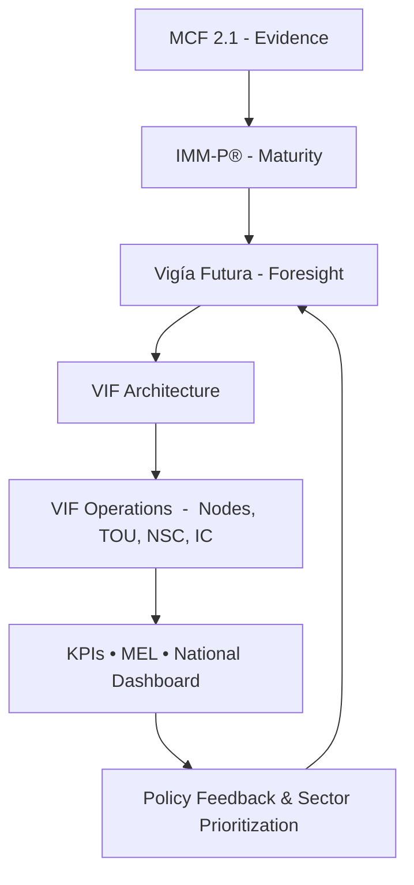

# 00a  -  How to Use the Vigía Incubation Framework (VIF)

## A Practical Guide for Governments, Incubators, Universities, and Investors  
**Version 1.0  -  Vigía Incubation Framework**

---

# **1. Purpose of This Guide**

The Vigía Incubation Framework (VIF) is a **national operating system for public–private incubation**, designed to unify ecosystem actors, standardize evidence-driven entrepreneurship, and enable long-term competitiveness.  

This guide explains **how to navigate, understand, and deploy the full framework**, whether you are:

- A ministry or government agency  
- A private incubator or accelerator  
- A university or research center  
- An investor or corporate partner  
- An international organization supporting innovation

---

# **2. How the Documents Are Organized**

VIF is composed of **Core Sections (00–10)** and **Technical Annexes (01–10)**.

### **2.1 Core Sections (What & Why)**  
Provide the conceptual, strategic, and structural foundations for a national incubator network.

| Section | Purpose |
|---------|---------|
| 00 | Executive Summary |
| 01 | Introduction |
| 02 | Ecosystem Diagnostic |
| 03 | Network Architecture |
| 04 | Legal & Governance |
| 05 | Funding Model |
| 06 | Benchmarking |
| 07 | KPIs & Scorecards |
| 08 | Roadmap |
| 09 | Governance & Legal |
| 10 | Templates |

### **2.2 Technical Annexes (How)**  
Operationalize every component of VIF.

| Annex | Purpose |
|--------|----------|
| 01 | NSC Terms of Reference |
| 02 | TOU Operating Manual |
| 03 | Investment Committee Framework |
| 04 | National Decree Template |
| 05 | Public–Private Partnership MOU |
| 06 | Investment Agreements |
| 07 | Data Privacy & Sharing |
| 08 | IP Agreements |
| 09 | Branding & Communication |
| 10 | MEL Framework |

---

# **3. Who Should Read What (Role-Based Navigation)**

### **3.1 Government & Policy Leaders**
Read:
- 00 Executive Summary  
- 01, 04, 05, 07  
- Annex 01, 04, 09, 10  

Purpose: Develop national policy, governance, and funding architecture.

---

### **3.2 Technical Operating Unit (TOU)**
Read:
- 03, 04, 07, 09  
- Annex 02, 03, 07, 10  

Purpose: Execute national programs, run the dashboard, manage MEL.

---

### **3.3 Incubators & Universities**
Read:
- 02, 03, 07, 08  
- Annex 05, 07, 08  

Purpose: Deliver incubation programs using standardized evidence templates.

---

### **3.4 Investors & Co-Investment Partners**
Read:
- 05, 06, 07  
- Annex 03, 06, 10  

Purpose: Understand due diligence, tranching, and investment rules.

---

# **4. The VIF Logic: How Everything Fits Together**

:::info Mermaid Diagram

:::

---

# **5. Implementation Sequence (Recommended Order)**

### **Step 1  -  Diagnostic**
- Read Sections 00–02  
- Conduct national ecosystem assessment  

### **Step 2  -  Design**
- Read Sections 03–04  
- Select governance, legal, and operational structures  

### **Step 3  -  Capital & Funding**
- Read Section 05 + Annex 06  
- Define National Innovation Fund mechanisms  

### **Step 4  -  Evidence & Maturity**
- Align programs to MCF 2.1 and IMM‑P®  
- Build templates and training  

### **Step 5  -  Operationalization**
- Implement TOU (Annex 02)  
- Create national dashboard (Section 07, Annex 10)  

### **Step 6  -  National Launch**
- Accreditation of incubator nodes  
- Deploy programs in pilot + scale  

### **Step 7  -  Continuous Learning**
- Annual review  
- Update sector priorities using Vigía Futura  

---

# **6. Reading Strategy for Busy Leaders**

For ministers, agency directors, CEOs, and donors:

### **Read these first (90-minute briefing pack):**
1. 00  -  Executive Summary  
2. 01  -  Introduction  
3. 03  -  Architecture  
4. 05  -  Funding Model  
5. Annex 01  -  NSC  
6. Annex 04  -  Decree  
7. Annex 10  -  MEL  

This provides a **policy-ready understanding** of VIF.

---

# **7. Assumptions & Prerequisites**

- Basic digital infrastructure  
- Strong institutional coordination (public–private)  
- Legal authority to establish network governance  
- Budget for the National Innovation Fund  
- A local team capable of running the TOU  
- Shared desire to professionalize and scale entrepreneurship  

If any of these are missing, VIF includes mitigation measures.

---

# **8. Key Concepts Explained**

### **Evidence-Driven Entrepreneurship (MCF 2.1)**  
Startups must validate decisions using structured evidence, reducing risk.

### **Maturity-Based Governance (IMM‑P®)**  
Institutions receive a maturity score to improve capabilities over time.

### **Foresight Integration (Vigía Futura)**  
The country prioritizes future sectors using global trends and signals.

### **Networked Incubation**  
All incubators use shared protocols, templates, and reporting.

---

# **9. Output of This Guide**

After reading this section, users will:

- Understand the structure of VIF  
- Know which documents to read for their role  
- Recognize how every component fits together  
- Be able to follow the recommended implementation sequence  
- Know how to navigate the full VIF documentation package  

---

# **10. References**

Small curated set (full list in 11‑references.md):

- OECD (2023) *STI Outlook*  
- WIPO (2023) *Global Innovation Index*  
- Blank (2013) *Four Steps to the Epiphany*  
- OECD (2019) *Principles of Public Governance*  
- Schwarz (1991) *The Art of the Long View*

