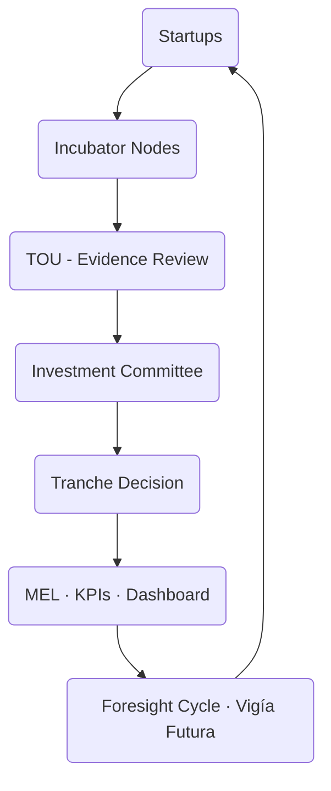

# 04  -  Operating Model  
## Vigía Incubation Framework (VIF)  
**National Public–Private Incubation Network Guide  -  Version 1.0**

---

# **1. Introduction**

The **Operating Model** defines *how* the Vigía Incubation Framework (VIF) works in practice.  
Where Section 03 describes the system’s **architecture**, Section 04 translates that structure into:

- daily operations  
- program workflows  
- evidence flows  
- decision-making processes  
- data pipelines  
- capability requirements  
- investment interactions  
- nationwide coordination mechanisms  

This section must be read **after Section 03  -  System Architecture**, because it activates the governance structures, capital flows, and ecosystem design principles established there.

For navigation support, see **00a  -  How to Use VIF**.  
For terminology, see **00c  -  Glossary**.

---

# **2. How to Read This Section**

This section explains:

- *what actors do,*  
- *how they interact,*  
- *what evidence they submit,*  
- *how decisions are made,*  
- and *how national consistency is maintained.*

It is used by:

- TOU teams  
- incubator nodes  
- universities  
- private accelerators  
- government innovation units  
- investors and co-investment partners  

Sections that depend on this one:

- Section 05  -  Governance & Capability Requirements  
- Section 06  -  Funding & Investment  
- Section 07  -  KPIs & MEL  
- Section 08  -  Roadmap & Phasing  
- Section 10  -  Templates

---

# **3. Operating Model Overview**

The VIF operating model follows a **closed-loop national innovation cycle** driven by:

- evidence (MCF 2.1),  
- institutional maturity (IMM-P®),  
- and strategic foresight (Vigía Futura).  

This cycle ensures continuous learning and adaptive national coordination.

---

# **4. High-Level Operating Model Diagram**

:::info Mermaid Diagram

:::

This closed-loop structure ensures that insights from each cycle strengthen the next.

---

# **5. Operating Principles**

The VIF Operating Model follows six national-level principles:

## **5.1 Standardization with Contextual Flexibility**
- All incubators apply the same evidence standards (MCF 2.1).  
- Programs use consistent modules.  
- Regional adaptations remain allowed.

## **5.2 Public–Private Symmetry**
- Public and private incubators follow the same rules.  
- Decision rights and reporting obligations are mirrored.  
- Accreditation and compliance rules apply equally.

## **5.3 Evidence Before Investment**
No investment decisions occur without a validated evidence package.

## **5.4 Capability-Driven Governance**
IMM-P® defines maturity expectations for:

- TOU  
- incubator nodes  
- ministerial units  
- university partners

## **5.5 Transparency & Digital Traceability**
All evidence, KPIs, and tranche decisions live inside the national VIF system.

## **5.6 Continuous Adaptation**
Vigía Futura ensures programs adjust to emerging sectors and national priorities.

---

# **6. Core Operating Modules**

The operating model consists of **eight modules**, each corresponding to a stage in the national innovation cycle.

---

## **6.1 Module 1  -  Outreach & Attraction**

### **Purpose**
Generate a strong national pipeline of diverse, high-quality startups.

### **Key Activities**
- Public and private outreach campaigns  
- Partnerships with universities  
- Coordination with municipalities and regions  
- Early diagnostic using MCF 2.1  
- Pre-registration through the national platform  

### **Outputs**
- Startup pipeline catalog  
- Early-stage evidence (MCF 2.1)  
- Regional distribution reports  

---

## **6.2 Module 2  -  Selection & Eligibility**

### **Purpose**
Ensure fairness, consistency, and transparency across nodes.

### **Key Activities**
- Eligibility screening  
- Capability review  
- Founding team assessment  
- Initial evidence review (MCF 2.1)  
- Foresight alignment check (Vigía Futura sectors)  

### **Outputs**
- Selection scorecard  
- Eligibility decision  
- Node assignment  

---

## **6.3 Module 3  -  Incubation Delivery**

### **Purpose**
Develop capabilities, evidence, and clarity for each startup.

### **Key Activities**
- Delivery of standardized program modules  
- MCF-driven customer discovery  
- Problem framing & opportunity analysis  
- Solution evidence  
- Business model assessment  
- Use of approved templates (Section 10)  
- Mentoring and coaching sessions  

### **Outputs**
- MCF 2.1 evidence package  
- Updated venture profile  
- Customer validation data  

---

## **6.4 Module 4  -  Acceleration & Investment Readiness**

### **Purpose**
Prepare validated startups for investment and scaling.

### **Key Activities**
- Pricing, GTM, and business model refinement  
- Financial modeling (standard templates)  
- Technical feasibility checks  
- Operational planning  
- Pitch readiness  
- MCF 2.1 investment evidence  

### **Outputs**
- Investment-readiness evidence package  
- Investment memo draft  
- Maturity readiness profile  

---

## **6.5 Module 5  -  Investment & Tranching**

### **Purpose**
Enable transparent, evidence-based funding decisions.

### **Key Activities**
- IC review  
- Tranche-based decision making  
- SAFE or co-investment agreements  
- Risk evaluation  
- Regulatory compliance checks  
- Data logging for MEL  

### **Outputs**
- Investment decision  
- Tranche schedule  
- Investment ledger entries  

---

## **6.6 Module 6  -  Monitoring, KPIs & MEL**

### **Purpose**
Ensure continuous learning, accountability, and transparency.

### **Key Activities**
- Monthly KPI submission  
- Startup progress reviews  
- Node performance evaluation  
- Institutional maturity updates (IMM-P®)  
- Identification of learning patterns  
- Dashboard publication  

### **Outputs**
- MEL reports  
- National dashboard updates  
- Policy inputs  

---

## **6.7 Module 7  -  Graduation**

### **Purpose**
Transition validated startups to scaling, investment, or exit pathways.

### **Key Activities**
- Graduation evidence review  
- Compliance checks  
- Export-readiness assessment  
- Referral to public–private partners  
- Alumni onboarding  

### **Outputs**
- Graduation certificate  
- Readiness scores  
- Alumni database entry  

---

## **6.8 Module 8  -  Foresight & Policy Feedback**

### **Purpose**
Update national programs using insights from every cohort.

### **Key Activities**
- Sector trend reassessment  
- Weak signal tracking (Vigía Futura)  
- Policy alignment workshops  
- Annual strategic updates  
- Program redesign with NSC  

### **Outputs**
- Updated national sector priorities  
- Program adjustments  
- National innovation strategy updates  

---

# **7. Operating Model Constraints**

All operating models must account for:

- Talent shortages in incubator teams  
- Digital infrastructure gaps  
- Regional capability disparities  
- Procurement and administrative delays  
- Institutional resistance  
- Funding volatility  
- Limited data culture or systems  

The TOU must plan mitigation strategies tailored to these constraints.

---

# **8. Capability Requirements for Incubator Nodes**

Minimum requirements to operate inside VIF:

| Capability Category | Requirement |
|----------------------|-------------|
| **Governance** | Clear mandate, leadership, decision-making clarity |
| **Evidence & Data** | Ability to deliver MCF packages + KPIs monthly |
| **Team Capability** | MCF-trained staff, coaching capacity |
| **Infrastructure** | Digital tools, meeting space, stable systems |
| **Compliance** | Legal readiness, data privacy, ethics |
| **Program Delivery** | Ability to run standardized modules |

These requirements are further detailed in **Section 05  -  Governance & Capability Requirements**.

---

# **9. Data & Evidence Flows**

:::info Mermaid Diagram

:::

This ensures **national learning, consistency, and accountability**.

---

# **10. Connection to Section 05**

Section 05 expands this operating model into:

- governance maturity requirements (IMM-P®)  
- accreditation norms  
- TOU capability standards  
- decision-making rights  
- oversight mechanisms  
- institutional roles  

---

# **11. Reference Snapshot**

Primary Doulab frameworks defining the operating model:

- **MicroCanvas® Framework 2.1**  -  https://www.themicrocanvas.com  
- **Innovation Maturity Model Program (IMM-P®)**  -  https://www.doulab.net/services/innovation-maturity  
- **Vigía Futura**  -  https://www.doulab.net/vigia-futura  

External influences (non-primary):

- OECD Public Governance Principles  
- WIPO Global Innovation Index  
- OECD Strategic Foresight Toolkit  
- World Bank GovTech Maturity Index  

Full bibliography in **11-references.md**.

---

# **12. Licensing**

This document is licensed under the **Creative Commons Attribution 4.0 International License (CC BY 4.0)**.  
See: **[LICENSE.md](./LICENSE.md)**  

MicroCanvas®, IMM-P® and VIF are **proprietary methodologies of Doulab**.

