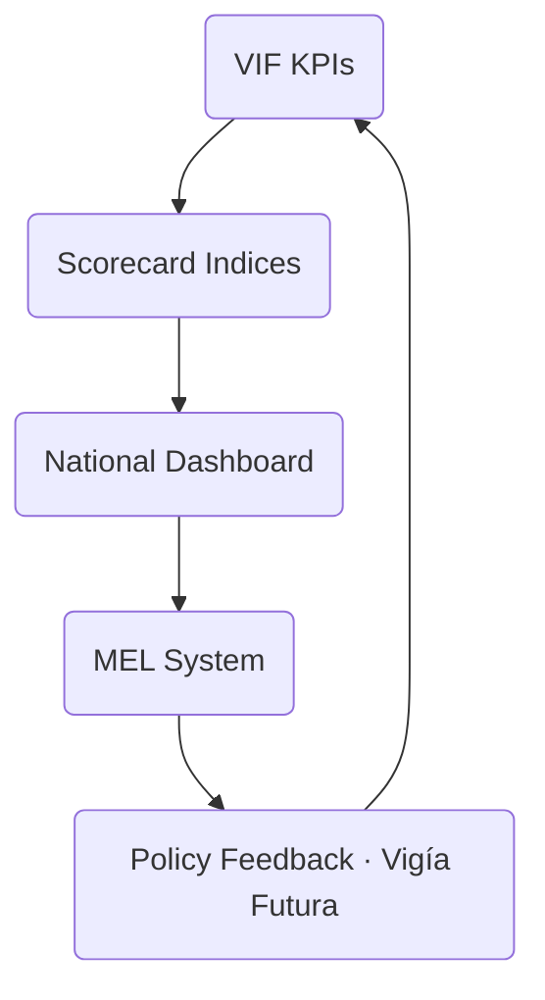
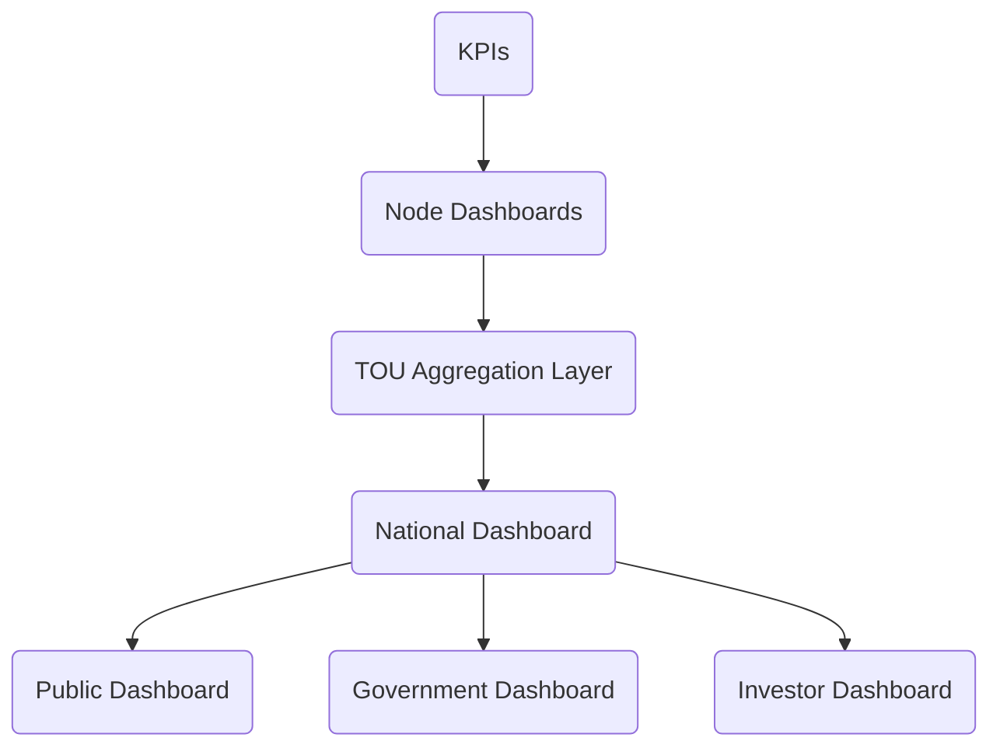

# 07  -  KPIs & Scorecard  
## Vigía Incubation Framework (VIF)  
**National Public–Private Incubation Network Guide  -  Version 1.0**

---

# **1. Introduction**

A national incubation network cannot function without **clear, standardized, and evidence-driven performance measurement**.  
KPIs and scorecards ensure:

- national visibility,  
- cross-node comparability,  
- accountability,  
- data integrity,  
- investment discipline, and  
- continuous improvement across the system.

This section provides the **measurement backbone** for VIF by defining:

- what must be measured,  
- how it must be measured,  
- how it is reported, and  
- how KPIs link to funding, governance, and policy.

For navigation support, see **00a  -  How to Use VIF**.  
For terminology, see **00c  -  Glossary**.

---

# **2. How to Read This Section**

This section explains:

- what KPIs matter and why,  
- how KPIs flow through the VIF system,  
- how KPIs inform investment decisions,  
- how the national scorecard is constructed,  
- how KPIs strengthen governance,  
- how data feeds into foresight (Vigía Futura), and  
- how KPIs support national policy improvement.

This section directly supports:

- Section 03  -  System Architecture  
- Section 04  -  Operating Model  
- Section 05  -  Funding Model  
- Section 08  -  Roadmap & Phasing  
- Annex 10  -  Templates

---

# **3. KPI Framework Overview**

The VIF KPI Framework integrates:

- **Evidence (MCF 2.1)**  
- **Institutional maturity (IMM-P®)**  
- **Foresight insights (Vigía Futura)**  
- **Startup performance data**  
- **Incubator operational data**  
- **National innovation metrics**

---

# **4. KPI System Diagram**

:::info Mermaid Diagram

:::

This loop ensures the KPI system is **adaptive**, **evidence-driven**, and **strategically aligned**.

---

# **5. Measurement Philosophy**

The KPI system is based on four principles:

### **5.1 Evidence Over Assumptions**
KPIs must be grounded in verifiable data, not narrative.

### **5.2 Leading & Lagging Indicators**
- *Leading indicators* predict future success  
- *Lagging indicators* confirm outcomes

Both are required for national visibility.

### **5.3 Contextualization**
KPIs must be comparable across nodes **but interpreted contextually**.

### **5.4 Transparency & Traceability**
All KPI submissions must be logged in the national digital system.

---

# **6. KPI Categories**

KPIs are grouped into five national categories:

1. **Startup Performance**  
2. **Incubator Maturity & Capability**  
3. **Program Delivery & Quality**  
4. **Investment & Tranching Performance**  
5. **Network-Level Economic Indicators**

Each category contains KPIs reported **monthly**, **quarterly**, or **annually**.

---

# **7. KPI Definitions**

Below is a non-exhaustive list of standardized KPIs.  
All definitions must be used consistently across incubator nodes.

## **7.1 Startup Performance KPIs**

| KPI | Definition | Frequency |
|-----|------------|-----------|
| Customer Interviews Completed | Number of validated customer conversations | Monthly |
| Evidence Components Completed | Number of MCF components finalized | Monthly |
| Monthly Active Users (MAU) | Active unique users per month | Monthly |
| Revenue | Gross monthly revenue | Monthly |
| Retention Rate | % of users retained month-to-month | Monthly |
| Customer Acquisition Cost (CAC) | Total acquisition cost / # of new customers | Quarterly |
| Service Delivery KPIs | Sector-specific operational indicators | Monthly |

---

## **7.2 Incubator Maturity & Capability KPIs**

| KPI | Definition | Frequency |
|-----|------------|-----------|
| IMM-P® Maturity Level | 0–5 score based on institutional capabilities | Annual |
| Governance Compliance | Adherence to reporting & decision rules | Quarterly |
| Evidence Review Quality | Accuracy and completeness of node submissions | Quarterly |
| Mentor/Coach Certification | % of staff trained in MCF standards | Annual |
| Digital Maturity | Ability to use national platform tools | Annual |

---

## **7.3 Program Delivery & Quality KPIs**

| KPI | Definition | Frequency |
|-----|------------|-----------|
| Module Completion Rate | % of standardized modules delivered | Quarterly |
| Coaching Hours | Total hours provided to startups | Monthly |
| Program Satisfaction Score | Participant-reported quality | Quarterly |
| Timeliness of Reports | % of reports delivered on time | Monthly |
| Compliance Violations | # of deviations from standards | Quarterly |

---

## **7.4 Investment & Tranching KPIs**

| KPI | Definition | Frequency |
|-----|------------|-----------|
| Tranche Approval Rate | % of tranches approved vs. submitted | Quarterly |
| Investment Lead Time | Time from submission to IC decision | Quarterly |
| Follow-On Funding | Total additional capital raised | Annual |
| Renewal Decisions | % of contracts renewed | Annual |

---

## **7.5 Network-Level KPIs**

| KPI | Definition | Frequency |
|-----|------------|-----------|
| Regional Coverage | # of active nodes per region | Annual |
| Sector Diversification | Spread across priority sectors | Annual |
| Job Creation | Total jobs generated by active startups | Annual |
| Export Readiness | % of startups preparing internationalization | Annual |
| Public Value Indicators | Sector-specific socio-economic impact metrics | Annual |

---

# **8. KPI Misuse & Ethical Guidelines**

To prevent distortions and ensure fairness:

- avoid KPI inflation,  
- avoid punitive KPI use,  
- avoid comparing nodes without context,  
- avoid vanity metrics,  
- avoid KPI overload,  
- avoid conflicting KPI incentives.

Nodes should focus on **learning**, not **gaming**.

---

# **9. National Scorecard**

KPIs feed into **five national indices**:

1. **Startup Outcomes Index**  
2. **Incubator Maturity Index**  
3. **Program Quality Index**  
4. **Investment Effectiveness Index**  
5. **National Innovation Impact Index**

---

# **10. Scorecard Methodology**

### **10.1 Normalization**
Values are normalized (0–100) to ensure comparability.

### **10.2 Weighting**
Each index contains weighted KPIs based on:

- strategic importance,  
- data reliability,  
- foresight alignment.

### **10.3 Aggregation**
Indexes are aggregated to produce a **national VIF performance score**.

### **10.4 Thresholds**
Score ranges:

- **80–100** → Excellent  
- **60–79** → Strong  
- **40–59** → Needs Support  
- **0–39** → Critical Attention  

---

# **11. National Dashboard Architecture**

:::info Mermaid Diagram

:::

Dashboards differ by audience but share the same underlying data.

---

# **12. National Reporting Calendar**

### **Monthly**
- Startup KPIs  
- Coaching hours  
- Evidence submissions  
- Timeliness KPIs  

### **Quarterly**
- Program quality indicators  
- Tranche decisions  
- Governance compliance  

### **Annual**
- IMM-P® maturity updates  
- Economic impact  
- Network coverage  
- Sector diversification  
- National scorecard publication  

---

# **13. Connection to Section 08  -  Roadmap & Phasing**

The KPIs in this section define:

- readiness milestones,  
- annual system targets,  
- capability requirements for scaling,  
- timeline checkpoints for national rollout.

---

# **14. Reference Snapshot**

Primary Doulab frameworks:

- **MicroCanvas® Framework 2.1**  -  https://www.themicrocanvas.com  
- **Innovation Maturity Model Program (IMM-P®)**  -  https://www.doulab.net/services/innovation-maturity  
- **Vigía Futura**  -  https://www.doulab.net/vigia-futura  

External influences (non-primary):

- OECD Public Governance Principles  
- OECD Strategic Foresight Toolkit  
- WIPO Global Innovation Index  
- World Bank GovTech Maturity Index  

Full bibliography available in **11-references.md**.

---

# **15. Licensing**

This document is licensed under the **Creative Commons Attribution 4.0 International License (CC BY 4.0)**.  
See: **[LICENSE.md](./LICENSE.md)**  

MicroCanvas®, IMM-P® and VIF are **proprietary methodologies of Doulab**.

