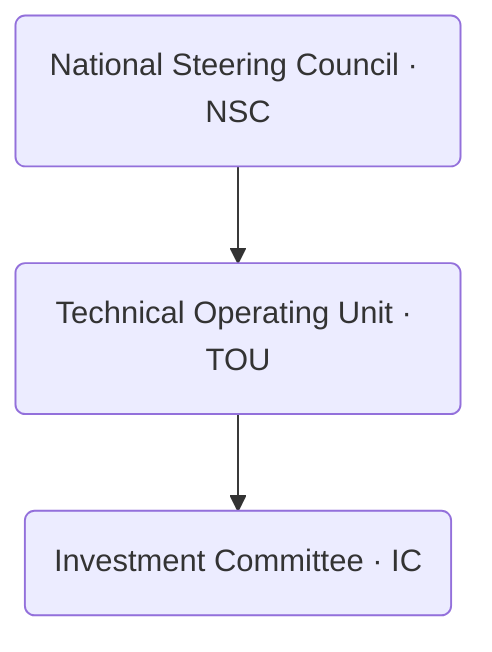

# 09  -  Governance & Legal Toolkit  
## Vigía Incubation Framework (VIF)  
**National Public–Private Incubation Network Guide  -  Version 1.0**

---

# **1. Introduction**

This section provides the **governance**, **legal**, and **regulatory** foundations required for the implementation of the Vigía Incubation Framework (VIF).  
Where previous sections define the system’s architecture, operating model, funding flows, KPIs, and roadmap, this section ensures the framework operates within a **clear, compliant, enforceable, and sustainable governance structure**.

It answers the following:

- Who has decision-making authority across the national network?  
- What are the legal and regulatory obligations of each actor?  
- How are data, investments, and evidence protected?  
- How are conflicts of interest, ethics, and compliance managed?  
- What documentation, policies, and legal templates are required?  
- How does governance evolve as institutional maturity increases (IMM-P®)?  

This toolkit provides a legally sound and operationally scalable foundation for public–private collaboration.

For navigation support, see **00a  -  How to Use VIF**.  
For terminology, see **00c  -  Glossary**.

---

# **2. How to Read This Section**

This section defines:

- governance bodies (NSC, TOU, IC),  
- legal duties and obligations,  
- data protections and privacy standards,  
- conflict-of-interest mechanisms,  
- compliance and oversight rules,  
- required policies,  
- minimum governance capabilities for institutions,  
- legal instruments for investment and collaboration.

This section supports:

- Section 03  -  System Architecture  
- Section 04  -  Operating Model  
- Section 05  -  Funding Model  
- Section 07  -  KPIs & Scorecard  
- Section 10  -  Templates & Tools  

---

# **3. Governance Architecture Overview**

VIF governance is structured around **three national bodies**, each with distinct mandates and legal responsibilities.

:::info Governance Bodies Overview

:::

Each body operates with predefined decision rights, reporting responsibilities, and compliance obligations.

---

# **4. Governance Bodies**

---

## **4.1 National Steering Council (NSC)**

### **Mandate**
The NSC provides **strategic direction**, **policy alignment**, and **national oversight**.

### **Legal Responsibilities**
- Approve strategic priorities, including sector tracks (Vigía Futura)  
- Approve multi-year budgeting for NIF  
- Define national governance policies  
- Approve accreditation standards  
- Ratify IC membership  
- Ensure alignment with national development strategies  

### **Decision Rights**
- High-level policy and strategy  
- System-wide KPIs (Section 07)  
- Major governance changes  
- National-level funding allocations  

### **Compliance Duties**
- Conflict-of-interest disclosures  
- Publication of annual governance report  
- Compliance with national public administration laws  

---

## **4.2 Technical Operating Unit (TOU)**

### **Mandate**
The TOU acts as the **central implementation body**, responsible for executing all operational, technical, and administrative activities of the national network.

### **Legal Responsibilities**
- Manage node accreditation  
- Oversee data reporting and KPI compliance  
- Manage VIF digital infrastructure  
- Enforce evidence standards (MCF 2.1)  
- Conduct institutional maturity assessments (IMM-P®)  
- Ensure the integrity of tranche-based funding flows  

### **Decision Rights**
- Approve or revoke node accreditation  
- Approve compliance-related penalties  
- Operational authority over templates, protocols, and reporting  
- First-level approval of investment submissions  

### **Compliance Duties**
- Maintain data protection and privacy compliance  
- Ensure integrity of evidence submissions  
- Maintain audit trails for funding decisions  

---

## **4.3 Investment Committee (IC)**

### **Mandate**
The IC provides **independent investment oversight**, ensuring decisions are based on evidence, maturity, and compliance.

### **Legal Responsibilities**
- Review and approve investment memos  
- Ensure transparent and unbiased decision-making  
- Apply evidence and risk standards consistently  
- Approve tranche releases and renewals  

### **Decision Rights**
- Final approval of startup tranches  
- Investment renewal decisions  
- Portfolio-level adjustments  

### **Compliance Duties**
- Conflict-of-interest declarations  
- Recusal in cases of personal or institutional conflict  
- Audit-friendly documentation  

---

# **5. Minimum Governance Capabilities (IMM-P® Alignment)**

Governance requirements for institutions derive from the **Innovation Maturity Model Program (IMM-P®)**.

## **5.1 Capability Areas**

| Capability Domain | Minimum Requirement |
|-------------------|---------------------|
| Governance | Defined leadership, decision rights, and escalation paths |
| Compliance | Auditability, legal clarity, privacy protocols |
| Evidence Integrity | MCF 2.1–compliant submission processes |
| Transparency | Reporting and dashboard participation |
| Maturity Development | Annual IMM-P® assessment |
| Risk Management | Policies for financial, operational, and data risk |

---

# **6. Legal & Regulatory Framework**

The legal toolkit establishes the requirements for:

- contracting and procurement,  
- investment and funding flows,  
- institutional collaboration,  
- data protection,  
- compliance,  
- ethical guidelines.

---

## **6.1 Legal Instruments**

### **Memorandum of Understanding (MoU)**
Establishes collaboration terms between:

- ministries,  
- universities,  
- municipalities,  
- private incubators,  
- international partners.

### **Accreditation Agreement**
Defines rights and responsibilities of incubator nodes within VIF.

### **Data Sharing Agreement**
Ensures lawful, privacy-compliant exchange of:

- KPIs  
- evidence  
- maturity assessments  
- investment documents  

### **Investment Agreements**
Depending on national law:

- SAFE agreements  
- grants  
- reimbursable advances  
- co-investment term sheets  

---

## **6.2 Compliance & Oversight Requirements**

### **Financial Compliance**
- multi-year budgeting (Section 05),  
- audit-friendly documentation,  
- digital traceability of transactions.

### **Regulatory Compliance**
- alignment with national innovation policies,  
- sector-specific regulations,  
- public administration norms.

### **Ethics & Conduct**
- conflict-of-interest rules,  
- recusal mechanisms,  
- minimum ethical training for reviewers.

---

# **7. Data Governance & Privacy Standards**

Data governance is based on:

- national data protection laws,  
- sector-specific regulations,  
- international good practices.

### **7.1 Data Governance Responsibilities**

| Actor | Responsibility |
|-------|----------------|
| TOU | Manage infrastructure, ensure lawful processing |
| Nodes | Submit accurate and timely data |
| NSC | Approve national data policies |
| IC | Protect investment-related data |

### **7.2 Privacy Standards**

- lawful basis for data collection,  
- purpose limitation,  
- data minimization,  
- accuracy,  
- storage limitation,  
- confidentiality,  
- integrity,  
- auditability.

---

# **8. Conflict-of-Interest Mechanisms**

To ensure trust across the network, conflict-of-interest mechanisms include:

- mandatory annual declarations,  
- recusal rules for reviewers and IC members,  
- transparent documentation of decisions,  
- public disclosure of summary decisions,  
- penalties for non-compliance.

---

# **9. Transparency & Accountability**

Transparency mechanisms include:

- national dashboard publication (Section 07),  
- open data (when lawful),  
- annual governance reports,  
- third-party audits,  
- system-wide compliance reviews.

---

# **10. Enforcement & Penalties**

Institutions may face:

- warnings,  
- probation status,  
- temporary suspension,  
- revocation of accreditation,  
- financial penalties (if permitted by law).

All enforcement actions must follow:

- due process,  
- transparency,  
- fairness,  
- official documentation.

---

# **11. Connection to Section 10  -  Templates & Tools**

This section lays the foundation for all templates in Section 10:

- MoU template  
- Accreditation agreements  
- Data governance policies  
- Investment agreements  
- Evidence review checklists  
- Conflict-of-interest declarations  

---

# **12. Reference Snapshot**

Primary Doulab frameworks:

- **MicroCanvas® Framework 2.1**  -  https://www.themicrocanvas.com  
- **Innovation Maturity Model Program (IMM-P®)**  -  https://www.doulab.net/services/innovation-maturity  
- **Vigía Futura**  -  https://www.doulab.net/vigia-futura  

External influences (non-primary):

- OECD Public Governance Principles  
- World Bank GovTech Maturity Index  
- OECD Strategic Foresight Toolkit  
- WIPO Global Innovation Index  

Full bibliography available in **11-references.md**.

---

# **13. Licensing**

[Vigia Incubation Framework](https://vif.doulab.net) © 2025 by [Luis A. Santiago](https://www.linkedin.com/in/lasantiagoa/) is licensed under [CC BY-NC-ND 4.0](https://creativecommons.org/licenses/by-nc-nd/4.0/)    
See: **[LICENSE.md](./LICENSE.md)**  

MicroCanvas®, IMM-P® and VIF are **proprietary methodologies of Doulab**.
