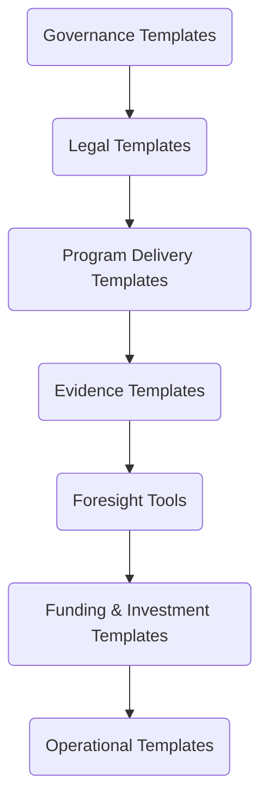

# 10  -  Templates & Tools  
## Vigía Incubation Framework (VIF)  
**National Public–Private Incubation Network Guide  -  Version 1.0**

---

# **1. Introduction**

Templates and tools are the **operational backbone** of the Vigía Incubation Framework (VIF).  
They ensure that all incubator nodes - whether public, private, academic, municipal, or mixed - operate with the same:

- standards,  
- definitions,  
- evidence requirements,  
- reporting obligations,  
- governance criteria, and  
- investment documentation.

Where previous sections define the **what** (architecture, governance, funding, KPIs, roadmap),  
this section defines the **how**  -  providing ready-to-use templates that transform policy into execution.

Templates are designed to be:

- fully adaptable to national contexts,  
- aligned with legal and regulatory frameworks,  
- validated through MCF 2.1 evidence standards,  
- compatible with IMM-P® maturity requirements,  
- integrated with Vigía Futura foresight cycles.

---

# **2. How to Read This Section**

This section is organized into seven template families:

1. Governance Templates  
2. Legal Templates  
3. Program Delivery Templates  
4. Evidence Templates  
5. Foresight Templates  
6. Funding & Investment Templates  
7. Operational Templates  

For each template type, we include:

- **Purpose**  
- **Components**  
- **Use Cases**  
- **Versioning Guidance**  
- **Alignment to VIF Sections**  
- **Owner (NSC, TOU, IC)**  

These templates support:

- Section 03  -  System Architecture  
- Section 04  -  Operating Model  
- Section 05  -  Funding Model  
- Section 07  -  KPIs & Scorecard  
- Section 09  -  Governance & Legal  
- Section 11  -  References  
- Section 12  -  Licensing  

---

# **3. Templates Architecture Diagram**

:::info Mermaid Diagram

:::

This architecture ensures standardization across the entire national network.

---

# **4. Template Ownership & Versioning**

## **4.1 Ownership Model**

| Template Family | Owner |
|-----------------|--------|
| Governance Templates | NSC |
| Legal Templates | NSC + TOU |
| Program Delivery Templates | TOU |
| Evidence Templates | TOU |
| Foresight Templates | NSC + Vigía Futura |
| Funding Templates | IC + TOU |
| Operational Templates | TOU |

---

## **4.2 Versioning Rules**

- Only the **owner** may issue new versions.  
- Changes require **review approval** by relevant governance bodies.  
- All nodes must use **the latest approved version**.  
- Deprecated versions must be archived.  
- Version history must be traceable via digital platform logs.

---

# **5. Governance Templates**

## **5.1 NSC Charter Template**
**Purpose:** Define NSC structure, responsibilities, decision rights.  
**Components:** Mandate, membership, voting rules, conflict-of-interest rules.  
**Use Case:** National governance setup.

## **5.2 TOU Operating Manual**
**Purpose:** Provide operational rules for implementation.  
**Components:** Processes, compliance rules, digital system protocols.  
**Use Case:** All TOU daily operations.

## **5.3 IC Governance Policy**
**Purpose:** Define investment decision rules.  
**Components:** Approval criteria, evidence requirements, quorum rules.  
**Use Case:** Investment review cycles.

---

# **6. Legal Templates**

## **6.1 Memorandum of Understanding (MoU)**
Purpose, scope, partner obligations.

## **6.2 Accreditation Agreement**
Node rights, responsibilities, compliance duties.

## **6.3 Data Sharing Agreement**
Roles, permissions, limitations, privacy rules.

## **6.4 Investment Agreements**
SAFE, grants, co-investment, reimbursable advance models (adapted nationally).

---

# **7. Program Delivery Templates**

## **7.1 Standardized Module Templates**
Aligned to Section 04 modules.

## **7.2 Coaching & Mentoring Protocols**
Rules, responsibilities, KPI alignment.

## **7.3 Program Completion Certificate**
Standardized reporting.

---

# **8. Evidence Templates**

Evidence templates are **directly based on MCF 2.1**.

## **8.1 Evidence Submission Template**
Customer analysis, problem definition, validation evidence.

## **8.2 Experiment Log Template**
Hypothesis → Method → Result → Insight → Decision.

## **8.3 Evidence Audit Checklist**
Used by TOU.

---

# **9. Foresight Templates (Vigía Futura)**

## **9.1 Horizon Scan Template**
Signals, trends, weak signals.

## **9.2 Sector Prioritization Template**
Used by NSC + Vigía Futura.

## **9.3 Futures Wheel Template**
Structured exploration of impact pathways.

---

# **10. Funding & Investment Templates**

## **10.1 Investment Memo Template**
Required for IC review.

## **10.2 Tranche Release Checklist**
Compliance rules.

## **10.3 Investment Renewal Template**
Progress, evidence, readiness.

---

# **11. Operational Templates**

## **11.1 Reporting Calendar Template**
Monthly / quarterly / annual requirements.

## **11.2 KPI Submission Template**
Aligned with Section 07.

## **11.3 Node Self-Assessment Template**
IMM-P® alignment.

---

# **12. Localization Guidance**

Templates must be adapted at national level:

- incorporate national legal terminology,  
- align with procurement and contracting law,  
- adapt for linguistic contexts,  
- align with public–private collaboration norms,  
- respect national data protection regulations.

Localization must not alter:

- evidence integrity rules,  
- maturity alignment rules,  
- governance decision rights,  
- investment approval standards.

---

# **13. Alignment to KPIs & MEL**

Each template contributes to one or more KPIs defined in Section 07.

Examples:

- Evidence templates → evidence compliance  
- Investment templates → tranche turnaround  
- Governance templates → maturity progression  
- Foresight templates → sector alignment indicators  

---

# **14. Reference Snapshot**

Primary Doulab frameworks:

- **MicroCanvas® Framework 2.1**  -  https://www.themicrocanvas.com  
- **Innovation Maturity Model Program (IMM-P®)**  -  https://www.doulab.net/services/innovation-maturity  
- **Vigía Futura**  -  https://www.doulab.net/vigia-futura  

External influences (non-primary):

- OECD Public Governance Principles  
- OECD Strategic Foresight Toolkit  
- World Bank GovTech Maturity Index  
- WIPO Global Innovation Index  

Full bibliography available in **11-references.md**.

---

# **15. Licensing**

This document is licensed under the **Creative Commons Attribution 4.0 International License (CC BY 4.0)**.  
See: **[LICENSE.md](./LICENSE.md)**  

MicroCanvas®, IMM-P® and VIF are **proprietary methodologies of Doulab**.
