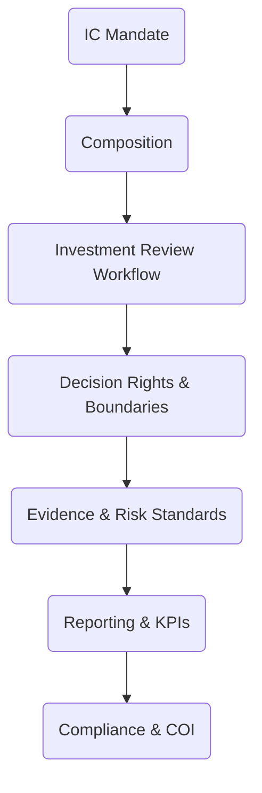
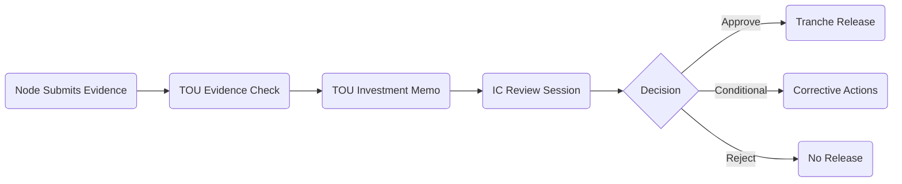

# Annex 03  -  Terms of Reference & Operating Manual  
## Investment Committee (IC)  
### Vigía Incubation Framework (VIF)  
**National Public–Private Incubator Network Guide  -  Version 1.0**

---

# **1. Introduction**

The **Investment Committee (IC)** is the independent, evidence‑driven decision‑making body responsible for evaluating and approving all investment‑related processes under the Vigía Incubation Framework (VIF).  
It ensures that investment decisions are:

- transparent,  
- evidence‑based (MCF 2.1),  
- maturity‑aligned (IMM-P®),  
- free from political interference,  
- financially responsible,  
- auditable and compliant,  
- equitable across public and private incubator nodes.

This annex defines the **Terms of Reference (ToR)** and **Operating Manual** for the IC, establishing:

- governance structure,  
- mandate,  
- composition,  
- decision rights & boundaries,  
- evidence requirements,  
- maturity criteria,  
- review workflow,  
- compliance and ethical obligations,  
- reporting requirements,  
- KPIs and performance expectations.

This annex supports **Sections 03, 04, 05, 07, 09, and 10**.

---

# **2. How to Use This Annex**

This annex is designed for:

- investment evaluators,  
- national innovation authorities,  
- legal and compliance teams,  
- public and private incubator leadership,  
- TOU and NSC decision‑makers.

Use this annex to:

1. Establish the IC as an independent investment body.  
2. Define all investment‑related workflows and decision rights.  
3. Train new IC members with standardized evaluation criteria.  
4. Ensure fairness, transparency, and evidence integrity in investment decisions.  
5. Maintain auditability and compliance across the national incubation network.

This annex provides the **minimum governance and operational standards** for IC functioning.  
Countries may customize titles and meeting formats, but may NOT alter:

- evidence standards (MCF 2.1),  
- maturity alignment rules (IMM-P®),  
- IC independence from political entities,  
- tranching and renewal logic,  
- conflict‑of‑interest protocols.

---

# **3. IC Governance Architecture**

:::info Mermaid Diagram

:::

---

# **4. Mandate**

The IC is responsible for:

- conducting independent evaluation of all investment cases,  
- applying standardized, evidence‑driven criteria,  
- authorizing or rejecting tranches,  
- ensuring investment decisions align with maturity stages (IMM-P®),  
- ensuring compliance with national investment rules,  
- safeguarding the integrity and neutrality of the investment process.

The IC is the **final authority** for all investment decisions under VIF.

---

# **5. Composition & Membership**

## **5.1 Membership Structure**

The IC should include 5–9 members representing:

- private‑sector investors (2–3),  
- academia or research institutions (1–2),  
- national innovation authority (1),  
- independent experts (1–2),  
- finance/compliance specialist (1).

## **5.2 Appointment Rules**

- Members are appointed by the NSC.  
- Terms: **2 years**, renewable once.  
- Members must have investment, entrepreneurship, or innovation governance experience.  
- Mandatory completion of induction training (MCF 2.1, IMM-P®, risk & compliance).

---

# **6. Responsibilities**

The IC is responsible for:

### **6.1 Investment Evaluation**
- Reviewing investment memos submitted by the TOU.  
- Applying evidence‑based decision criteria.  
- Ensuring financial and operational viability.  

### **6.2 Risk Assessment**
- Conducting risk scoring based on standardized criteria.  
- Ensuring alignment with national regulatory frameworks.  

### **6.3 Compliance Oversight**
- Ensuring all submissions follow evidence and maturity frameworks.  
- Ensuring transparency and traceability.  

### **6.4 Tranche Decision-Making**
- Approving, rejecting, or conditionally approving tranche releases.  
- Issuing written justification for each decision.

---

# **7. Decision Rights & Boundaries**

## **7.1 IC Decision Rights**
The IC has the authority to:

- approve investment tranches,  
- request additional evidence,  
- reject insufficient or non‑compliant submissions,  
- apply conditional approvals,  
- recommend corrective actions.

## **7.2 Boundaries (Prohibited Interference)**

To ensure neutrality and governance integrity:

**The IC may NOT:**

- modify evidence standards (MCF 2.1),  
- alter maturity scoring (IMM-P®),  
- interfere in TOU operational processes,  
- receive external influence from political authorities,  
- make exceptions to compliance or audit rules,  
- approve investments without complete documentation.

---

# **8. Investment Review Workflow**

:::info Mermaid Diagram

:::

## **8.1 Required Documentation**
All submissions must include:

- validated evidence (MCF 2.1),  
- updated KPIs,  
- updated maturity level (IMM-P®),  
- financial model or forecast,  
- investment memo (Section 10 template),  
- risk assessment worksheet,  
- compliance declaration.

---

# **9. Evidence Standards (MCF 2.1)**

Investment decisions must be grounded exclusively in:

- validated customer and problem evidence,  
- validated solution feasibility evidence,  
- validated business model assumptions,  
- experiment results and insight logs,  
- risk mitigation plans.

**Evidence manipulation or inflation is grounds for immediate rejection.**

---

# **10. Maturity Alignment (IMM-P®)**

Each investment level corresponds to a minimum IMM-P® score:

| Tranche | Minimum Maturity Level | Description |
|--------|-------------------------|-------------|
| Seed / Pre‑Seed | 1.5 | Initial evidence + capability baseline |
| Validation Tranche | 2.0 | Evidence + validated learning + operational capability |
| Scaling Tranche | 2.5–3.0 | Repeatable processes + risk mitigation |
| Expansion Tranche | 3.0+ | Operational excellence + strategic readiness |

The IC must review results of the TOU’s annual maturity assessments before approving any tranche.

---

# **11. Risk Evaluation**

Risk categories:

- **Financial risk**  
- **Operational risk**  
- **Team risk**  
- **Market risk**  
- **Evidence risk**  
- **Compliance risk**  
- **Technology risk**

Risk scoring uses a standardized matrix (Section 10 template).

---

# **12. IC KPIs**

| KPI | Description |
|------|-------------|
| Decision Turnaround Time | Time from submission to decision |
| Evidence Integrity Score | % of decisions based on validated evidence |
| Reversal Rate | % of decisions requiring later correction |
| Audit Reliability Score | Quality of documentation for audits |
| Portfolio Quality Index | Aggregate performance of supported startups |

---

# **13. Localization Guidance**

Countries may customize:

- meeting schedule,  
- membership titles,  
- internal decision template wording.

Countries may NOT customize:

- IC independence rules,  
- evidence and maturity standards,  
- minimum documentation requirements,  
- conflict‑of‑interest protocols.

---

# **14. Reference Snapshot**

Primary Doulab frameworks:

- **MicroCanvas® Framework 2.1**  -  https://www.themicrocanvas.com  
- **Innovation Maturity Model Program (IMM-P®)**  -  https://www.doulab.net/services/innovation-maturity  
- **Vigía Futura**  -  https://www.doulab.net/vigia-futura  

External influences (non-primary):

- OECD Public Governance Principles  
- World Bank GovTech Maturity Index  
- OECD Strategic Foresight Toolkit  
- WIPO Global Innovation Index  

See **11-references.md** for full bibliography.

---

# **15. Licensing**

This annex is licensed under the **Creative Commons Attribution 4.0 International License (CC BY 4.0)**.  
See: **[LICENSE.md](../LICENSE.md)**  

MicroCanvas®, IMM-P® and VIF are **proprietary methodologies of Doulab**.
