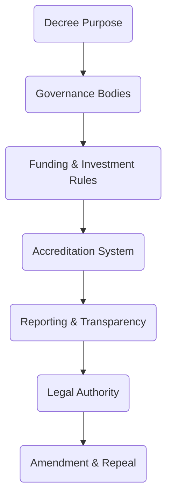

# Annex 04  -  National Decree Template  
## Legal Foundation for the Vigía Incubation Framework (VIF)  
### National Public–Private Incubator Network Guide  -  Version 1.0

---

# **1. Introduction**

This annex provides a **National Decree Template** for countries adopting the **Vigía Incubation Framework (VIF)** as the legal basis for a national public–private incubator network.  
A national decree establishes:

- legal authority for the system,  
- governance bodies (NSC, TOU, IC),  
- funding mechanisms,  
- accreditation structures,  
- reporting and transparency obligations,  
- conflict‑of‑interest and compliance rules,  
- alignment with national innovation and digital transformation policies.

This template is designed for adaptation by:

- national innovation authorities,  
- ministries of economy/industry,  
- digital government agencies,  
- legal and regulatory departments,  
- public–private partnership offices.

For definitions, see **00c – Glossary**.  
For system architecture, see **Sections 03, 04, 05, 07, and 09**.  
For governance bodies, see **Annexes 01–03**.

---

# **2. How to Use This Annex**

This annex defines the **minimum required structure** of a national decree establishing a VIF‑aligned incubation network.

### **Mandatory Components (must not be removed)**  
- Legal establishment of the network  
- Creation of NSC, TOU, and IC  
- Adoption of MCF 2.1 and IMM‑P® as national standards  
- Evidence integrity and maturity compliance rules  
- Funding and co‑investment rules  
- Accreditation rules  
- Transparency and reporting obligations  
- Conflict‑of‑interest rules  
- IC independence  

### **Adaptable Components (can be customized)**  
- Ministry names  
- Budget references  
- Legal citations  
- Institutional mandates  
- Territorial scope  
- Local language and formatting  

### **Prohibited Modifications**  
Countries may NOT change:

- evidence standards (MCF 2.1),  
- maturity standards (IMM‑P®),  
- independence of the IC,  
- compliance and audit requirements,  
- conflict‑of‑interest protocols.

---

# **3. Decree Architecture Diagram**

:::info Decree Structure Overview

:::

---

# **4. Model Decree Template**

Below is the full national decree template, written in a legally neutral and internationally adaptable format.

---

## **Article 1  -  Purpose**

This Decree establishes the **National Public–Private Incubation Network**, adopting the **Vigía Incubation Framework (VIF)** as the national model for innovation development, startup incubation, investment support, and evidence‑based policy execution.

The objective is to strengthen national competitiveness through:

- innovation capability building,  
- startup development,  
- public–private collaboration,  
- digital transformation,  
- institutional maturity progression,  
- foresight‑driven planning.

---

## **Article 2  -  Legal Establishment of Governance Bodies**

The following bodies are hereby established:

1. **National Steering Council (NSC)** – strategic and policy authority.  
2. **Technical Operating Unit (TOU)** – operational and administrative authority.  
3. **Investment Committee (IC)** – independent investment decision authority.

Their mandates, composition, and functions are defined in **Annexes 01–03**.

---

## **Article 3  -  Adoption of National Standards**

The following standards are formally adopted as national references:

1. **MicroCanvas® Framework 2.1** for evidence‑based innovation.  
2. **Innovation Maturity Model Program (IMM‑P®)** for institutional capability assessment.  
3. **Vigía Futura** as the national foresight and trend analysis mechanism.

All programs, incubators, and participating organizations must comply with these standards.

---

## **Article 4  -  Accreditation System**

The TOU is authorized to accredit incubator nodes based on:

- capability requirements,  
- maturity assessments (IMM‑P®),  
- evidence submission standards (MCF 2.1),  
- compliance and ethics criteria,  
- operational readiness.

Accreditation can be:

- granted,  
- renewed,  
- placed under probation,  
- suspended,  
- revoked.

Appeals must follow the procedures defined by the TOU.

---

## **Article 5  -  Funding & Co‑Investment Mechanisms**

### **5.1 National Innovation Fund (NIF)**  
A multi‑year fund is established to support:

- incubation programs,  
- startup tranches,  
- capability development,  
- co‑investment with private actors.

### **5.2 Tranching Rules**  
The IC shall approve investments based on:

- validated evidence,  
- maturity scores,  
- risk assessment,  
- compliance documentation.

### **5.3 Co‑Investment**  
Private investors may co‑invest using:

- SAFE instruments,  
- grants,  
- matching funds,  
- reimbursable advances.

Governments may adapt instruments to local legislation.

---

## **Article 6  -  Reporting & Transparency**

The TOU shall maintain:

- national dashboards,  
- quarterly KPI reports,  
- annual maturity and capability reports,  
- evidence audit logs,  
- public transparency reports (where lawful).

Dashboards must follow rules in **Section 07  -  KPIs & Scorecard**.

---

## **Article 7  -  Conflict‑of‑Interest & Compliance**

All governance bodies must follow:

- annual conflict‑of‑interest declarations,  
- recusal rules,  
- auditability requirements,  
- ethical conduct protocols,  
- data governance rules.

IC independence must be strictly preserved.

---

## **Article 8  -  Foresight Integration**

Vigía Futura shall guide:

- sector prioritization,  
- annual program updates,  
- strategic adjustments to the incubation system,  
- identification of emerging opportunities and risks.

The NSC shall incorporate foresight insights into national decisions.

---

## **Article 9  -  National Authority & Institutional Alignment**

This Decree aligns with national:

- economic development strategies,  
- digital transformation policies,  
- entrepreneurship laws,  
- public administration regulations.

Where conflicts exist, this Decree prevails unless superseded by higher legal authority.

---

## **Article 10  -  Amendment & Repeal**

The NSC may propose amendments to this Decree.  
The issuing authority may:

- amend specific articles,  
- update references to annexes,  
- repeal outdated provisions.

Any prior legal instrument inconsistent with this Decree is hereby repealed.

---

# **5. Localization Guidance**

Countries adapting this Decree must:

- replace ministry names,  
- update legal references,  
- integrate national data protection frameworks,  
- adapt co‑investment rules to local law,  
- update transparency mechanisms in accordance with national regulations.

They must NOT:

- weaken evidence integrity requirements,  
- alter maturity scoring methodology,  
- interfere with IC independence.

---

# **6. Reference Snapshot**

Primary Doulab frameworks:

- **MicroCanvas® Framework 2.1**  -  https://www.themicrocanvas.com  
- **Innovation Maturity Model Program (IMM‑P®)**  -  https://www.doulab.net/services/innovation-maturity  
- **Vigía Futura**  -  https://www.doulab.net/vigia-futura  

External influences (non‑primary):

- OECD Public Governance Principles  
- OECD Strategic Foresight Toolkit  
- World Bank GovTech Maturity Index  
- WIPO Global Innovation Index  

Full bibliography available in **11‑references.md**.

---

# **7. Licensing**

[Vigia Incubation Framework](https://vif.doulab.net) © 2025 by [Luis A. Santiago](https://www.linkedin.com/in/lasantiagoa/) is licensed under [CC BY-NC-ND 4.0](https://creativecommons.org/licenses/by-nc-nd/4.0/)    
See: **[LICENSE.md](../LICENSE.md)**  

MicroCanvas®, IMM-P® and VIF are **proprietary methodologies of Doulab**.
