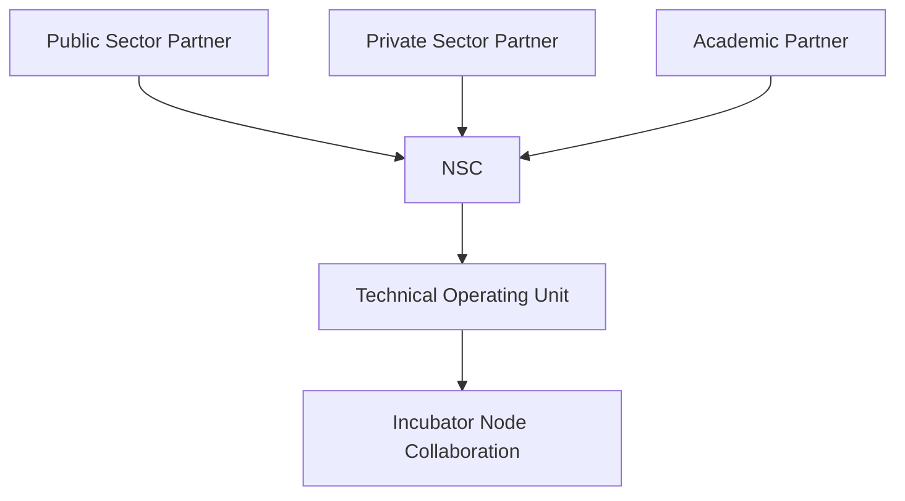

# Annex 05  -  Public–Private Partnership (PPP)  
## Memorandum of Understanding (MOU) Template

---

# **1. Purpose of the MOU**

This **Memorandum of Understanding (MOU)** establishes the terms of collaboration between **public**, **private**, and **academic** institutions participating in the **National Public–Private Incubator Network** under the **Vigía Incubation Framework (VIF)**.

The MOU defines:
- Roles and responsibilities  
- Governance alignment  
- Reporting obligations  
- Funding and participation parameters  
- Compliance and transparency rules  

This template is adaptable for bilateral or multilateral agreements.

---

# **2. Parties to the MOU**

This MOU is entered into by:

| Party | Type | Represented By | Role in Network |
|-------|------|----------------|-----------------|
| Government Institution | Public | Name, Title | Policy, governance, funding oversight |
| Private Company / VC | Private | Name, Title | Co-investment, mentorship, commercialization |
| University / Research Center | Academic | Name, Title | Talent pipeline, research commercialization |
| Incubator / Accelerator | Network Node | Name, Title | Program delivery, reporting |

Additional parties may be incorporated through annexes.

---

# **3. Shared Vision**

All parties commit to advancing:
- National entrepreneurship  
- Innovation maturity  
- Economic diversification  
- Public–private collaboration  
- Long-term competitiveness  
- Sector prioritization ([Vigía Futura](https://www.doulab.net/vigia-futura))  
- Evidence-based operations ([MCF 2.1](https://www.themicrocanvas.com))  

---

# **4. Scope of Collaboration**

The parties agree to collaborate in the following areas:

## **4.1 Programmatic Collaboration**
- Startup incubation and acceleration  
- Mentor and expert participation  
- Talent development programs  
- Soft-landing and internationalization  

## **4.2 Investment & Capital**
- Participation in public–private co-investment mechanisms  
- Access to National Innovation Fund programs  
- Provision of private capital, sponsorships, or services  

## **4.3 Research & Commercialization**
- Joint R&D initiatives  
- Technology transfer  
- IP collaboration opportunities  

## **4.4 Data & Reporting**
- Use of standardized KPI frameworks  
- Evidence documentation using MCF templates  
- Quarterly reporting to TOU  

---

# **5. Governance & Decision-Making**

Parties agree to follow the governance structure defined in:
- **Annex 01  -  NSC Terms of Reference**  
- **Annex 02  -  TOU Operating Manual**  
- **Annex 03  -  Investment Committee Framework**  

## **5.1 Governance Diagram**

:::info Mermaid Diagram

:::

---

# **6. Roles & Responsibilities**

## **6.1 Public Sector Partner Responsibilities**

| Area | Responsibilities |
|-------|------------------|
| Governance | Participate in NSC, provide policy alignment |
| Funding | Support public funding mechanisms |
| Coordination | Facilitate links across institutions |
| Transparency | Ensure compliance with reporting laws |

---

## **6.2 Private Sector Partner Responsibilities**

| Area | Responsibilities |
|------|------------------|
| Investment | Provide co-investment or sponsorship |
| Mentorship | Participate in mentorship and advisory programs |
| Market Access | Facilitate pilot programs and industry pathways |
| Scaling | Support internationalization of startups |

---

## **6.3 Academic Partner Responsibilities**

| Area | Responsibilities |
|-------|------------------|
| Talent Pipeline | Provide training and academic support |
| Research | Enable research-to-startup transfer |
| Infrastructure | Provide labs and research assets |
| Collaboration | Participate in sector studies ([Vigía Futura](https://www.doulab.net/vigia-futura)) |

---

## **6.4 Incubator/Accelerator Responsibilities**

| Area | Responsibilities |
|-------|------------------|
| Program Delivery | Implement incubation and acceleration |
| Reporting | Submit quarterly reports to TOU |
| Evidence | Use [MCF 2.1](https://www.themicrocanvas.com) templates |
| Compliance | Adhere to SOPs and quality standards |

---

# **7. Information Sharing & Data Governance**

The parties agree to comply with:
- National data protection laws  
- GDPR-equivalent frameworks (if applicable)  
- Ethical AI and digital governance standards  

## **7.1 Data Handling Table**

| Data Type | Owner | Access | Usage |
|-----------|--------|--------|--------|
| Startup KPIs | Incubator | TOU | National dashboard |
| Financial Reports | Startup | IC, NSC | Investment decisions |
| Research Data | University | Partners | Commercialization |
| Sector Signals | [Vigía Futura](https://www.doulab.net/vigia-futura) | National Network | Prioritization |

---

# **8. Funding Commitments**

Funding commitments are optional and negotiated per MOU.

| Party | Type of Contribution | Amount/Value | Frequency |
|--------|------------------------|----------------|------------|
| Public Sector | Grants, funding | TBD | Annual |
| Private Sector | Co-investment, sponsorship | TBD | Per cohort |
| University | In-kind resources | TBD | Continuous |
| Incubator | Facilities, staff | TBD | Continuous |

---

# **9. Duration & Renewal**

- Standard MOU duration: **3–5 years**  
- Renewal: automatic with mutual consent  
- Early termination requires **90 days’ notice**  

---

# **10. Amendments**

Amendments may be made:
- Through written agreement  
- Based on NSC recommendations  
- After regulatory changes  
- Following annual foresight updates  

---

# **11. Dispute Resolution**

Parties agree to resolve disputes through:

1. Mediation facilitated by the NSC  
2. If unresolved: arbitration under national law  
3. Only then: competent national courts  

---

# **12. Signatures**

**Public Sector Partner**  
Name, Title  
Institution  
Signature: ______________________  
Date: ___ / ___ / _____

**Private Sector Partner**  
Name, Title  
Organization  
Signature: ______________________  
Date: ___ / ___ / _____

**Academic Partner**  
Name, Title  
Organization  
Signature: ______________________  
Date: ___ / ___ / _____

**Incubator Node (Optional)**  
Name, Title  
Organization  
Signature: ______________________  
Date: ___ / ___ / _____

---

# **13. Outputs of Annex 05**

This annex provides:
- A complete, ready-to-use MOU for public–private–academic collaboration  
- Tables, diagrams, and structured sections for clarity  
- Adaptable templates for funding, roles, governance, and reporting  
- A unifying agreement model for all actors in the national incubator network

## © Copyright

© 2025 [Doulab](https://doulab.net). All rights reserved.  
[MicroCanvas®](https://www.themicrocanvas.com) Framework and [IMM-P®](https://www.doulab.net/services/innovation-maturity) Program are registered marks of [Doulab](https://doulab.net).  
Licensed under the [Creative Commons Attribution 4.0 International License](../LICENSE.md).
