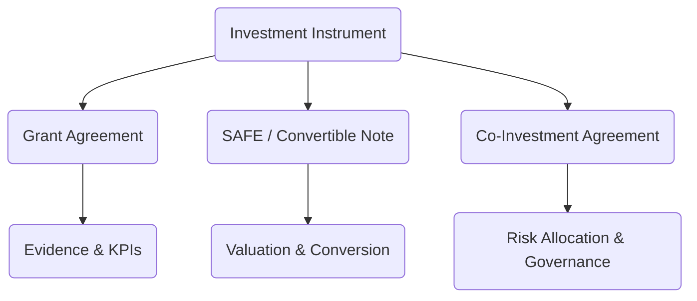

# Annex 06  -  Investment Agreements  
## Templates for Grants, SAFE/Convertible Notes & Co‑Investment  
### Vigía Incubation Framework (VIF)  
**National Public–Private Incubator Network Guide  -  Version 1.0**

---

# **1. Introduction**

This annex provides the standardized **investment agreement templates** used within the **Vigía Incubation Framework (VIF)**.  
These templates ensure that all investment-related instruments:

- follow evidence and maturity standards (MCF 2.1, IMM-P®),  
- comply with governance (NSC, TOU, IC),  
- maintain auditability and transparency,  
- respect conflict‑of‑interest and compliance rules,  
- integrate with national co‑investment and funding mechanisms,  
- are legally adaptable for public and private sectors.

This annex includes the three approved investment instruments:

1. **Grant Agreement (Non‑Equity, Evidence-Based Tranches)**
2. **SAFE / Convertible Note Agreement (Equity-Linked Early-Stage Instrument)**
3. **Co-Investment Agreement (Government + Private Investors)**

These templates support **Section 05  -  Funding Model**, **Annex 03  -  IC**, and **Section 10  -  Templates**.

---

# **2. How to Use This Annex**

This annex defines the **minimum required structure** for all investment agreements in VIF.

### **Mandatory Components (Not Negotiable)**
- Evidence validation via MCF 2.1  
- Maturity alignment (IMM-P® minimum thresholds)  
- TOU evidence checks  
- IC investment authority  
- KPI reporting obligations  
- Auditability and compliance  
- Conflict‑of‑interest rules  
- Prohibition on political interference  

### **Adaptable Components**
- Valuation caps  
- Tranche size  
- Co-investor structure  
- Repayment terms (if required by local law)  
- Governing law and jurisdiction  

### **Prohibited Modifications**
Countries may **NOT** change:
- IC independence  
- Evidence standards  
- Maturity thresholds  
- Required documentation  
- Risk disclosure obligations  

---

# **3. Investment Agreement Architecture**

:::info Mermaid Diagram

:::

---

# **4. Evidence & Maturity Preconditions (All Instruments)**

Before any investment is approved:

## **4.1 Evidence Requirements (MCF 2.1)**  
The startup must provide:

- validated problem evidence  
- validated customer evidence  
- validated solution feasibility  
- validated business model assumptions  
- experiment logs  
- learning insights  
- risk mitigation plans  

## **4.2 Maturity Requirements (IMM-P®)**  
Minimum thresholds:

| Stage | Minimum IMM-P® Score | Description |
|-------|-----------------------|-------------|
| Pre-Seed Grant | 1.5 | Basic evidence validated |
| Validation Tranche | 2.0 | Repeatable evidence & learning |
| Scaling Capital | 2.5–3.0 | Operational consistency |
| Expansion Capital | 3.0+ | Institutional readiness |

No investment may proceed without TOU evidence verification and IC approval.

---

# **5. Template 1  -  Grant Agreement**  
(Non‑Equity, Tranche‑Based Funding)

---

## **5.1 Purpose**

The Grant Agreement establishes non‑equity, milestone‑linked financial support for early-stage startups.

## **5.2 Structure**

| Component | Requirement |
|-----------|-------------|
| Type | Non‑equity financial support |
| Governance | IC approval + TOU verification |
| Disbursement | Evidence-based tranches |
| Reporting | KPI monthly + evidence logs |
| Audits | Mandatory |
| Repayment | Only in cases of fraud or misuse |

---

## **5.3 Core Clauses**

### **Article 1  -  Parties**
- Granting Authority (government/public entity)  
- Recipient Startup  

### **Article 2  -  Grant Amount & Tranches**
- Total Amount  
- Tranche Structure  
- Required Evidence For Each Tranche  

### **Article 3  -  Reporting Obligations**
- Monthly KPI report  
- Quarterly IC readiness update  
- Full evidence logs  

### **Article 4  -  Compliance**
- Data accuracy  
- Fund usage rules  
- Audit cooperation  

### **Article 5  -  Misuse & Remedies**
- Repayment triggered by:  
  - fraud,  
  - falsified evidence,  
  - non‑compliance.  

### **Article 6  -  Termination**
- For breach or termination of participation.

---

# **6. Template 2  -  SAFE / Convertible Note Agreement**  
(Equity-Linked Early-Stage Instrument)

---

## **6.1 Purpose**

A standardized early-stage financing instrument used by public and private investors under VIF.

## **6.2 Structure**

| Component | Requirement |
|----------|------------|
| Type | SAFE or Convertible Note |
| Equity | Converts at priced round or trigger event |
| Governance | IC approval |
| Evidence | Required for each tranche |
| Valuation Cap | Adaptable |
| Discounts | Allowed |

---

## **6.3 Core Clauses**

### **Article 1  -  Parties**  
- Investor (public or private)  
- Startup  

### **Article 2  -  Investment Amount**

### **Article 3  -  Conversion Triggers**
- Equity financing  
- Change of control  
- Expiration date (if convertible note)

### **Article 4  -  Valuation Cap & Discount**

### **Article 5  -  IC & TOU Governance Binding**
Conversion validity requires:

- evidence integrity  
- maturity compliance  
- IC approval  

### **Article 6  -  Representations & Warranties**

### **Article 7  -  Risk Disclosures**

### **Article 8  -  Termination**

---

# **7. Template 3  -  Co‑Investment Agreement**  
(Government + Private Investors)

---

## **7.1 Purpose**

Defines the financial relationship between:

- government innovation authority,  
- private-sector investors,  
- participating startups.

---

## **7.2 Structure**

| Component | Requirement |
|-----------|-------------|
| Type | Direct co‑investment |
| Governance | IC approval mandatory |
| Evidence | MCF 2.1 compliance |
| Maturity | IMM-P® compliance |
| Risk Allocation | Shared + disclosed |
| Reporting | Full transparency |

---

## **7.3 Core Clauses**

### **Article 1  -  Parties**  
- Government Investor  
- Private Investor(s)  
- Startup  

### **Article 2  -  Investment Amounts & Ratios**

### **Article 3  -  Risk Allocation**
Includes:  
- operational risk,  
- market risk,  
- financial risk,  
- compliance risk,  
- data risk,  
- fraud risk.

### **Article 4  -  Governance Alignment**
All investments are bound by:  
- IC independence  
- TOU evidence checks  
- MCF 2.1  
- IMM-P®  

### **Article 5  -  Reporting Obligations**
- KPI sharing  
- financial reports  
- audits  

### **Article 6  -  Exit & Liquidation**

---

# **8. Localization Guidance**

Countries may adapt:

- valuation caps,  
- repayment/interest rules (if legally required),  
- formats for co‑investment,  
- governing law and jurisdiction.

Countries may NOT modify:

- evidence requirements,  
- maturity alignment,  
- IC independence,  
- compliance and COI rules.

---

# **9. Reference Snapshot**

Primary Doulab frameworks:

- **MicroCanvas® Framework 2.1**  -  https://www.themicrocanvas.com  
- **Innovation Maturity Model Program (IMM-P®)**  -  https://www.doulab.net/services/innovation-maturity  
- **Vigía Futura**  -  https://www.doulab.net/vigia-futura  

External influences:

- OECD Public Governance Principles  
- World Bank GovTech Maturity Index  
- OECD Strategic Foresight Toolkit  
- WIPO Global Innovation Index  

See **11-references.md** for the full bibliography.

---

# **10. Licensing**

This annex is licensed under the **Creative Commons Attribution 4.0 International License (CC BY 4.0)**.  
See: **../LICENSE.md**  

MicroCanvas®, IMM-P® and VIF are **proprietary methodologies of Doulab**.
