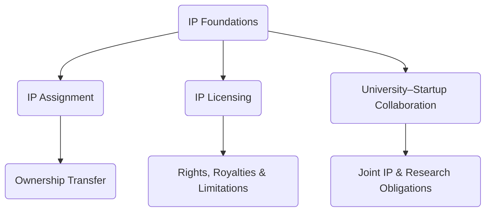

# Annex 08  -  Intellectual Property (IP) Agreements  
## IP Ownership, Licensing, Assignment & University–Startup Collaboration  
### Vigía Incubation Framework (VIF)  
**National Public–Private Incubator Network Guide  -  Version 1.0**

---

# **1. Introduction**

This annex defines the **Intellectual Property (IP) governance framework** required for participants in the **Vigía Incubation Framework (VIF)**, including:

- startups,  
- incubator nodes,  
- universities and research institutions,  
- public-sector innovation agencies,  
- private investors and co-investors,  
- mentors and evaluators.

The purpose of this annex is to ensure that all IP created, used, transferred, or licensed within the national incubation network is:

- legally protected,  
- allocated fairly,  
- transparently documented,  
- fully auditable,  
- compliant with national IP laws,  
- aligned with evidence standards (MCF 2.1),  
- aligned with maturity progression rules (IMM-P®),  
- consistent with governance (NSC, TOU, IC) and compliance (Annex 07).

This annex provides three standardized templates:

1. **IP Assignment Agreement**  
2. **IP Licensing Agreement**  
3. **University–Startup Collaboration Agreement**

---

# **2. How to Use This Annex**

### **2.1 Mandatory Components (Not Negotiable)**  
All IP agreements must include:

- conflict‑of‑interest declarations,  
- transparency and audit requirements,  
- documentation aligned with MCF 2.1,  
- maturity consistency aligned with IMM-P®,  
- IC independence (investment decisions cannot be influenced by IP transfers),  
- compliance with national IP laws,  
- data privacy rules (Annex 07),  
- evidence traceability requirements,  
- national security or export control considerations (if applicable).

### **2.2 Adaptable Components**  
Countries may localize:

- governing law,  
- jurisdiction,  
- IP registration bodies,  
- royalty rates,  
- revenue-sharing formulas,  
- university R&D policies,  
- licensing durations and financial terms.

### **2.3 Prohibited Modifications**  
Countries **may NOT**:

- weaken evidence integrity requirements,  
- bypass TOU compliance processes,  
- undermine IC independence,  
- obscure ownership structures,  
- eliminate auditability or data retention rules.

---

# **3. IP Architecture Diagram**

:::info Mermaid Diagram

:::

---

# **4. Template 1  -  IP Assignment Agreement**

### **4.1 Purpose**  
Transfers full ownership of specified IP from one party (Assignor) to another (Assignee).

### **4.2 Structure**

| Section | Requirement |
|--------|-------------|
| Identified IP | Clear definition of what IP is being assigned |
| Ownership Transfer | Full transfer of rights, title, and interest |
| Representations | Assignor must prove ownership |
| Warranties | No liens, disputes, or encumbrances |
| Evidence Compliance | IP must align with MCF 2.1 documentation |
| Maturity Compliance | IP must reflect IMM-P® assessed capability |
| Confidentiality | Required for all parties |
| Audit Rights | Mandatory under VIF |
| Governing Law | Localized |

---

## **4.3 Core Clauses**

### **Article 1  -  Parties**  
Assignor → Startup / Researcher / Entity  
Assignee → Startup / Innovation Authority / Investor

### **Article 2  -  Description of Assigned IP**

### **Article 3  -  Transfer of Ownership**  
The Assignor permanently transfers:

- all rights,  
- all title,  
- all interest,  
- all derivative works,  
- all associated registrations.

### **Article 4  -  Representations & Warranties**

### **Article 5  -  Confidentiality**

### **Article 6  -  Evidence & Documentation Requirements**  
Assignor must deliver:

- experiment logs,  
- validation data (MCF 2.1),  
- maturity-related documentation (IMM-P®),  
- development history,  
- existing licensing obligations.

### **Article 7  -  Audit & Compliance**

### **Article 8  -  Governing Law**

---

# **5. Template 2  -  IP Licensing Agreement**

### **5.1 Purpose**  
Allows one party (Licensor) to grant another (Licensee) the right to use IP under defined conditions.

### **5.2 Structure**

| Section | Requirement |
|--------|-------------|
| Grant of Rights | Exclusive/non-exclusive use defined clearly |
| Financial Terms | Royalties or lump-sum payments |
| Field of Use | Allowed and restricted application areas |
| Duration | Localized |
| Evidence Integrity | IP must be linked to traceable MCF 2.1 logs |
| Sub‑Licensing | Rules must be explicit |
| Restrictions | No illegal or unethical use |
| Revocation | Clear termination scenarios |

---

## **5.3 Core Clauses**

### **Article 1  -  Parties**

### **Article 2  -  Licensed IP Description**

### **Article 3  -  Grant of License**  
Defines:

- exclusive or non-exclusive rights,  
- geographic scope,  
- field of use,  
- limitations.

### **Article 4  -  Financial Terms (Royalties)**

### **Article 5  -  Evidence & Attribution Requirements**

### **Article 6  -  Data, Privacy & Compliance (Annex 07)**

### **Article 7  -  Confidentiality, Audit, and Reporting**

### **Article 8  -  Termination**

---

# **6. Template 3  -  University–Startup Collaboration Agreement**

### **6.1 Purpose**  
Defines IP ownership, research obligations, rights of use, and commercialization pathways for collaborations involving:

- universities,  
- public research centers,  
- startup teams,  
- spin-offs.

### **6.2 Structure**

| Section | Requirement |
|--------|-------------|
| Background IP | Ownership before collaboration |
| Foreground IP | Ownership resulting from collaboration |
| Joint IP | Rules for shared ownership |
| Revenue-Sharing | Required transparency |
| Publication | Embargo period (recommended: 6–12 months) |
| Safety & Lab Use | Mandatory |
| Data Governance | Must follow Annex 07 |
| Evidence Traceability | Must follow MCF 2.1 |

---

## **6.3 Core Clauses**

### **Article 1  -  Parties**  
University, Startup, Researchers, and any affiliated Labs.

### **Article 2  -  Background IP Disclosure**

### **Article 3  -  Foreground & Joint IP Rules**

### **Article 4  -  Revenue-Sharing Agreement**

### **Article 5  -  Use of Facilities and Research Infrastructure**

### **Article 6  -  Academic Publications & Embargoes**

### **Article 7  -  Data, Privacy & Security (Annex 07)**

### **Article 8  -  Compliance, Audit & Dispute Resolution**

---

# **7. Localization Guidance**

Countries must adapt:

- legal terminology,  
- national IP registry references,  
- royalty/financial rules,  
- publication rights frameworks,  
- technology transfer regulations.

Countries may NOT modify:

- evidence or maturity requirements,  
- auditability rules,  
- governance boundaries (NSC–TOU–IC),  
- IP-related COI requirements.

---

# **8. Reference Snapshot**

Primary Doulab frameworks:

- **MicroCanvas® Framework 2.1**  -  https://www.themicrocanvas.com  
- **Innovation Maturity Model Program (IMM-P®)**  -  https://www.doulab.net/services/innovation-maturity  
- **Vigía Futura**  -  https://www.doulab.net/vigia-futura  

External influences (non-primary):

- WIPO IP Governance Standards  
- OECD IP & Knowledge Transfer Guidelines  
- OECD Public Governance Principles  
- GDPR (for data-linked IP)  

Full bibliography available in **11-references.md**.

---

# **9. Licensing**

This annex is licensed under the **Creative Commons Attribution 4.0 International License (CC BY 4.0)**.  
See: **[LICENSE.md](../LICENSE.md)**  

MicroCanvas®, IMM-P® and VIF are **proprietary methodologies of Doulab**.
