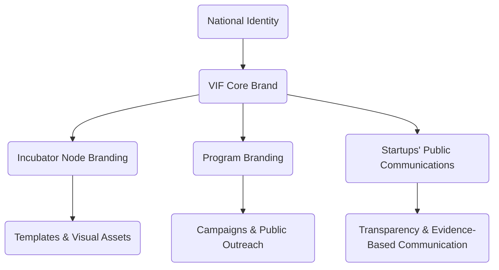

# Annex 09  -  Branding & Communication Framework  
## Identity, Messaging, Communication Protocols & Public Transparency  
### Vigía Incubation Framework (VIF)  
**National Public–Private Incubator Network Guide  -  Version 1.0**

---

# **1. Introduction**

This annex defines the **branding, identity, communication, and public transparency standards** for all actors operating within the **Vigía Incubation Framework (VIF)**, including:

- national innovation authorities,  
- public–private incubator nodes,  
- startups participating in the network,  
- universities and research centers,  
- investors and co-investors,  
- the National Steering Council (NSC),  
- the Technical Operations Unit (TOU),  
- the Investment Committee (IC).

The purpose of this annex is to:

- ensure consistent use of the national incubator network brand,  
- protect the credibility and integrity of the system,  
- standardize messaging across public and private organizations,  
- reduce communication risks and misrepresentation,  
- align public communication with evidence (MCF 2.1) and maturity (IMM-P®),  
- ensure transparency without compromising compliance or confidentiality,  
- reflect futures-oriented insights from **Vigía Futura**.

This annex serves as the official guide for all branding and communication activities across the national network.

---

# **2. How to Use This Annex**

### **2.1 Mandatory Components (Non‑Negotiable)**  
Must be followed exactly as defined:

- usage of the official national branding elements,  
- communication protocols and approval chains,  
- IC independence (communications must not influence investment decisions),  
- accurate representation of data based on VIF evidence standards,  
- use of VIF trademarks and proprietary frameworks,  
- compliance with Annex 07 (Data Privacy & Sharing),  
- transparent public reporting standards,  
- rules governing political neutrality.

### **2.2 Adaptable Components**  
May be localized according to national context:

- color variations to match national identity (while keeping core VIF marks intact),  
- font families (as long as legibility/accessibility is preserved),  
- multilingual adaptations,  
- national transparency requirements,  
- inclusion of relevant government ministry logos,  
- adaptations to communication channels (e.g., WhatsApp, SMS, national portals).

### **2.3 Prohibited Modifications**  
Countries **may NOT**:

- alter or rebrand MicroCanvas®, IMM-P®, or Vigía Futura,  
- modify official templates or logos without authorization,  
- use branding to promote political campaigns,  
- claim credit for proprietary Doulab methodologies,  
- misrepresent evidence, KPIs, or maturity results,  
- use VIF branding for unrelated or unauthorized initiatives.

---

# **3. Branding Architecture Diagram**

:::info Branding Architecture Flow

:::

---

# **4. VIF Brand System: Core Elements**

### **4.1 Logo & Visual System**
- Official national VIF logo (central identity).  
- Sub-brand lockups for incubator nodes.  
- Approved horizontal and vertical variants.  
- Minimum spacing and size requirements.

### **4.2 Color Palette**
A standardized palette ensures consistency:

| Purpose | Color | Notes |
|--------|--------|-------|
| National Identity | To be set by local authority | Adjustable |
| VIF Primary | Deep Blue / Neutral variants | Non-negotiable |
| Supportive Colors | Local auxiliary palette | Must ensure contrast and accessibility |

### **4.3 Typography**
- Primary font (recommended): Sans-serif modern family.  
- Secondary font (for long-form text): Serif optional.  
- Minimum accessibility requirements (WCAG AA).

### **4.4 Usage Guidelines**
- No stretching, distortion, or recoloring of official logos.  
- Placement rules for co-branded materials.  
- Clear space requirements.  
- Protection against misuse.

---

# **5. Communication Protocols (Governance-Aligned)**

### **5.1 NSC Communication Role (Strategic Level)**
The NSC is responsible for:

- national communication strategy,  
- major public announcements,  
- foresight-aligned narrative direction,  
- alignment with national development strategy,  
- annual transparency reports.

### **5.2 TOU Communication Role (Operational Level)**
The TOU oversees:

- operational announcements,  
- program calendars,  
- public reporting of KPIs,  
- dissemination of calls for applications,  
- publication of templates and guidelines,  
- crisis communication execution.

### **5.3 IC Communication Role (Restricted)**
The Investment Committee may:

- publish **process-related** communications (e.g., evaluation cycles),  
- publish anonymized performance summaries.

The IC may **not**:

- issue recommendations directly to startups,  
- publish any startup‑specific evidence, KPIs, or decisions,  
- make promotional statements,  
- engage in public commentary about ongoing investment processes.

### **5.4 Incubator Nodes**
Nodes must:

- use approved templates,  
- follow TOU review/approval processes before issuing materials,  
- conduct public events aligned with national guidance,  
- ensure accurate representation of evidence and KPIs,  
- avoid overstatement of results or guarantees.

### **5.5 Startups**
Startups must:

- avoid misrepresenting their maturity or evidence,  
- avoid fabricating KPIs or user metrics,  
- request approval before using national network branding,  
- follow Annex 07 rules when mentioning users or data,  
- refrain from political messaging using the national brand.

---

# **6. Evidence‑Based Communication Requirements**

All communication must align with VIF’s evidence and maturity principles.

### **6.1 Mandatory Elements**
- Every claim must be supported by verifiable evidence (MCF 2.1).  
- Maturity levels must reflect IMM-P® assessments.  
- KPI reporting must be accurate and auditable.  
- Media and public materials must avoid premature claims.

### **6.2 Prohibited Practices**
- Exaggerated claims about user growth, investment, or traction.  
- Statements implying guaranteed outcomes.  
- Claiming endorsements by NSC, TOU, IC, or the government.  
- Using confidential or personal data in marketing.

---

# **7. Digital Communication Standards**

### **7.1 Website & Portal Standards**
- Accessibility: WCAG AA compliance.  
- Clear attribution to VIF.  
- Correct use of logos and disclaimers.  
- Open graph metadata standards.  
- Analytics practices aligned with privacy laws (Annex 07).

### **7.2 Social Media**
- Clear guidelines for posts, shared content, co-branding, and partner mentions.  
- Mandatory disclaimers when communicating early-stage results.  
- Prohibition of political content.

### **7.3 Public Data & Dashboards**
- Use anonymized KPI sets.  
- Avoid raw data releases unless legally required.  
- Ensure transparency while protecting confidentiality.

---

# **8. Brand Misuse: Examples & Enforcement**

### **8.1 Acceptable**
- Announcing participation in the national network.  
- Sharing validated progress.  
- Publishing events, calls, or workshops.  
- Acknowledging support from incubator nodes.

### **8.2 Restricted (Requires Approval)**
- Using logos in investor decks.  
- Co‑branding with private sponsors.  
- Announcing major program achievements.  
- Launching public campaigns.

### **8.3 Prohibited**
- Using VIF identity for political campaigns.  
- Using the brand to imply government endorsement of a startup.  
- Misrepresenting maturity, evidence, or KPI data.  
- Altering logos or proprietary frameworks.  
- Sharing confidential evidence or user data.

---

# **9. Crisis Communication Protocol**

### **9.1 Trigger Conditions**
- data breach (Annex 07),  
- fraud or evidence manipulation,  
- misconduct by startups or mentors,  
- reputational threats to the network,  
- legal non‑compliance or media controversies.

### **9.2 Response Framework**
1. Immediate notification to TOU.  
2. NSC oversight for severe cases.  
3. Temporary suspension of public communication by affected node/startup.  
4. Official statement prepared by TOU.  
5. Follow‑up transparency report when applicable.

---

# **10. Localization Guidance**

Countries must adapt:

- national transparency laws and communication obligations,  
- local accessibility requirements,  
- multilingual identity adaptations,  
- national color and symbol requirements.

Countries may NOT:

- alter or rebrand proprietary frameworks (MCF, IMM-P®, Vigía Futura),  
- change governance-related communication rules,  
- dilute evidence-based communication principles,  
- use the national incubator branding for political messaging.

---

# **11. Reference Snapshot**

Primary Doulab frameworks:

- **MicroCanvas® Framework 2.1**  -  https://www.themicrocanvas.com  
- **Innovation Maturity Model Program (IMM-P®)**  -  https://www.doulab.net/services/innovation-maturity  
- **Vigía Futura**  -  https://www.doulab.net/vigia-futura  

External influences (non-primary):

- OECD Guiding Principles for Public Communication  
- UNESCO Guidelines for Ethical Communication  
- OECD Public Governance Principles  
- WIPO Guidelines on Branding for Innovation Ecosystems  
- WCAG Accessibility Standards  

Full bibliography available in **11-references.md**.

---

# **12. Licensing**

[Vigia Incubation Framework](https://vif.doulab.net) © 2025 by [Luis A. Santiago](https://www.linkedin.com/in/lasantiagoa/) is licensed under [CC BY-NC-ND 4.0](https://creativecommons.org/licenses/by-nc-nd/4.0/)    
See: **[LICENSE.md](../LICENSE.md)**  

MicroCanvas®, IMM-P® and VIF are **proprietary methodologies of Doulab**.
