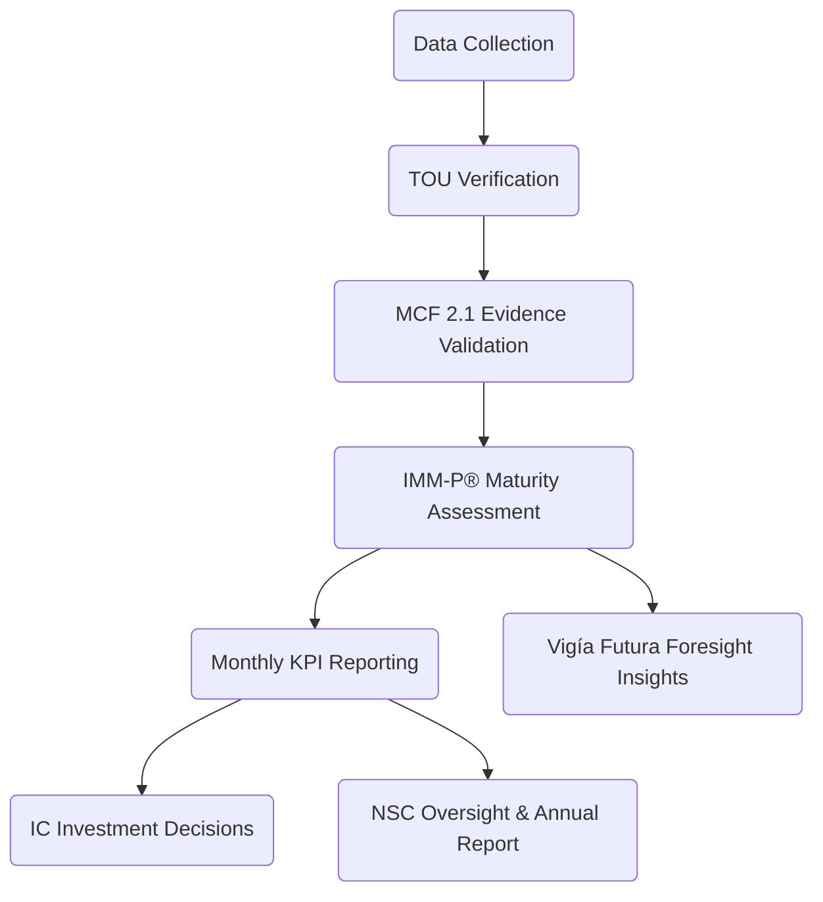

# Annex 10  -  Monitoring, Evaluation & Learning (MEL) Framework  
## Performance Measurement, Evidence Cycles, Continuous Improvement & Public Transparency  
### Vigía Incubation Framework (VIF)  
**National Public–Private Incubator Network Guide  -  Version 1.0**

---

# **1. Introduction**

This annex establishes the **Monitoring, Evaluation, and Learning (MEL)** framework for the **Vigía Incubation Framework (VIF)**. It defines the system through which:

- incubator nodes,  
- startups,  
- universities,  
- investors,  
- government agencies, and  
- governance bodies (NSC, TOU, IC)

generate, validate, interpret, and use data to:

- measure performance,  
- assess evidence quality (MCF 2.1),  
- determine maturity progression (IMM-P®),  
- guide investment decisions,  
- ensure accountability and transparency,  
- identify risks and systemic bottlenecks,  
- improve national innovation policy,  
- inform strategic foresight processes (Vigía Futura).

The MEL framework is a **core pillar** of VIF governance. It ensures decisions are rooted in **valid evidence**, **auditable metrics**, and **continuous learning cycles**.

---

# **2. How to Use This Annex**

### **2.1 Mandatory Components (Not Negotiable)**  
All countries must implement:

- MCF 2.1 as the evidence standard,  
- IMM-P® as the maturity progression model,  
- TOU as the national MEL operator,  
- standardized KPI definitions (Section 07),  
- annual national MEL cycle,  
- conflict-of-interest controls for evaluators,  
- full audit trails of data processing (Annex 07),  
- transparency principles aligned with Annex 09,  
- foresight integration through Vigía Futura.

### **2.2 Adaptable Components (Localized)**  
Countries may adapt:

- additional KPIs required by national law,  
- statistical reporting granularity,  
- publication and transparency requirements,  
- additional ministries/agencies participating,  
- data dashboards and visualization formats,  
- alignment with national planning frameworks.

### **2.3 Prohibited Modifications**  
Countries may NOT:

- alter or replace MCF 2.1,  
- alter or replace IMM-P®,  
- bypass TOU verification processes,  
- grant IC unrestricted access to personal or sensitive data,  
- modify MEL cycle timing without NSC approval,  
- weaken or remove auditability requirements.

---

# **3. MEL Architecture Diagram**

:::info MEL System Flow

:::

---

# **4. MEL Pillars**

## **4.1 Monitoring**
Real-time and periodic tracking of:

- KPIs defined in Section 07,  
- incubation activity,  
- progress against milestones,  
- risk indicators,  
- financial disbursement compliance,  
- participant engagement (mentorship, training, peer learning).

## **4.2 Evaluation**
Formal assessment processes:

- evidence validation (MCF 2.1),  
- maturity scoring (IMM-P®),  
- pre-investment evaluation cycles,  
- post-investment performance evaluation,  
- node accreditation audits,  
- national and regional benchmarking.

## **4.3 Learning**
System-wide learning processes:

- reflective analysis inside nodes,  
- experiment-based learning by startups,  
- capability-building for public and private partners,  
- national and regional learning forums,  
- insight generation for policy improvement,  
- foresight and trend analysis via **Vigía Futura**.

---

# **5. MEL Principles**

### **5.1 Evidence-Based Decision Making**
All decisions must be grounded in:

- validated evidence,  
- experiment logs,  
- user data (where lawful),  
- maturity progression rules.

### **5.2 Transparency & Accountability**
Aligned with Annex 09:

- national-level annual reporting,  
- publication of aggregated insights,  
- public dashboards (with anonymized data),  
- NSC transparency oversight.

### **5.3 Integrity & Auditability**
Aligned with Annex 07:

- full audit trail of all evidence,  
- logging of modifications,  
- reproducible experiments,  
- immutable KPI reporting history.

### **5.4 Conflict of Interest Management**
All MEL actors must:

- declare financial interests annually,  
- recuse when conflicts exist,  
- avoid evaluating startups they mentor or invest in,  
- avoid influencing IC decisions.

### **5.5 Learning Orientation**
MEL is not punitive.  
Learning is formalized through:

- reflection cycles for nodes,  
- national learning events,  
- maturity growth as a system-level KPI.

---

# **6. MEL Indicators (Core Indicators)**

### **6.1 Startup-Level KPIs**
Aligned with Section 07:

- problem validation rate,  
- customer learning cycles completed,  
- solution feasibility outcomes,  
- evidence-to-insight conversion ratio,  
- cost of evidence generation vs. impact,  
- maturity score (IMM-P®),  
- compliance adherence.

### **6.2 Node-Level KPIs**
- node accreditation level,  
- graduation rate of startups,  
- quality of evidence verification,  
- responsiveness to TOU reporting cycles,  
- community engagement metrics.

### **6.3 System-Level KPIs**
- national innovation maturity,  
- performance by geographies or sectors,  
- quality of evidence across nodes,  
- investment readiness rates,  
- insight generation rate,  
- policy-learning outputs.

---

# **7. MEL Reporting Cycle**

### **7.1 Monthly (Nodes → TOU)**
- KPI dashboard updates,  
- evidence logs,  
- experiment outcomes,  
- risk reports.

### **7.2 Quarterly (TOU → NSC)**
- aggregated performance summaries,  
- risk heat maps,  
- compliance flags,  
- maturity progression updates.

### **7.3 Semi-Annual (TOU → IC)**
Restricted-access reports:

- investment readiness,  
- validated evidence summaries,  
- maturity scoring,  
- anonymized risk profiles.

### **7.4 Annual (NSC → Public)**
- national MEL report,  
- public dashboard updates,  
- foresight insights (Vigía Futura),  
- recommended policy adjustments,  
- system-level performance.

---

# **8. Data Requirements & Standards**

### **8.1 Evidence Requirements (MCF 2.1)**
Each startup must provide:

- experiment logs,  
- validation data,  
- prototype documentation,  
- adoption risks,  
- customer segmentation evidence.

### **8.2 Maturity Requirements (IMM-P®)**
Startups must achieve minimum maturity thresholds to:

- access grants,  
- unlock SAFE/convertible investments,  
- move to scaling phases.

### **8.3 Data Privacy & Protection**
Aligned with Annex 07:

- comply with national privacy laws,  
- avoid over-collection,  
- use encryption standards (AES-256 at rest, TLS 1.3 in transit),  
- apply role-based access controls.

### **8.4 Security Standards**
- multi-factor authentication (MFA),  
- endpoint security,  
- annual penetration tests,  
- logging and monitoring requirements.

---

# **9. Foresight Integration (Vigía Futura)**

### **9.1 Purpose**
Incorporating trends and future signals into MEL processes strengthens:

- medium and long-term policy alignment,  
- investment strategy,  
- startup prioritization,  
- risk mitigation,  
- national resilience.

### **9.2 Foresight Data Sources**
- global innovation signals,  
- regional foresight reports,  
- national trend monitoring,  
- scenario-based analyses.

### **9.3 Integration in MEL**
- annual foresight section in national MEL report,  
- alignment between maturity pathways and future readiness,  
- consideration of megatrends in investment decisions.

---

# **10. Localization Guidance**

Countries must adapt:

- legal references to national MEL or evaluation laws,  
- national transparency obligations,  
- data hosting and sovereignty requirements,  
- timelines to align with fiscal cycles,  
- language requirements for public reporting.

Countries may NOT modify:

- evidence rules,  
- maturity progression rules,  
- governance boundaries (NSC–TOU–IC),  
- audit and compliance standards.

---

# **11. Reference Snapshot**

Primary Doulab frameworks:

- **MicroCanvas® Framework 2.1**  -  https://www.themicrocanvas.com  
- **Innovation Maturity Model Program (IMM-P®)**  -  https://www.doulab.net/services/innovation-maturity  
- **Vigía Futura**  -  https://www.doulab.net/vigia-futura  

External influences (non-primary):

- OECD Evaluation Principles  
- OECD Public Governance Principles  
- UNDP Monitoring & Evaluation Guidelines  
- World Bank GovTech Maturity Index  
- OECD Strategic Foresight Toolkit  

Full bibliography available in **11-references.md**.

---

# **12. Licensing**

[Vigia Incubation Framework](https://vif.doulab.net) © 2025 by [Luis A. Santiago](https://www.linkedin.com/in/lasantiagoa/) is licensed under [CC BY-NC-ND 4.0](https://creativecommons.org/licenses/by-nc-nd/4.0/)    
See: **[LICENSE.md](../LICENSE.md)**  

MicroCanvas®, IMM-P® and VIF are **proprietary methodologies of Doulab**.
