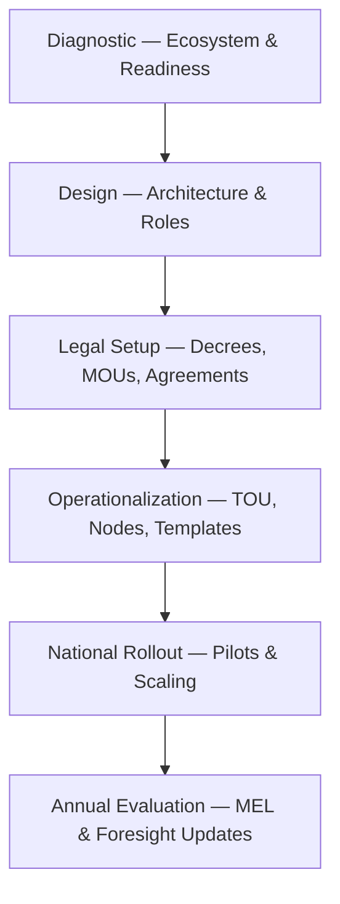

# 00 — Executive Summary  
## Vigía Incubation Framework (VIF)  
**National Public–Private Incubation Network Guide — Version 1.2**

---

# **1. Problem Overview: Why Countries Need a New Incubation Model**

Across Latin America, Europe, and other regions, national innovation ecosystems face five recurring systemic problems:

1. **Fragmented incubation efforts** — Programs operate independently, with no shared standards, metrics, or shared learning.  
2. **Weak evidence-based entrepreneurship** — Startup decisions are rarely validated with structured, repeatable methodologies.  
3. **Low institutional maturity** — Ministries, universities, and incubators often lack unified governance and operational capability.  
4. **Lack of foresight-driven priorities** — National strategies frequently ignore emerging industries and long-term trends.  
5. **Inefficient public–private collaboration** — Incentives are misaligned, and investments follow non-standardized, opaque criteria.

These gaps prevent countries from unlocking their full innovation potential.

---

# **2. Vision: What VIF Enables**

The **Vigía Incubation Framework (VIF)** establishes a **unified, future-ready national incubation system** that:

- Standardizes entrepreneurship development across multiple incubators and regions  
- Improves institutional maturity in public, private, and academic organizations  
- Directs investment into validated, future-aligned ventures  
- Creates a transparent, data-driven innovation ecosystem  
- Enables government, private sector, universities, and investors to collaborate under a shared operating model  

VIF transforms fragmented initiatives into a **coherent national engine for innovation and competitiveness**.

---

# **3. What VIF Is**

VIF is a **national operating system for public–private incubation**, built on three core frameworks developed and maintained by Doulab:

### **• MicroCanvas® Framework 2.1 (MCF 2.1)**  
An evidence-driven venture development framework that structures problem analysis, customer validation, solution definition, and business model evaluation.  
**Primary source:** Doulab — *The MicroCanvas Framework* (https://www.themicrocanvas.com)

### **• Innovation Maturity Model Program (IMM-P®)**  
A maturity and capability model that assesses institutional readiness, governance, and execution capacity across organizations and programs.  
**Primary source:** Doulab — *Innovation Maturity Program (IMM-P®)* (https://www.doulab.net/services/innovation-maturity)

### **• Vigía Futura**  
A strategic foresight and futures observatory that identifies emerging sectors, weak signals, and long-term opportunities, guiding sector prioritization within VIF.  
**Primary source:** Doulab — *Vigía Futura* (https://www.doulab.net/vigia-futura)

These three Doulab frameworks are themselves informed by global practice in:

- evidence-based entrepreneurship,  
- innovation governance and maturity, and  
- strategic foresight and futures studies,  

but remain **original Doulab methodologies** with their own formal definitions and operating logic.

---

# **4. VIF Architecture (High-Level Overview)**

This architecture ensures continuous national learning and adaptive policy-making.

For a full systems diagram and detailed layer breakdown, see **00b – VIF Architecture Diagram**.

---

# **5. Why National Incubator Networks Matter**

Countries that coordinate incubation and early-stage support through national-level platforms tend to achieve:

- Higher startup survival and graduation rates  
- Greater mobilization of public and private investment  
- Stronger links between universities, government, and industry  
- Improved policy coherence and learning  
- Better alignment between innovation initiatives and long-term national strategies  

A national public–private incubation network turns incubation from a set of isolated projects into a **strategic, measurable public capability**.

---

# **6. Core Benefits of VIF**

### **6.1 For Governments**
- Transparent performance tracking via standardized KPIs and MEL  
- Evidence-based policy design and adjustment  
- Stronger national competitiveness and sector diversification  
- Clear governance mechanisms (NSC, TOU, IC) for innovation programs  

### **6.2 For Incubators & Universities**
- Shared tools, templates, and operating standards  
- Training and evaluation aligned with MCF 2.1 and IMM-P®  
- Access to national and co-investment funding mechanisms  
- Stronger, more investable startup pipelines  

### **6.3 For Startups**
- Faster, structured validation cycles  
- Reduced risk and uncertainty when making key decisions  
- Clearer path to investment readiness and co-investment  
- Connection to future-oriented priority sectors identified by Vigía Futura  

### **6.4 For Investors & Financial Partners**
- Evidence-rich, comparable due diligence across startups and incubators  
- Standardized tranching and milestone frameworks  
- Reduced uncertainty through national MEL and governance  
- Clear visibility into sectoral pipelines and national priorities  

---

# **7. Implementation Sequence (Recommended)**

This recommended sequence is compatible with global practice in national innovation policy, but uniquely operationalized through VIF, MCF 2.1, IMM-P®, and Vigía Futura.

---

# **8. Five-Year National Impact Scenario**

If implemented and governed effectively, VIF can enable a typical country to achieve the following trajectory:

### **Years 1–2**
- National diagnostic completed  
- Governance structures (NSC, TOU, IC) established  
- First incubator nodes accredited and aligned with MCF 2.1  
- Initial cohorts of startups supported under shared standards  

### **Years 3–4**
- National dashboard operational, with comparable KPIs across nodes  
- University commercialization routes strengthened  
- Co-investment mechanisms active with public–private partners  
- Foresight-driven sector prioritization influencing program portfolios  

### **Year 5**
- Consolidated sectoral clusters in priority industries  
- Increased local and foreign investment in early-stage ventures  
- Higher institutional maturity in key agencies and nodes (IMM-P® scores)  
- Policy-learning loop functioning annually, informed by MEL and Vigía Futura  

---

# **9. Reading Guide**

To navigate the full VIF documentation:

- For orientation and roles → **00a — How to Use VIF**  
- For the visual system overview → **00b — VIF Architecture Diagram**  
- For terminology and definitions → **00c — Glossary**  
- For legal, governance, and operational details → Sections 02–10 and Annexes 01–10  

---

# **10. Reference Snapshot**

The Vigía Incubation Framework (VIF) is:

- Conceptually grounded in Doulab’s original frameworks:  
  - MicroCanvas® Framework 2.1 — https://www.themicrocanvas.com  
  - Innovation Maturity Model Program (IMM-P®) — https://www.doulab.net/services/innovation-maturity  
  - Vigía Futura — https://www.doulab.net/vigia-futura  

- Informed by global practice in:  
  - Evidence-based entrepreneurship  
  - Innovation governance and public-sector capability  
  - Strategic foresight and futures studies  
  - Startup finance and early-stage investment  

For a full academic and policy bibliography, see **11-references.md**.

---

# **Conclusion**

VIF provides countries with a **comprehensive, evidence-driven, maturity-aware, and future-oriented national incubation system**, integrating:

- Governance and coordination (NSC, TOU, IC)  
- Standardized venture development (MCF 2.1)  
- Institutional capability and maturity (IMM-P®)  
- Strategic foresight and sectoral prioritization (Vigía Futura)  
- Funding and co-investment mechanisms  
- Monitoring, evaluation, and learning (MEL)  

It enables governments and ecosystem actors to accelerate entrepreneurship, strengthen innovation capacity, and position the nation competitively for the coming decade—using a coherent, rigorously defined framework whose primary sources are open and clearly referenced.

