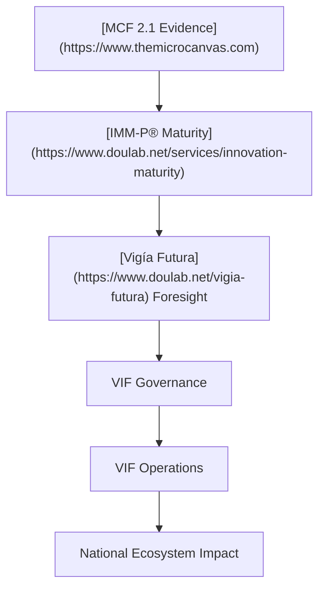

# 00 — Executive Summary  
## Vigía IncubaNet Framework (VIF)  
### National Public–Private Incubator Network Guide

---

# **1. Purpose of the Vigía IncubaNet Framework (VIF)**

The **Vigía IncubaNet Framework (VIF)** provides a complete, operational, and future‑aligned system for designing, launching, and managing any **National Public–Private Incubator Network**.  
It is built on three core methodological pillars:

- **[MicroCanvas Framework 2.1 (MCF 2.1)](https://www.themicrocanvas.com)** — evidence-driven venture development  
- **[Innovation Maturity Model Program (IMM‑P®)](https://www.doulab.net/services/innovation-maturity)** — capability and governance maturity  
- **[Vigía Futura](https://www.doulab.net/vigia-futura)** — strategic foresight and sector prioritization  

VIF integrates these into one unified blueprint that governments, universities, investors, and incubators can adopt to accelerate entrepreneurship, strengthen innovation ecosystems, and increase economic competitiveness.

---

# **2. Why National Incubator Networks Matter**

A structured, multi-institution incubator network:

- Reduces fragmentation across public, private, and academic actors  
- Ensures consistent program quality  
- Increases survival and success rates of startups  
- Strengthens national competitiveness  
- Reduces investment risk through standardized evidence  
- Aligns innovation efforts with long-term economic opportunities  
- Supports job creation and talent development  
- Attracts foreign investment through transparency and governance  

---

# **3. What VIF Enables**

VIF provides governments with an **end-to-end operating system** for national incubation, including:

### **3.1 Governance**
- National Steering Council (NSC)  
- Technical Operating Unit (TOU)  
- Investment Committee (IC)  
- National Innovation Fund alignment  

### **3.2 Operations**
- Standardized program delivery across all incubator nodes  
- Evidence-based venture development  
- Tranche-based funding mechanisms  
- National dashboard and unified KPI system  

### **3.3 Legal & Institutional**
- Decree templates  
- MOUs  
- Investment agreements  
- Data-sharing, IP, and compliance frameworks  

### **3.4 Transparency & Learning**
- National scorecard  
- MEL (Monitoring, Evaluation & Learning) system  
- Foresight-driven sector prioritization  
- Annual reports and public dashboards  

---

# **4. Who This Framework Is For**

VIF is intentionally designed for:

| Stakeholder | Value Provided |
|-------------|----------------|
| **Governments** | National competitiveness, structure, policy alignment |
| **Incubators** | Standardized tools, quality assurance, access to capital |
| **Universities** | Commercialization pathways, IP frameworks |
| **Investors** | Evidence-based due diligence and reduced risk |
| **Startups** | Clear path from idea to investability |
| **International organizations** | Scalable governance and reporting |

---

# **5. Structure of the VIF Documentation**

The complete VIF guide includes:

## **Core Sections (00–10)**  
0. Executive Summary  
1. Introduction  
2. Ecosystem Diagnostic  
3. Network Architecture  
4. Legal & Governance  
5. Funding Model  
6. Benchmarking  
7. KPIs & Scorecard  
8. Roadmap  
9. Governance & Legal  
10. Templates  

## **Annex Set (01–10)**  
Detailed tools including NSC ToR, TOU Manual, IC Framework, Decree Template, PPP MOU, Investment Agreements, Data Governance, IP Agreements, Branding Guide, and MEL Framework.

---

# **6. The VIF Operating Logic**

VIF ensures that programs are:

- Evidence-driven  
- Maturity-aligned  
- Future-oriented  
- Transparent  
- Scalable  

---

# **7. Expected National Outcomes**

By implementing VIF, countries can expect:

### **7.1 Economic Impact**
- Increased startup creation and survival rates  
- Higher levels of investment mobilization  
- Growth of competitive sector clusters  
- Job creation and talent development  

### **7.2 Government Impact**
- Stronger policy coherence  
- Transparent reporting  
- High-quality institutional coordination  
- Reduction of duplicated efforts  

### **7.3 Ecosystem Impact**
- Professionalization of incubators  
- Internationalization of local ventures  
- Increased research commercialization  
- Reduction in risk for early-stage investment  

---

# **8. Why VIF is Unique**

Unlike traditional incubator manuals, VIF is:

- **Modular** (usable in full or in parts)  
- **Evidence-based** ([MCF 2.1](https://www.themicrocanvas.com) at its core)  
- **Foresight-driven** ([Vigía Futura](https://www.doulab.net/vigia-futura))  
- **Maturity-aware** [(IMM-P®)](https://www.doulab.net/services/innovation-maturity)  
- **National-level scalable**  
- **Technology-ready** (Docusaurus, dashboards, OS integration)  

---

# **9. Implementation Path at a Glance**

---

# **10. Conclusion**

This Executive Summary provides a high-level overview of the Vigía IncubaNet Framework (VIF), its logic, and its value.  
The full guide offers a complete, structured, and evidence-based approach to building a **world‑class national network of public–private incubators**.

Countries can adopt VIF as-is or adapt it to their legal, economic, and cultural contexts—achieving consistency, transparency, and long-term impact.

## © Copyright

© 2025 [Doulab](https://doulab.net). All rights reserved.  
[MicroCanvas®](https://www.themicrocanvas.com) Framework and [IMM-P®](https://www.doulab.net/services/innovation-maturity) Program are registered marks of [Doulab](https://doulab.net).  
Licensed under the [Creative Commons Attribution 4.0 International License](LICENSE.md).
