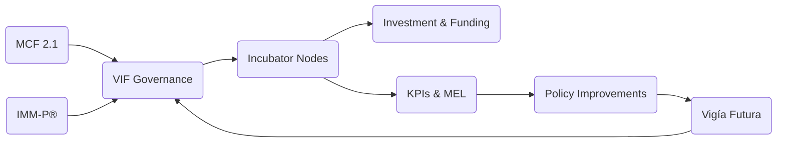

# 00b — VIF Architecture Diagram  
## Visual Overview of the Vigía Incubation Framework  
**Version 1.0 — Vigía Incubation Framework**

---

# **1. Purpose of This Architecture Diagram**

This section provides a **single‑page visual model** of the Vigía Incubation Framework (VIF), showing how:

- Evidence (MCF 2.1)  
- Institutional Maturity (IMM‑P®)  
- Future Prioritization (Vigía Futura)  
- Governance (NSC, TOU, IC)  
- Incubator Nodes  
- Funding  
- MEL  
- Policy  

all work together as one integrated national system.

It is used for:

- Government briefings  
- Investor presentations  
- International partners  
- Workshops & onboarding  
- University and incubator alignment  

---

# **2. High-Level VIF System Diagram**

```mermaid
flowchart TD
    subgraph Inputs["National Inputs & Foundations"]
        A1[MCF 2.1<br/>Evidence Engine]
        A2[IMM‑P®<br/>Institutional Maturity]
        A3[Vigía Futura<br/>Strategic Foresight]
    end

    subgraph Governance["Governance Layer"]
        B1[National Steering Council<br/>(NSC)]
        B2[Technical Operating Unit<br/>(TOU)]
        B3[Investment Committee<br/>(IC)]
    end

    subgraph Operations["Operational Layer"]
        C1[Public Incubator Nodes]
        C2[Private Incubator Nodes]
        C3[University Incubator Nodes]
        C4[International Partners]
    end

    subgraph Capital["Capital & Funding Layer"]
        D1[National Innovation Fund]
        D2[Co‑Investment Mechanisms]
        D3[Tranche‑Based Disbursement]
    end

    subgraph MEL["Monitoring, Evaluation & Learning"]
        E1[KPI System]
        E2[National Dashboard]
        E3[Quarterly Reviews]
        E4[Annual Performance Cycle]
    end

    subgraph PolicyFeedback["Policy Feedback Loop"]
        F1[Annual Sector Updates<br/>via Vigía Futura]
        F2[Evidence‑Driven Policy Adjustments]
    end

    A1 --> B2
    A2 --> B1
    A3 --> B1

    B1 --> B2
    B2 --> B3

    B2 --> C1
    B2 --> C2
    B2 --> C3
    C1 --> D1
    C2 --> D1

    D1 --> B3
    B3 --> D3

    C1 --> E1
    C2 --> E1
    C3 --> E1

    E1 --> E2 --> E4
    E4 --> F1 --> A3
    F2 --> B1
```

---

# **3. Layer-by-Layer Explanation**

## **3.1 Evidence & Foresight Inputs**
These three engines power the entire national system:

| Component | Purpose |
|----------|---------|
| **MCF 2.1** | Standardized venture evidence for all incubators |
| **IMM‑P®** | Maturity scoring for institutions & programs |
| **Vigía Futura** | National future sector prioritization |

---

## **3.2 Governance Layer**

| Body | Function |
|-------|----------|
| **NSC** | National strategy, oversight, and cross-sector alignment |
| **TOU** | Daily execution, coordination, KPIs, MEL, technical backbone |
| **IC** | Investment approvals, risk oversight, tranche decisions |

---

## **3.3 Operational Layer**

All incubators use the same:

- evidence templates  
- reporting standards  
- KPI & MEL rules  
- program criteria  

Nodes can be public, private, academic, or international.

---

## **3.4 Capital & Funding Layer**

Funding is delivered using:

- SAFE / grants / co‑investment  
- National Innovation Fund  
- Tranche‑based milestones  
- Evidence-triggered disbursements  

---

## **3.5 MEL Layer (Monitoring, Evaluation & Learning)**

Includes:

- quarterly KPI reviews  
- national dashboard (public)  
- annual maturity assessments  
- scorecards  

---

## **3.6 Policy Feedback Loop**

The system continuously learns:

- MEL → shows what's working  
- Foresight → shows what's coming  
- Governance → adjusts policies  

This is how VIF creates **adaptive, future‑ready national innovation policy**.

---

# **4. Printable Simplified Diagram**



---

# **5. Recommended Use Cases**

- National presentations  
- Internal onboarding for ministries  
- International donor alignment  
- Website front page  
- Summary slide in pitch decks  
- Visual index in the VIF documentation  

---

# **6. References**

For full citations see **11-references.md**

- OECD (2019) *Innovation Governance Principles*  
- OECD (2020) *Strategic Foresight Toolkit*  
- Etzkowitz & Leydesdorff (1995) *Triple Helix Model*  
- Blank (2013) *Evidence‑Based Entrepreneurship*  
- Mowery (2001) *Technology Transfer*

