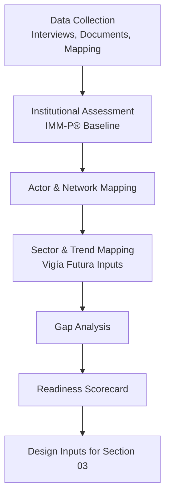

# 02 — Ecosystem Diagnostic  
## Vigía Incubation Framework (VIF)  
**National Public–Private Incubation Network Guide — Version 1.2**

---

# **1. Introduction**

A national public–private incubation network can only succeed if the country fully understands the structure, strengths, weaknesses, capabilities, and limitations of its innovation ecosystem.  
The **Ecosystem Diagnostic** is the foundational step of VIF and determines:

- Whether the country is ready for a unified national incubation system  
- Which institutions should participate as incubator nodes  
- The maturity and capability gaps that need to be addressed  
- Which sectors and regional clusters offer the highest potential  
- The risks and structural constraints the national system must navigate  

This section must be read **before** Sections 03–05, as it provides the analytical foundation for the system architecture, governance model, and funding structure.

For navigation support, see **00a — How to Use VIF**.  
For terminology, see **00c — Glossary**.

---

# **2. Purpose of the Diagnostic**

The diagnostic provides a **structured, evidence-based assessment** of the national innovation ecosystem, helping to answer:

1. What institutions currently exist?  
2. What roles do they play?  
3. How capable are they (based on IMM-P®)?  
4. What gaps must be addressed for a national network to function?  
5. Which sectors show future potential (via Vigía Futura)?  
6. What structural constraints could influence implementation?  

The diagnostic ensures VIF is **adapted to the country’s real context**, not deployed as a generic model.

---

# **3. Diagnostic Framework Overview**

The Ecosystem Diagnostic integrates three Doulab methodologies:

| Framework | What It Contributes | Diagnostic Role |
|----------|----------------------|-----------------|
| **MCF 2.1** | Evidence structure for venture-level insights | Ensures that incubator pipelines are assessed on evidence, not assumptions |
| **IMM-P®** | Capability and governance maturity scoring | Evaluates institutional readiness |
| **Vigía Futura** | Future sector mapping & weak signals | Identifies emerging opportunities |

Together, they produce a **multi-layer national snapshot**.

---

# **4. Diagnostic Process Flow**



---

# **5. Components of the Diagnostic**

## **5.1 Institutional Landscape**
The diagnostic identifies all relevant actors across:

- Public sector (ministries, agencies, municipalities)  
- Academia (universities, research centers)  
- Private incubators & accelerators  
- Corporate innovation programs  
- Venture capital & angel networks  
- NGOs and international partners  

For each actor, the diagnostic defines:

- Mandate  
- Capabilities  
- Program history  
- Operational maturity (IMM-P® baseline)  
- Linkages to other actors  
- Potential role inside VIF  

---

## **5.2 IMM-P® Capability Assessment**
Each institution is assessed across IMM-P® dimensions:

1. Governance  
2. Strategic Alignment  
3. Leadership & Decision-Making  
4. Operational Delivery  
5. Data & Evidence Practices  
6. Service & Program Maturity  
7. Learning & Improvement Processes  

Outputs include:

- A capability heatmap  
- Maturity score (0–5)  
- Priority capabilities to strengthen  

---

## **5.3 Ecosystem Mapping**
This identifies:

- Existing incubators and their program structure  
- Gaps and overlaps  
- Geographic distribution  
- Specialization areas  
- International linkages  
- Policy dependencies  

```
Public Sector → Universities → Private Sector → Investors → Clusters → International Partners
```

This network mapping helps identify **where nodes should be placed** and **how coordination must occur**.

---

## **5.4 Sector & Trend Mapping (Vigía Futura)**
Vigía Futura provides:

- Weak signals  
- Opportunity themes  
- Sector prioritization  
- Cross-sector interactions  
- Futures horizon scanning  
- Early risk identification  

These inputs help determine:

- Which sectors the incubator network should prioritize  
- Which institutions are best positioned to lead them  
- Which capabilities must be developed to compete globally  

---

## **5.5 Gap Analysis**
The diagnostic compares **current state vs. desired future state**, identifying:

- Missing capabilities  
- Underdeveloped institutional roles  
- Structural constraints  
- Funding gaps  
- Data limitations  
- Policy inconsistencies  

Gaps are categorized into:

| Category | Description |
|----------|-------------|
| Structural | Laws, regulations, budget flows |
| Institutional | Capabilities, governance, processes |
| Market | Talent shortages, investment gaps |
| Geographic | Regional imbalances |
| Sectoral | Lack of specialization or research depth |
| Operational | Missing templates, standards, data flows |

---

## **5.6 Readiness Scorecard**
A national readiness score is calculated using:

- IMM-P® maturity baselines  
- Evidence availability (MCF 2.1)  
- Foresight alignment (Vigía Futura)  
- Network mapping  
- Policy and structural constraints  

This produces a **Red / Yellow / Green** readiness assessment for launching the National Public–Private Incubation Network.

---

# **6. Diagnostic Interpretation Guide**

- **Green** → Country is ready for full VIF implementation  
- **Yellow** → VIF should begin with pilots and capability-building  
- **Red** → VIF requires foundational work before national rollout  

This interpretation helps governments decide:

- Timing  
- Resource allocation  
- Governance strategy  
- Required international support  
- Scaling model (centralized vs. decentralized)  

---

# **7. Diagnostic Constraints**
Every diagnostic must acknowledge:

- Limited access to reliable data  
- Varying levels of institutional buy-in  
- Political cycles and leadership changes  
- Geographic disparities  
- Budget constraints  
- Fragmented or outdated regulations  
- Limited adoption of evidence-driven practices  

These constraints shape the implementation model.

---

# **8. Connection to Section 03 — System Architecture**

Section 03 builds directly on this diagnostic by specifying:

- Governance structures (NSC, TOU, IC)  
- Incubator node roles  
- Operational standards  
- Funding mechanisms  
- MEL architecture  
- Policy learning loops  

Without this diagnostic, Section 03 would be theoretical; the diagnostic ensures the architecture is **contextually grounded**.

---

# **9. Reference Snapshot**

Primary Doulab frameworks defining this diagnostic:

- **MicroCanvas® Framework 2.1** — https://www.themicrocanvas.com  
- **Innovation Maturity Model Program (IMM-P®)** — https://www.doulab.net/services/innovation-maturity  
- **Vigía Futura** — https://www.doulab.net/vigia-futura  

For global influences on ecosystem and policy diagnostics, see:

- OECD Innovation Governance  
- WIPO Global Innovation Index  
- OECD Strategic Foresight Toolkit  
- World Bank GovTech Maturity Index  

Full bibliography available in **11-references.md**.

---

# **10. Licensing**

This document is licensed under the **Creative Commons Attribution 4.0 International License (CC BY 4.0)**.  
See: **[LICENSE.md](../LICENSE.md)**

MicroCanvas® and IMM-P® are **proprietary methodologies of Doulab**.

