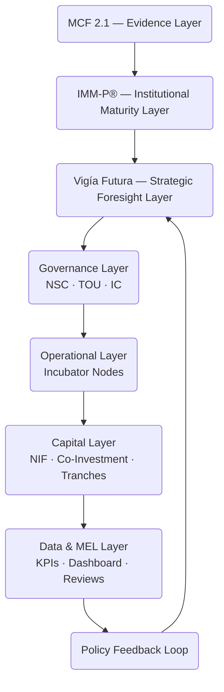

# 03 — System Architecture  
## Vigía Incubation Framework (VIF)  
**National Public–Private Incubation Network Guide — Version 1.2**

---

# **1. Introduction**

The **System Architecture** defines the structural backbone of the Vigía Incubation Framework (VIF).  
It translates the findings of the Ecosystem Diagnostic (Section 02) into:

- governance structures,  
- institutional roles,  
- operational layers,  
- capital flows,  
- data and MEL systems,  
- foresight integration,  
- and national coordination mechanisms.

This section must be read **before** Section 04 — Operating Model, because the operating model activates and operationalizes the architecture defined here.

For navigation support, see **00a – How to Use VIF**.  
For terminology, see **00c – Glossary**.

---

# **2. How to Read This Section**

This section explains *what the national system is*, not *how it operates day-to-day*.

- Section 03 = **Structure**  
- Section 04 = **Processes**  
- Section 05 = **Governance & Capability Requirements**  
- Section 06 = **Funding & Investment**  

---

# **3. Architectural Overview**

VIF architecture integrates the three core Doulab frameworks:

| Framework | Influence on Architecture |
|----------|----------------------------|
| **MCF 2.1** | Defines evidence flow, program modules, and validation stages |
| **IMM-P®** | Defines institutional maturity levels, TOU capability norms, and incubator eligibility |
| **Vigía Futura** | Shapes sector priorities, cluster design, and long-term system adaptivity |

This creates a **multi-layer, future-ready national innovation system**.

---

# **4. High-Level Architecture Diagram**



---

# **5. VIF Architectural Layers**

## **5.1 Strategic Intelligence Layer**
This layer integrates:

- Evidence (MCF 2.1)  
- Maturity insights (IMM-P®)  
- Foresight signals (Vigía Futura)  

It ensures the network is driven by **validated insights and future orientation**.

---

## **5.2 Governance Layer**
Composed of three national bodies:

### **National Steering Council (NSC)**
- Sets national priorities  
- Approves sectoral focus areas  
- Provides political and strategic alignment  
- Ensures cross-institutional collaboration  

### **Technical Operating Unit (TOU)**
- Central coordination and execution body  
- Oversees incubator accreditation  
- Manages MEL, KPIs, and data flows  
- Enforces program standards and templates  

### **Investment Committee (IC)**
- Evaluates startup evidence packages  
- Approves tranche-based investments  
- Applies standardized due‑diligence  
- Ensures investment integrity  

---

## **5.3 Operational Layer (Incubator Nodes)**
Nodes may be:

- Public incubators  
- University incubators  
- Private accelerators  
- Corporate innovation units  
- International partner nodes  

Each node follows:

- MCF 2.1 evidence standards  
- IMM-P® capability requirements  
- VIF program templates and KPIs  
- Central reporting & MEL protocols  

### **Minimum Capability Requirements for Every Node**

| Capability Area | Requirement |
|-----------------|-------------|
| Governance | Clear leadership, decision rights, mandate |
| Data | Ability to submit KPIs + evidence digitally |
| Team | Operational lead + MCF‑trained coach |
| Programs | Ability to deliver standardized modules |
| Compliance | Legal, privacy, ethics readiness |
| Infrastructure | Minimum physical/digital capacity |

---

## **5.4 Capital & Funding Layer**

Funding flows follow four principles:

1. **Transparency**  
2. **Evidence-driven decision making**  
3. **Risk-managed capital allocation**  
4. **Tranche-based disbursement tied to milestones**

Mechanisms include:

- National Innovation Fund  
- Public–private co-investment  
- SAFE-based early-stage instruments  
- Grant-based capacity-building funds  

### **Capital Safety & Integrity Measures**

- Standard fiduciary rules  
- Anti‑corruption safeguards  
- Evidence‑based investment memos  
- Third‑party auditing  
- Transparent tranche decisions  
- Full digital traceability  

---

## **5.5 Data, KPIs & MEL Layer**
This layer ensures national visibility and accountability.

Components include:

- Startup KPIs  
- Incubator KPIs  
- National dashboard  
- Learning cycles  
- Annual capability reviews  
- Policy insights  

Outputs feed into the **Policy Feedback Loop**, enabling yearly system adjustment.

---

## **5.6 Sector Tracks & Clusters**
Sector tracks are defined using **Vigía Futura** insights:

- Weak signal mapping  
- Opportunity windows  
- Horizon scanning  
- Emerging sector portfolios  

Examples of sector tracks (illustrative only):

- GovTech  
- HealthTech  
- FinTech  
- ClimateTech  
- CreativeTech  
- TourismTech  
- AI & Digital Public Infrastructure  

Each track may form **regional clusters** based on:

- academic specialization  
- private‑sector strength  
- demand concentration  
- talent availability  

---

## **5.7 Architectural Variants**

VIF supports multiple national configurations:

### **Variant 1 — Centralized**
One national hub, all programs coordinated centrally.

### **Variant 2 — Hub-and-Spoke**
Core TOU with regional incubator nodes.

### **Variant 3 — Polycentric / Distributed**
Multiple regional hubs interacting across a shared national backbone (best for large or federal countries).

Variant selection is determined by the diagnostic (Section 02).

---

## **5.8 System Dynamics**
The architecture forms a closed-loop system:

```
Evidence → Capability → Foresight → Governance → Programs → Capital → MEL → Policy → (back to Foresight)
```

This ensures continuous adaptation and national learning.

---

# **6. Connection to Section 04 — Operating Model**

Section 04 translates this architecture into:

- daily operations  
- workflows  
- processes  
- data flows  
- accreditation rules  
- program delivery standards  

Architecture = **what the system is**  
Operating Model = **how the system works**

---

# **7. Reference Snapshot**

Primary Doulab frameworks informing the architecture:

- **MicroCanvas® Framework 2.1** — https://www.themicrocanvas.com  
- **Innovation Maturity Model Program (IMM-P®)** — https://www.doulab.net/services/innovation-maturity  
- **Vigía Futura** — https://www.doulab.net/vigia-futura  

External influences (non-primary):

- OECD Public Governance Principles  
- WIPO Global Innovation Index  
- OECD Strategic Foresight Toolkit  
- World Bank GovTech Maturity Index  

See **11-references.md** for full bibliography.

---

# **8. Licensing**

This document is licensed under the **Creative Commons Attribution 4.0 International License (CC BY 4.0)**.  
See: **[LICENSE.md](../LICENSE.md)**  

MicroCanvas® and IMM-P® are **proprietary methodologies of Doulab**.

