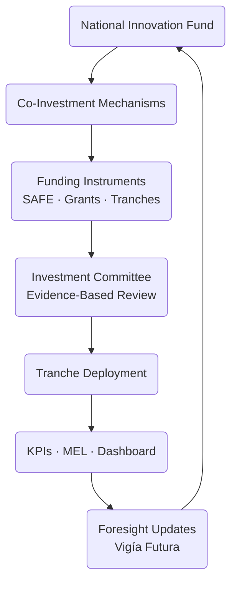
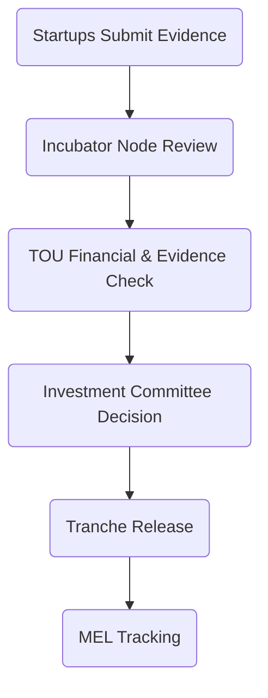

# 05 — Funding Model  
## Vigía Incubation Framework (VIF)  
**National Public–Private Incubation Network Guide — Version 1.2**

---

# **1. Introduction**

The **Funding Model** defines how capital flows through the Vigía Incubation Framework (VIF).  
It operationalizes the financial mechanisms needed to support:

- early‑stage validation,  
- national incubation and acceleration programs,  
- capability‑building for incubator nodes,  
- investment readiness,  
- co‑investment,  
- tranche‑based startup financing, and  
- long‑term sustainability of the national network.

This section must be read **after Section 03 — System Architecture** and **Section 04 — Operating Model**, as it builds on the governance structures, investment processes, evidence practices, and MEL systems defined there.

For navigation support, see **00a — How to Use VIF**.  
For terminology, see **00c — Glossary**.

---

# **2. How to Read This Section**

This section explains:

- how national capital is structured,  
- how it moves through VIF,  
- how decisions are made,  
- how risk is controlled, and  
- how public–private investment becomes sustainable.

It should be used by:

- Ministries and public-sector funding agencies  
- Private investors and co‑investment partners  
- Incubator node operators  
- TOU financial and compliance teams  
- Government budget planners  
- International donors and development partners  

Sections that depend on this one:

- **Section 06 — Governance & Capability Requirements**  
- **Section 07 — KPIs & MEL**  
- **Section 08 — Roadmap & Phasing**  
- **Annex 06 — Investment Instruments**

---

# **3. High-Level Funding Architecture**

The VIF Funding Model is based on **five financial pillars**:

1. **National Innovation Fund (NIF)**  
2. **Public–Private Co‑Investment Mechanisms**  
3. **Tranche-Based Disbursement (Evidence-Driven)**  
4. **Capacity-Building Funding for Nodes (IMM-P®)**  
5. **Reinvestment & Sustainability Loop**

---

# **4. Funding Architecture Diagram**

This cycle ensures that capital allocation remains:

- transparent,  
- evidence‑driven,  
- risk‑managed, and  
- strategically aligned with evolving national priorities.

---

# **5. Funding Principles**

## **5.1 Evidence Before Capital**
No funds are released unless:

- the startup delivers an **MCF 2.1 evidence package**, and  
- the incubator node meets **IMM-P® capability requirements**.

## **5.2 Public–Private Symmetry**
Public and private investors follow:

- the same due diligence templates,  
- the same definitions of readiness, and  
- the same tranche milestones.

## **5.3 Transparency & Digital Traceability**
All funding processes must be fully logged within the VIF digital ecosystem.

## **5.4 Sustainable Multi-Year Budgeting**
NIF is structured for multi‑year stability, with buffers for uncertainty.

## **5.5 Risk‑Managed Investment**
Funding decisions must incorporate:

- maturity scores (IMM-P®),  
- risk diagnostics,  
- evidence quality,  
- team capability, and  
- foresight alignment.

---

# **6. National Innovation Fund (NIF)**

The **NIF** is the central financial mechanism of VIF.

## **6.1 Components**
- Annual national budget allocation  
- Public–private matching funds  
- International donor contributions  
- Recycling of SAFE or equity returns  
- University innovation funds (where available)  
- Regional government contributions  

## **6.2 Use of Funds**
Funds can be deployed across:

- startup incubation and acceleration  
- investment-readiness work  
- tranche-based funding  
- capability‑building for incubators  
- network digital infrastructure  
- MEL system maintenance

---

# **7. Public–Private Co‑Investment Mechanisms**

Co‑investment mechanisms enable:

- shared risk,  
- shared due diligence,  
- greater investment scale,  
- and stronger national investment pipelines.

Mechanisms may include:

- matching funds (1:1, 1:2, 1:3)  
- catalytic capital instruments  
- blended finance  
- university–industry co‑funding  
- corporate innovation investment  

All co‑investment partners must follow:

- the same investment maturity criteria (IMM-P®),  
- the same evidence package requirements (MCF 2.1), and  
- the same investment review process (IC).

---

# **8. Tranche-Based Disbursement**

Funding is never released as a lump sum.  
It is structured in **tranches** tied to measurable, evidence‑driven milestones.

### **8.1 Milestone Types**
- Completion of MCF 2.1 evidence phases  
- Customer validation metrics  
- Technical feasibility milestones  
- Regulatory or compliance milestones  
- Commercial milestones  
- Growth and retention metrics  

### **8.2 Tranche Decision Flow**

Tranche requirements are standardized across all nodes.

---

# **9. Funding Instruments**

VIF supports multiple funding instruments, depending on national legislation:

### **9.1 SAFE (Simple Agreement for Future Equity)**
Used when allowed by national regulations.

### **9.2 Grants**
For early‑stage validation or capability-building.

### **9.3 Co‑Investment Agreements**
Formalized between NIF and private investors.

### **9.4 Reimbursable Advances (optional)**
Where country legislation allows.

### **9.5 Sector-Specific Funds**
Aligned with Vigía Futura sector tracks.

---

# **10. Minimum Eligibility Requirements for Funding**

To receive funding through VIF, a startup must:

- be enrolled in an accredited incubator node,  
- have completed a minimum set of **MCF 2.1 evidence components**,  
- demonstrate alignment with priority sectors,  
- meet minimal operational maturity criteria,  
- comply with all data and reporting requirements,  
- have no outstanding compliance issues,  
- submit updated KPIs monthly.

---

# **11. Capital Integrity & Safeguards**

To ensure long-term credibility and risk mitigation, VIF requires:

- anti‑corruption safeguards,  
- conflict of interest policies,  
- third‑party financial audits,  
- digital traceability for all transactions,  
- standardized investment memos,  
- IC decisions logged publicly (summary-only),  
- annual financial transparency reports.

These safeguards ensure national and international trust.

---

# **12. Funding Cycle Map**

This map mirrors the national innovation cycle in Sections 03 and 04.

---

# **13. Sustainability Mechanisms**

Sustainability is fundamental to long-term national innovation strategy.

## **13.1 Reinvestment Loop**
Returns from equity-based instruments (SAFE, equity, royalties) flow back into NIF.

## **13.2 Diaspora Capital Channels**
Diaspora investors may participate through:

- matching schemes,  
- co‑investment vehicles,  
- philanthropic innovation funds.

## **13.3 Multilateral Engagement**
The model supports partnerships with:

- CAF  
- IDB Lab  
- World Bank  
- UNDP  
- EU development programs  

## **13.4 Corporate Innovation Capital**
Corporate partners can sponsor:

- sector tracks,  
- challenges,  
- open innovation cohorts,  
- investment vehicles.

---

# **14. Connection to Section 06 — Governance & Capability Requirements**

Section 06 expands this Funding Model into:

- investment governance rights,  
- IC membership rules,  
- fiduciary roles,  
- node financial compliance requirements,  
- maturity progression (IMM-P®),  
- TOU capacity requirements.

It ensures that the funding architecture is well-governed, auditable, and aligned to national strategy.

---

# **15. Reference Snapshot**

Primary Doulab frameworks informing the Funding Model:

- **MicroCanvas® Framework 2.1** — https://www.themicrocanvas.com  
- **Innovation Maturity Model Program (IMM-P®)** — https://www.doulab.net/services/innovation-maturity  
- **Vigía Futura** — https://www.doulab.net/vigia-futura  

External influences (non-primary):

- OECD Public Governance Principles  
- OECD Strategic Foresight Toolkit  
- WIPO Global Innovation Index  
- World Bank GovTech Maturity Index  

For full bibliography, see **11-references.md**.

---

# **16. Licensing**

This document is licensed under the **Creative Commons Attribution 4.0 International License (CC BY 4.0)**.  
See: **[LICENSE.md](../LICENSE.md)**  

MicroCanvas® and IMM-P® are **proprietary methodologies of Doulab**.

