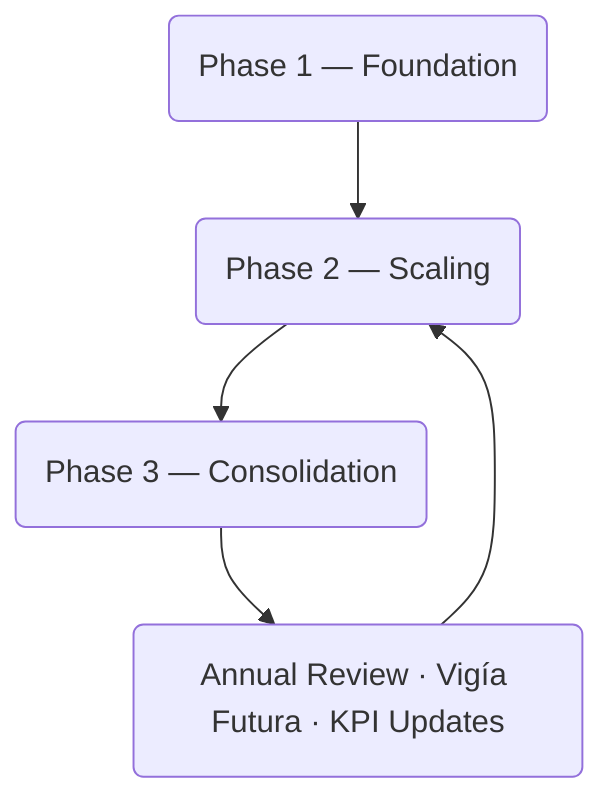

# 08 — Roadmap & Phasing  
## Vigía Incubation Framework (VIF)  
**National Public–Private Incubation Network Guide — Version 1.2**

---

# **1. Introduction**

The **Roadmap & Phasing** section defines how the Vigía Incubation Framework (VIF) is deployed over time.  
Where Sections 03–07 define *what the system is* and *how it functions*, this section defines:

- **when** each component is introduced,  
- **in what order**,  
- **under what constraints**,  
- **with which capabilities**, and  
- **with which dependencies across the system**.

A national incubation network must be deployed **progressively**, not all at once.  
This ensures:

- institutional maturity grows predictably (IMM-P®),  
- programs launch only when evidence standards are in place (MCF 2.1),  
- sector priorities evolve with the future (Vigía Futura),  
- governance and funding structures stabilize before scaling,  
- risk is minimized during early implementation.

---

# **2. How to Read This Section**

This section provides:

- phased national deployment strategy,  
- milestone structure,  
- dependencies across governance, funding, and KPIs,  
- sequencing logic,  
- risk and mitigation strategies,  
- foresight-driven review cycles.

Sections that depend on this one:

- Section 03 — System Architecture  
- Section 04 — Operating Model  
- Section 05 — Funding Model  
- Section 07 — KPIs & Scorecard  
- Section 10 — Templates & Tools  

---

# **3. Roadmap Principles**

The roadmap follows five core principles:

### **3.1 Maturity-Based Progression (IMM-P®)**
Institutions evolve from lower capability levels to higher ones through structured growth.

### **3.2 Evidence-Driven (MCF 2.1)**
Evidence standards dictate when programs can proceed.

### **3.3 Foresight-Aligned (Vigía Futura)**
Sector priorities and national innovation themes evolve based on emerging signals.

### **3.4 Public–Private Symmetry**
All nodes—public or private—advance through the same phases.

### **3.5 Sustainability & Long-Term Governance**
Roadmap phases ensure the system can survive political cycles and funding volatility.

---

# **4. Roadmap Architecture Diagram**

This loop reflects a **continuous evolution cycle**, rather than a one-time deployment.

---

# **5. Phase Structure Overview**

The roadmap is organized into **three phases**:

1. **Phase 1 — Foundation (Months 0–12)**  
   Build structures, governance, KPIs, and digital systems.

2. **Phase 2 — Scaling (Months 12–36)**  
   Accelerate program delivery, expand nodes, increase investment activity.

3. **Phase 3 — Consolidation (Months 36–60)**  
   Achieve national coverage, refine programs, and stabilize the model.

Each phase includes:

- objectives,  
- milestones,  
- risks,  
- dependencies, and  
- KPIs.

---

# **6. Detailed Roadmap**

---

## **6.1 Phase 1 — Foundation (0–12 Months)**

### **Objective**
Establish the structural and operational foundations of VIF.

### **Milestones**
- Formal creation of:
  - National Steering Council (NSC)  
  - Technical Operating Unit (TOU)  
  - Investment Committee (IC)
- National Innovation Fund (NIF) established  
- Digital evidence platform operational  
- First cohort of incubator nodes accredited  
- National KPIs defined (Section 07)  
- Initial sector priorities defined (Vigía Futura)  
- Baseline IMM-P® maturity assessments completed  

### **Dependencies**
- Governance definitions from Section 03  
- Operating model modules from Section 04  
- Funding mechanisms from Section 05  
- KPI definitions from Section 07  

### **KPIs**
- % of governance bodies operational  
- % of nodes accredited  
- Digital system uptime  
- Evidence submission compliance  
- Completion rate of IMM-P® baseline assessments  

### **Risks & Mitigation**
| Risk | Mitigation |
|------|------------|
| Political delays | Early cross-ministry alignment |
| Insufficient node maturity | Capability-building bootcamps |
| Digital system slippage | Phased deployment + testing |
| Funding bottlenecks | Multi-year budgeting + donor alignment |

---

## **6.2 Phase 2 — Scaling (12–36 Months)**

### **Objective**
Expand programs, increase startup throughput, and strengthen investment activity.

### **Milestones**
- Expansion of incubator nodes (regional & sectoral)  
- First national batches of startups graduated  
- Tranche-based investments fully operational  
- National Dashboard launched  
- Second cycle of sector priorities via Vigía Futura  
- Improvement in IMM-P® maturity across nodes  
- Co-investment mechanisms activated  

### **Dependencies**
- Successful completion of Phase 1  
- Digital systems and KPI flow operational  
- Working IC and TOU structures  

### **KPIs**
- Startup graduation rate  
- Tranche approval turnaround time  
- Node performance consistency  
- Co-investment participation rate  
- Maturity progression (IMM-P®)  

### **Risks & Mitigation**
| Risk | Mitigation |
|------|------------|
| Uneven node performance | Standardized program audits |
| Slow investment processes | IC capacity reinforcement |
| Talent shortages | Regional training partnerships |
| Sector misalignment | Vigía Futura horizon review |

---

## **6.3 Phase 3 — Consolidation (36–60 Months)**

### **Objective**
Stabilize the system, optimize programs, and establish international positioning.

### **Milestones**
- National coverage achieved  
- Specialized sector tracks refined  
- Alumni programs established  
- National innovation impact report published  
- International partnerships formalized  
- Return on investment mechanisms functioning  
- Fully functional national foresight loop  

### **Dependencies**
- Fully operational Phase 2  
- Evidence and KPI compliance stabilized  
- Strong TOU operational maturity  

### **KPIs**
- National coverage index  
- Economic impact metrics  
- Internationalization rate  
- Return-on-investment indicators  
- Governance stability metrics  

### **Risks & Mitigation**
| Risk | Mitigation |
|------|------------|
| Funding volatility | Reinvestment loop + multi-year budgeting |
| Loss of political support | Transparent reporting + public dashboards |
| Sector stagnation | Annual foresight cycle updates |
| Over-complexity | Simplification of processes |

---

# **7. Annual Review & Foresight Cycle**

At the end of each year:

1. KPI results are analyzed (Section 07)  
2. Institutional maturity updates occur (IMM-P®)  
3. Sector priorities are refreshed (Vigía Futura)  
4. Investment instruments are adjusted  
5. Governance and processes are refined  

This ensures VIF remains:

- future-aligned,  
- evidence-driven,  
- investment-ready, and  
- resilient across government cycles.

---

# **8. Five-Year National Impact Targets**

By the end of Year 5, typical national goals include:

- ≥ 60% node maturity improvement (IMM-P®)  
- ≥ 70% evidence compliance (MCF 2.1)  
- ≥ 50+ active incubator nodes  
- ≥ 500–1000 supported startups  
- ≥ 20–30% securing follow-on funding  
- ≥ 10–15% generating exports  
- Improved public value indicators (sector-specific)  
- Established diaspora investment channels  

These targets serve as strategic orientation guidelines.

---

# **9. Reference Snapshot**

Primary Doulab frameworks informing the Roadmap:

- **MicroCanvas® Framework 2.1** — https://www.themicrocanvas.com  
- **Innovation Maturity Model Program (IMM-P®)** — https://www.doulab.net/services/innovation-maturity  
- **Vigía Futura** — https://www.doulab.net/vigia-futura  

External influences (non-primary):

- OECD Public Governance Principles  
- OECD Strategic Foresight Toolkit  
- WIPO Global Innovation Index  
- World Bank GovTech Maturity Index  

Full bibliography in **11-references.md**.

---

# **10. Licensing**

This document is licensed under the **Creative Commons Attribution 4.0 International License (CC BY 4.0)**.  
See: **[LICENSE.md](../LICENSE.md)**  

MicroCanvas® and IMM-P® are **proprietary methodologies of Doulab**.
