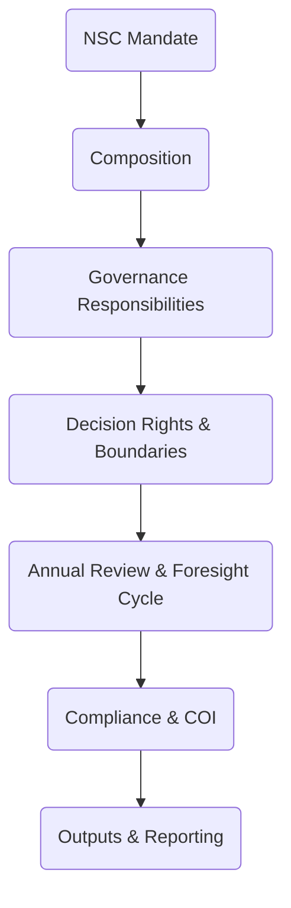

# Annex 01 — Terms of Reference (ToR)  
## National Steering Council (NSC)  
### Vigía Incubation Framework (VIF)  
**National Public–Private Incubator Network Guide — Version 1.2**

---

# **1. Introduction**

The **National Steering Council (NSC)** is the highest-level governance body of the Vigía Incubation Framework (VIF).  
It provides **strategic direction**, **national policy alignment**, **oversight**, and **system-wide decision-making** for the public–private incubation network.  

This annex defines the **Terms of Reference (ToR)** for the NSC, establishing:

- mandate and scope,  
- membership and composition,  
- decision rights and boundaries,  
- operating procedures,  
- compliance and ethical obligations,  
- reporting requirements,  
- linkage to IMM-P®, MCF 2.1, and Vigía Futura,  
- localization guidelines for national adaptation.

These ToRs function as the **official governance contract** for countries adopting VIF.

For definitions, see **00c — Glossary**.  
For system context, see **Sections 03, 04, 05, 07, and 09**.

---

# **2. How to Use This Annex**

This annex is designed for:

- Ministers and senior public officials  
- University and private-sector partners  
- NSC members  
- Policy units and innovation agencies  
- Legal and compliance teams  

Use this annex to:

1. Establish the NSC during Phase 1 (see Section 08 — Roadmap)  
2. Define legal and operational governance structures  
3. Standardize roles and responsibilities  
4. Align decision-making across ministries and partners  
5. Integrate foresight and evidence into policy strategy  

This annex provides the **minimum national standards** for NSC operation.  
Countries may adapt it to their legal frameworks provided they maintain:

- evidence integrity (MCF 2.1),  
- maturity alignment (IMM-P®),  
- governance independence of the IC,  
- public–private symmetry,  
- transparent decision-making,  
- traceable documentation.

---

# **3. NSC Governance Architecture**

---

# **4. Mandate**

The NSC ensures the national incubation network is:

- strategically aligned with development priorities,  
- grounded in evidence-based decision-making (MCF 2.1),  
- built on institutional maturity progression (IMM-P®),  
- responsive to emerging trends (Vigía Futura),  
- financially sustainable,  
- transparent and publicly accountable.

The NSC does **not** interfere in day-to-day operations (TOU) or investment decisions (IC).

---

# **5. Composition & Membership**

## **5.1 Membership Structure**

Membership must ensure representation across:

- national government ministries (2–4 members),  
- private-sector representatives (1–2),  
- university or research institutions (1–2),  
- municipal or regional authorities (optional),  
- Vigía Futura foresight representative (1),  
- independent expert (1).

## **5.2 Appointment Rules**

- Members are formally appointed by the lead ministry or national innovation authority.  
- Terms last **2–3 years**, renewable once.  
- Diversity across gender, region, sector, and expertise is encouraged.  
- Members must complete governance and ethics induction.

---

# **6. Responsibilities**

The NSC is responsible for:

### **6.1 Strategic Direction**
- Approving national incubation strategy  
- Defining sector priorities (with Vigía Futura)  
- Approving long-term vision and goals  
- Ensuring alignment with national economic plans  

### **6.2 Policy Alignment**
- Ensuring compliance with public-sector regulations  
- Reviewing cross-ministerial mandates  
- Defining legal frameworks for public–private collaboration  

### **6.3 Governance Oversight**
- Approving accreditation standards  
- Approving major system changes  
- Approving annual national KPIs (Section 07)  
- Reviewing compliance and maturity assessments  

### **6.4 Accountability**
- Publishing governance reports  
- Overseeing transparency and open data (where lawful)  
- Monitoring system-wide risks  

---

# **7. Decision Rights & Boundaries**

## **7.1 NSC Decision Rights**
The NSC has authority to:

- approve national strategy,  
- approve multi-year budgeting for NIF,  
- ratify IC membership,  
- set national KPIs,  
- approve governance and compliance rules,  
- approve node accreditation standards.

## **7.2 Boundaries (Prohibited Interference)**
To preserve system independence:

**The NSC may NOT:**

- intervene in investment decisions (IC autonomy),  
- override evidence requirements (MCF 2.1),  
- modify maturity assessment results (IMM-P®),  
- direct specific startup-level decisions,  
- bypass compliance or audit procedures,  
- impose political interference in operational matters.

---

# **8. Operating Procedures**

## **8.1 Meetings**
- Frequency: **quarterly**, with special meetings as needed.  
- Quorum: **50% + 1** of members.  
- Chair: Elected by members for a 1-year renewable term.  

## **8.2 Documentation**
- Minutes must be recorded using official templates (Section 10).  
- All decisions must be logged in the national digital system.  

## **8.3 Working Groups**
The NSC may create temporary working groups for:

- policy design,  
- foresight exercises,  
- funding strategy,  
- compliance reviews.

---

# **9. Annual Review & Foresight Cycle**

At the end of each year, the NSC conducts a national review that includes:

1. KPI evaluation (Section 07)  
2. Foresight update via Vigía Futura  
3. Maturity level review (IMM-P®)  
4. Funding adequacy review (Section 05)  
5. Governance and compliance audit  

Outputs feed into the following year’s roadmap (Section 08).

---

# **10. NSC KPIs**

| KPI | Description |
|------|-------------|
| Governance Compliance Score | % of adherence to governance rules |
| Foresight Alignment Index | Degree to which decisions follow VF priorities |
| Decision Implementation Rate | % of NSC decisions executed by TOU |
| Meeting Regularity | % of meetings held as scheduled |
| Transparency Score | Publication and documentation completeness |

---

# **11. Localization Guidance**

Countries must adapt:

- membership structure,  
- legal obligations,  
- public accountability rules,  
- meeting protocols,  
- confidentiality clauses.

Countries must **not** modify:

- evidence standards (MCF 2.1),  
- maturity standards (IMM-P®),  
- conflict-of-interest rules,  
- IC independence,  
- the annual foresight cycle.

---

# **12. Outputs & Reporting**

The NSC produces:

- annual strategic plan,  
- annual governance report,  
- sector prioritization updates,  
- system-wide KPI recommendations,  
- accreditation and compliance resolution.

---

# **13. Reference Snapshot**

Primary Doulab frameworks:

- **MicroCanvas® Framework 2.1** — https://www.themicrocanvas.com  
- **Innovation Maturity Model Program (IMM-P®)** — https://www.doulab.net/services/innovation-maturity  
- **Vigía Futura** — https://www.doulab.net/vigia-futura  

External influences (non-primary):

- OECD Public Governance Principles  
- OECD Strategic Foresight Toolkit  
- World Bank GovTech Maturity Index  
- WIPO Global Innovation Index  

See **11-references.md** for full bibliography.

---

# **14. Licensing**

This annex is licensed under the **Creative Commons Attribution 4.0 International License (CC BY 4.0)**.  
See: **[LICENSE.md](../LICENSE.md)**  

MicroCanvas® and IMM-P® are **proprietary methodologies of Doulab**.
