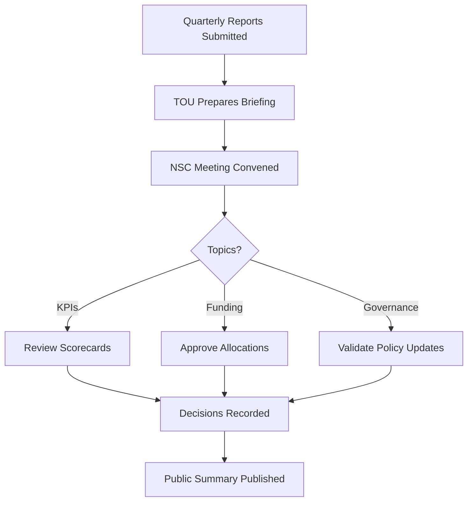
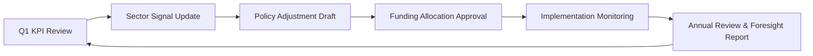

# Annex 01 — National Steering Council (NSC)  
## Terms of Reference (ToR)

---

# **1. Purpose of the National Steering Council (NSC)**

The National Steering Council (NSC) provides **strategic oversight**, ensures **public–private coordination**, and maintains **policy continuity** for the National Public–Private Incubator Network implemented under the **Vigía Incubation Framework (VIF)**.

The NSC ensures:
- Alignment with national development priorities  
- Long-term ecosystem stability  
- Transparent oversight of governance, investment, and performance  
- Integration of foresight ([Vigía Futura](https://www.doulab.net/vigia-futura)) into annual strategic cycles  

---

# **2. Mandate of the NSC**

The NSC is mandated to:

- Approve national incubator network priorities  
- Validate annual sector prioritization ([Vigía Futura](https://www.doulab.net/vigia-futura))  
- Oversee governance structures and compliance  
- Approve annual budgets and funding allocations  
- Review national scorecards and ecosystem KPIs  
- Provide policy continuity across political cycles  
- Approve new incubator nodes and strategic partnerships  
- Issue recommendations for policy or regulatory updates  

---

# **3. Composition of the NSC**

The NSC should reflect **public–private symmetry** and ecosystem diversity.

## **3.1 Recommended Composition Table**

| Sector | Role | Description |
|--------|------|-------------|
| Government | Ministry of Economy | National development and competitiveness alignment |
| Government | Ministry of Science/Technology | Research, innovation, and digital transformation policy |
| Government | Innovation Agency | Operational and policy backbone |
| Private Sector | VC/Investment Representative | Capital markets and investment cycles |
| Private Sector | Corporate Innovation Lead | Industry demand and commercialization pathways |
| Academia | University Innovation Office | Research-to-startup pathways |
| Academia | Technology Transfer Officer | IP, licensing, and research commercialization |
| International | External Expert or VC | Global benchmarking and integration |
| Network | Technical Operating Unit (TOU) Director | Operational insights and reporting |

---

# **4. Responsibilities of the NSC**

## **4.1 Governance Responsibilities**
- Approve governance protocols  
- Validate SOPs for the Technical Operating Unit (TOU)  
- Oversee compliance, risk management, and transparency  

## **4.2 Strategic Responsibilities**
- Approve annual national strategy for incubator network  
- Validate sector prioritization using [Vigía Futura](https://www.doulab.net/vigia-futura) signals  
- Ensure alignment with long-term national foresight indicators  

## **4.3 Funding Oversight**
- Approve high-level allocation of the National Innovation Fund  
- Validate investment rules, co-investment ratios, and tranche models  
- Review annual capital performance reports  

## **4.4 Performance & Evaluation**
- Review quarterly and annual KPI dashboards  
- Validate national scorecard  
- Commission independent audits  
- Oversee corrective actions when targets are not met  

---

# **5. Meeting Cadence & Workflow**

## **5.1 Meeting Frequency**
- **Quarterly meetings (mandatory)** — aligned with KPI reporting cycles  
- **Annual strategy meeting** — deep review of national competitiveness  
- **Extraordinary sessions** — crisis, emergency, or strategic opportunities  

## **5.2 Decision-Making Rules**
- Simple majority for standard approvals  
- Qualified majority (2/3) for:  
  - Funding rule changes  
  - Governance restructuring  
  - Sector priority redefinition  

## **5.3 NSC Meeting Workflow Diagram**

---

# **6. Reporting Obligations**

## **6.1 NSC Receives**
- Quarterly startup performance dashboards  
- Quarterly incubator node reports  
- TOU operational reports  
- Annual national foresight update ([Vigía Futura](https://www.doulab.net/vigia-futura))  
- Year-end capital deployment summary  
- Audit reports  

## **6.2 NSC Produces**
- Annual National Steering Report  
- Corrective action recommendations  
- Strategic updates for national policy frameworks  
- Public transparency summary  

---

# **7. Conflict-of-Interest (COI) Framework**

To ensure integrity:

## **7.1 COI Policy Components**
- Mandatory disclosure of financial interests  
- Recusal from decisions affecting related entities  
- Annual COI statement  
- Immediate reporting of changes  

## **7.2 COI Review Table**

| Risk Type | Examples | Mitigation |
|-----------|----------|------------|
| Financial | Personal investment in startups | Recusal from voting |
| Institutional | Employer has competing interests | Transparent disclosure |
| Familial | Family member in a funded startup | Abstain from evaluation |
| Strategic | Partnerships creating bias | Third-party oversight |

---

# **8. Annual Performance Cycle**

The NSC integrates both **ecosystem KPIs** and **foresight signals**.

## **8.1 Annual Performance Cycle Diagram**

---

# **9. Secretariat Support**

The NSC is supported by a Secretariat based within the **Technical Operating Unit (TOU)**.

## **Secretariat Duties**
- Prepare agendas and documents  
- Maintain archives and minutes  
- Coordinate communication between institutions  
- Track compliance with NSC decisions  

---

# **10. Amendments to the ToR**

These Terms of Reference may be revised:
- Annually, during the NSC strategy meeting  
- By special vote of 2/3 of council members  
- Following national policy or legal updates  

---

# **11. Outputs of Annex 01**

This annex provides:
- Complete governance charter for the NSC  
- Templates for membership, workflow, and decision-making  
- Foresight-integrated annual cycle  
- Conflict-of-interest safeguards  
- Process diagrams for implementation  

It forms the foundation for national governance under the Vigía Incubation Framework (VIF).

## © Copyright

© 2025 [Doulab](https://doulab.net). All rights reserved.  
[MicroCanvas®](https://www.themicrocanvas.com) Framework and [IMM-P®](https://www.doulab.net/services/innovation-maturity) Program are registered marks of [Doulab](https://doulab.net).  
Licensed under the [Creative Commons Attribution 4.0 International License](../LICENSE.md).
