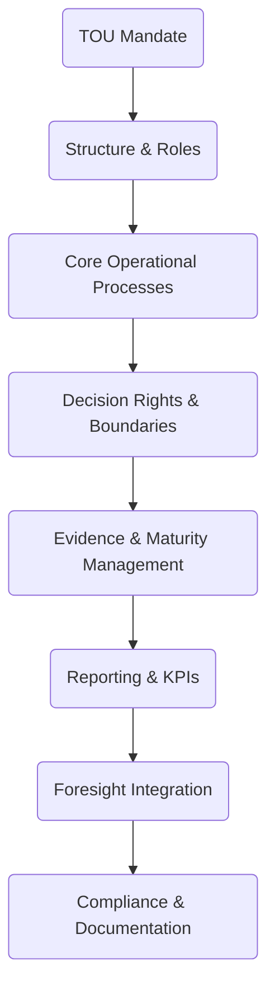

# Annex 02 — Terms of Reference & Operating Manual  
## Technical Operating Unit (TOU)  
### Vigía Incubation Framework (VIF)  
**National Public–Private Incubator Network Guide — Version 1.2**

---

# **1. Introduction**

The **Technical Operating Unit (TOU)** is the central executive and operational body responsible for implementing the Vigía Incubation Framework (VIF).  
It ensures that public–private incubator networks function with:

- evidence integrity (MCF 2.1),  
- institutional maturity progression (IMM-P®),  
- standardized reporting and KPIs,  
- governance compliance,  
- digital infrastructure efficiency,  
- policy alignment,  
- national scalability and consistency.

This annex provides the **Terms of Reference (ToR)** and **Operating Manual** for the TOU. It defines:

- mandate and roles,  
- operating procedures,  
- decision rights and boundaries,  
- capability requirements,  
- KPI expectations,  
- compliance duties,  
- cross-entity coordination,  
- documentation and audit requirements.

This annex supports **Sections 03, 04, 05, 07, 09, and 10**.

---

# **2. How to Use This Annex**

This annex is intended for:

- national innovation agencies,  
- ministries overseeing economic development,  
- universities and public–private incubator hubs,  
- TOU leaders and operational staff,  
- legal and compliance teams.

Use this annex to:

1. Establish and structure the TOU in Phase 1 (see Section 08 — Roadmap).  
2. Define all operational functions under VIF.  
3. Train new TOU staff using standardized roles and procedures.  
4. Align operational activities with national KPIs and foresight cycles.  
5. Integrate maturity and evidence practices across all nodes.

This annex defines the **minimum operational standards** for national implementation.  
Countries may localize language and structure, but may NOT alter:

- evidence standards (MCF 2.1),  
- maturity standards (IMM-P®),  
- governance boundaries,  
- tranching rules and IC independence,  
- conflict-of-interest protocols.

---

# **3. TOU Governance Architecture**

---

# **4. Mandate**

The TOU is responsible for:

- operating the national incubation network,  
- ensuring enforcement of standards and compliance,  
- managing accreditation and node capability development,  
- managing digital infrastructure and data flows,  
- supporting investment preparation and IC workflow,  
- ensuring evidence integrity across all nodes,  
- strengthening institutional maturity using IMM-P®,  
- ensuring foresight alignment via Vigía Futura.

The TOU is the **nerve center** of VIF.

---

# **5. Organizational Structure & Roles**

The TOU must include the following roles (titles may vary by country):

## **5.1 TOU Director**
- Strategic leadership  
- Oversight of all TOU functions  
- Primary liaison with NSC and IC  
- Responsible for compliance and reporting  

## **5.2 Evidence & Learning Team (MCF 2.1)**
- Evidence review  
- Validation checks  
- Experiment log audits  
- Startup support documentation  

## **5.3 Maturity & Capability Team (IMM-P®)**
- Institutional maturity assessments  
- Node capability coaching  
- Capability progression plans  

## **5.4 Investment Operations Team**
- Review of pre-IC investment memos  
- Quality assurance of tranche submissions  
- Data integrity checks  

## **5.5 Data & KPI Team**
- Data governance  
- KPI reporting  
- Dashboard operations  
- Data ingestion & traceability  

## **5.6 Digital Systems & Platform Team**
- Systems administration  
- User provisioning  
- Audit log maintenance  
- Infrastructure uptime  

## **5.7 Compliance & Ethics Team**
- Conflict-of-interest oversight  
- Compliance audits  
- Corrective action protocols  

---

# **6. Core Operational Processes**

The TOU manages all operational modules in Section 04.  
Key operational processes include:

1. **Node Accreditation Process**  
2. **Evidence Review & Quality Assurance**  
3. **Maturity Assessment Cycle (IMM-P®)**  
4. **Investment Submission Workflow**  
5. **Compliance Monitoring & Escalation**  
6. **National KPI Reporting Workflow**  
7. **Digital System Configuration & Maintenance**  
8. **Training & Capacity Building**

---

# **7. Decision Rights & Boundaries**

## **7.1 TOU Decision Rights**
The TOU may:

- approve or revoke accreditation,  
- approve evidence submissions before IC review,  
- approve compliance actions,  
- manage KPI pipelines,  
- enforce documentation requirements,  
- require corrective action plans from nodes.

## **7.2 Boundaries (Prohibited Interference)**

To preserve integrity of the system:

**The TOU may NOT:**

- override IC investment decisions,  
- adjust evidence standards (MCF 2.1),  
- alter maturity scoring (IMM-P®),  
- bypass governance protocols,  
- suppress or modify KPI data,  
- direct political or strategic mandates (NSC domain).

---

# **8. Evidence & Maturity Management**

## **8.1 Evidence Integrity (MCF 2.1)**
The TOU must:

- verify evidence quality,  
- enforce definitions and standards,  
- prevent evidence inflation or falsification,  
- maintain digital evidence logs,  
- ensure consistency across all nodes.

## **8.2 Maturity Progression (IMM-P®)**
The TOU must:

- conduct baseline assessments,  
- deliver capability progression coaching,  
- evaluate annual improvements,  
- maintain maturity score documentation,  
- prevent maturity manipulation.

---

# **9. Reporting & KPIs**

The TOU is responsible for maintaining the KPI pipelines described in **Section 07**.

## **9.1 Reporting Responsibilities**
- Monthly startup KPIs  
- Quarterly node performance  
- Annual maturity assessments  
- System incident reports  
- Evidence compliance reports  
- Investment memo quality reports  

## **9.2 TOU KPIs**

| KPI | Description |
|------|-------------|
| Evidence Compliance Rate | % of validated evidence submissions |
| Data Integrity Score | Accuracy of KPI ingestion & reporting |
| Audit Completion Rate | % of audits completed on schedule |
| Accreditation Cycle Time | Time to process node accreditation |
| Investment Memo Quality Score | % passing IC readiness thresholds |

---

# **10. Foresight Integration (Vigía Futura)**

The TOU works with Vigía Futura to:

- integrate emerging trends into program modules,  
- update sector priorities annually,  
- support strategic foresight exercises,  
- align national incubation strategy with global signals,  
- develop forward-looking KPI interpretations.

---

# **11. Compliance & Documentation**

TOU must maintain:

- full audit logs of decisions,  
- conflict-of-interest registers,  
- documentation templates from Section 10,  
- data governance compliance (GDPR-like standards),  
- operational manuals,  
- IC submission archives,  
- training and onboarding materials.

---

# **12. Localization Guidance**

Countries may customize:

- job titles,  
- reporting lines,  
- compliance terminology,  
- meeting frequency.

Countries may NOT customize:

- evidence requirements (MCF 2.1),  
- maturity progression rules (IMM-P®),  
- tranching requirements,  
- IC independence,  
- KPI integrity rules.

---

# **13. Reference Snapshot**

Primary Doulab frameworks:

- **MicroCanvas® Framework 2.1** — https://www.themicrocanvas.com  
- **Innovation Maturity Model Program (IMM-P®)** — https://www.doulab.net/services/innovation-maturity  
- **Vigía Futura** — https://www.doulab.net/vigia-futura  

External influences (non-primary):

- OECD Public Governance Principles  
- World Bank GovTech Maturity Index  
- OECD Strategic Foresight Toolkit  
- WIPO Global Innovation Index  

See **11-references.md** for full bibliography.

---

# **14. Licensing**

This annex is licensed under the **Creative Commons Attribution 4.0 International License (CC BY 4.0)**.  
See: **[LICENSE.md](../LICENSE.md)**  

MicroCanvas® and IMM-P® are **proprietary methodologies of Doulab**.
