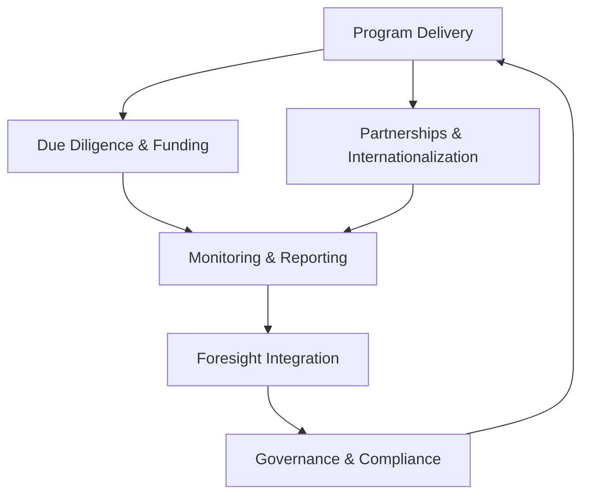
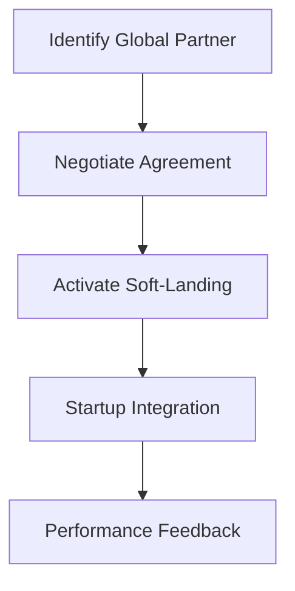

# Annex 02 — Technical Operating Unit (TOU)  
## Operating Manual

---

# **1. Purpose of the Technical Operating Unit (TOU)**

The **Technical Operating Unit (TOU)** is the operational backbone of the National Public–Private Incubator Network under the **Vigía IncubaNet Framework (VIF)**.  
It ensures **execution discipline**, **evidence-based decision-making**, and **transparent operations** across all incubator nodes and programs.

The TOU must be:
- Operationally independent  
- Technically skilled  
- Neutral and evidence-driven  
- Capable of coordinating public, private, and academic stakeholders  

---

# **2. Mandate of the TOU**

The TOU is responsible for:

- Executing the national incubation and acceleration programs  
- Administering the National Innovation Fund processes  
- Conducting due diligence based on [MCF 2.1](https://www.themicrocanvas.com) evidence  
- Coordinating all incubator nodes  
- Managing national KPIs, dashboards, and reporting cycles  
- Supporting governance bodies (NSC, Investment Committee, Advisory Board)  
- Ensuring alignment with foresight indicators ([Vigía Futura](https://www.doulab.net/vigia-futura))  
- Maintaining transparency, compliance, and documentation standards  

---

# **3. Organizational Structure**

## **3.1 Recommended TOU Structure Table**

| Role | Primary Responsibilities | Skills Required |
|------|---------------------------|------------------|
| **TOU Director** | Strategic leadership, governance liaison, annual planning | Policy, strategy, ecosystem expertise |
| **Program Manager (Incubation)** | Manage early-stage programs, MCF implementation | Startup operations, design thinking |
| **Program Manager (Acceleration)** | Growth programs, traction milestones | GTM, sales, scaling, investment prep |
| **Investment & Due Diligence Lead** | Funding evaluations, risk assessments | Finance, VC, valuation, MCF evidence |
| **Data & Insights Manager** | KPI tracking, dashboards, [IMM-P®](https://www.doulab.net/services/innovation-maturity) scoring | Data analysis, visualization |
| **Foresight & Sector Analyst** | [Vigía Futura](https://www.doulab.net/vigia-futura) integration, sector reports | Futures research, trend analysis |
| **Partnerships & Internationalization Lead** | External relations, global partners | BD, international ecosystems |
| **Operations & Compliance Officer** | SOPs, reporting, documentation | Project management, governance |
| **Administrative & Secretariat Support** | Scheduling, archiving, communication | Coordination, documentation |

---

# **4. TOU Operating Principles**

1. **Evidence First ([MCF 2.1](https://www.themicrocanvas.com))**  
2. **Maturity-Aligned Execution [(IMM-P®)](https://www.doulab.net/services/innovation-maturity)**  
3. **Foresight Integration ([Vigía Futura](https://www.doulab.net/vigia-futura))**  
4. **Transparency & Accountability**  
5. **Operational Agility**  
6. **Neutrality & Independence**  

---

# **5. TOU Core Processes**

TOU operations run through **six core process families**, shown in the diagram below.

## **5.1 Core Process Flow Diagram**

---

# **6. Detailed Operating Procedures**

## **6.1 Program Delivery (Incubation & Acceleration)**

### **Key Actions**
- Manage cohort cycles  
- Implement MCF-aligned evidence sprints  
- Coordinate mentors and experts  
- Oversee founder progress  
- Ensure program quality across all nodes  

### **Outputs**
- Cohort reports  
- Evidence dossiers  
- Go/No-Go recommendations  

---

## **6.2 Due Diligence & Funding Administration**

### **Steps**
1. Receive funding request (with MCF evidence)  
2. Conduct due diligence using TOU checklist  
3. Evaluate technical feasibility  
4. Prepare investment memo  
5. Send recommendations to Investment Committee  
6. Track tranche disbursements  

### **Due Diligence Table**

| Evaluation Area | Components | Tools |
|------------------|------------|--------|
| Market | Size, competition, insights | MCF, Sector Data |
| Team | Skills, execution readiness | Interviews |
| Evidence | Validation strength | [MCF 2.1](https://www.themicrocanvas.com) evidence forms |
| Finance | Revenue, projections | Financial models |
| Risk | Operational, technical, market | Risk matrix |

---

## **6.3 Monitoring & Reporting**

### **Responsibility Areas**
- KPI tracking  
- National scorecard maintenance  
- Quarterly reports for NSC  
- Annual ecosystem maturity ([IMM-P®](https://www.doulab.net/services/innovation-maturity) rescoring)  
- Dashboard updates  

### **Monitoring Workflow Diagram**

---

## **6.4 Foresight Integration**

The TOU integrates **annual sector signals** and **weak-signal detection** from [Vigía Futura](https://www.doulab.net/vigia-futura).

### **Activities**
- Update prioritization matrix  
- Analyze global shifts  
- Prepare foresight report  
- Recommend sector adjustments to NSC  

### **Inputs & Outputs Table**

| Input | Output |
|-------|---------|
| Trend data | Annual foresight report |
| Sector signals | Priority sector map |
| Global benchmarks | Policy recommendations |

---

## **6.5 Governance & Compliance Support**

### **Duties**
- Prepare NSC agendas, minutes, and reports  
- Manage IC and Advisory Board workflow  
- Ensure COI declarations are updated  
- Maintain all legal and operational documentation  

---

## **6.6 Partnerships & Internationalization**

### **Responsibilities**
- Identify global partners  
- Manage MoUs  
- Facilitate international soft-landing programs  
- Support startup globalization  

### **Internationalization Flow**

---

# **7. TOU Performance Indicators**

### **Key KPIs**
- Program completion rates  
- Evidence quality scores  
- Funding cycle efficiency  
- Time-to-decision for funding  
- International partnership activations  
- Data integrity score  
- Compliance rate  

---

# **8. Reporting Cadence**

| Report | Frequency | Recipient |
|--------|-----------|------------|
| Startup KPI Report | Quarterly | TOU → NSC |
| Incubator Node Report | Quarterly | TOU |
| National KPI Dashboard | Quarterly | NSC |
| Annual Foresight Update | Annual | NSC |
| Annual Ecosystem Maturity Review | Annual | NSC |
| Investment Summary | Quarterly | IC + NSC |

---

# **9. Secretariat & Administrative Support**

### **Secretariat Tasks**
- Schedule all governance meetings  
- Maintain digital archives  
- Distribute documentation packages  
- Log decisions and maintain action trackers  

---

# **10. Amendments to the TOU Manual**

May be updated annually or by:
- NSC majority vote  
- Regulatory changes  
- Innovation Fund governance updates  
- Major program restructuring  

---

# **11. Outputs of Annex 02**

This annex provides:
- Complete TOU structure  
- Operating principles  
- Evidence-based due diligence procedures  
- Reporting & KPI workflow diagrams  
- Foresight integration processes  
- Internationalization processes  
- Governance support framework  

It establishes the **operational backbone** for executing the VIF across all incubator nodes.

## © Copyright

© 2025 [Doulab](https://doulab.net). All rights reserved.  
[MicroCanvas®](https://www.themicrocanvas.com) Framework and [IMM-P®](https://www.doulab.net/services/innovation-maturity) Program are registered marks of [Doulab](https://doulab.net).  
Licensed under the [Creative Commons Attribution 4.0 International License](../LICENSE.md).
