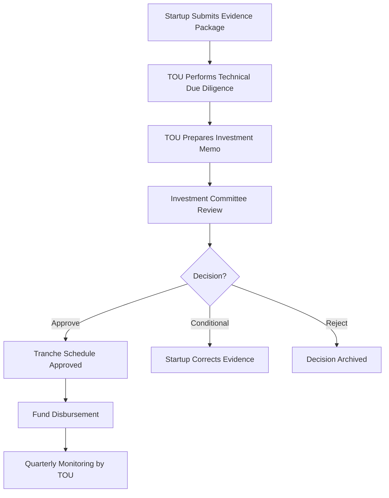

# Annex 03 — Investment Committee (IC)  
## Evaluation Framework

---

# **1. Purpose of the Investment Committee (IC)**

The **Investment Committee (IC)** governs all funding decisions within the National Public–Private Incubator Network under the **Vigía Incubation Framework (VIF)**.

Its core objective is to ensure that investments are:

- **Evidence-based** ([MCF 2.1](https://www.themicrocanvas.com))  
- **Aligned with ecosystem maturity** [(IMM‑P®)](https://www.doulab.net/services/innovation-maturity)  
- **Consistent across all incubator nodes**  
- **Transparent, auditable, and neutral**  
- **Strategically aligned with sector priorities** ([Vigía Futura](https://www.doulab.net/vigia-futura))  

The IC serves as the **final authority** on approving grants, matching funds, convertible notes/SAFE instruments, and co‑investment mechanisms.

---

# **2. Mandate of the Investment Committee**

The IC is mandated to:

- Review funding requests submitted by the TOU  
- Conduct technical & financial evaluation of evidence packages  
- Approve, adjust, or reject investment proposals  
- Authorize tranche disbursements  
- Apply risk‑management protocols  
- Ensure alignment with national sector priorities  
- Maintain transparency and independence in decisions  
- Produce quarterly and annual investment reports  

---

# **3. Composition of the Investment Committee**

## **3.1 Recommended IC Composition Table**

| Sector | Role | Expertise Required |
|--------|------|--------------------|
| Finance & Investment | VC / Angel Network Representative | Early-stage investing, valuations, risk |
| Finance & Banking | Corporate Finance Expert | Capital structuring, governance |
| Technology | Sector Specialist (rotating per vertical) | Deep market insight |
| Legal | Legal / Compliance Advisor | SAFE/Note structures, due diligence |
| Public Sector | Innovation Agency Representative | Policy alignment, national priorities |
| Ecosystem | TOU Investment & Due Diligence Lead (non‑voting) | Evidence & analysis presentation |

**Note:**  
TOU participates as **technical advisor**, not as a voting member.

---

# **4. Roles & Responsibilities**

## **4.1 IC Responsibilities**
- Evaluate investment readiness  
- Score evidence strength (MCF-aligned)  
- Review financial projections and revenue logic  
- Approve investment instruments  
- Manage follow‑on round decisions  
- Ensure compliance with funding rules  
- Document decisions for audit purposes  

## **4.2 TOU Responsibilities (Non-Voting)**
- Prepare investment memos  
- Present evidence dossiers  
- Provide scoring, data, and risk analysis  
- Track milestones and tranche triggers  
- Maintain digital investment archive  

---

# **5. Investment Evaluation Framework**

The IC evaluates startups using a **multidimensional scoring model** integrating MCF, [IMM-P®](https://www.doulab.net/services/innovation-maturity), and sector foresight.

## **5.1 Evaluation Dimensions Table**

| Dimension | Weight | Evaluation Criteria | Tools / Inputs |
|----------|--------|---------------------|----------------|
| **Evidence Strength ([MCF 2.1](https://www.themicrocanvas.com))** | 30% | Quality of problem, customer, and solution evidence | Evidence Dossier |
| **Market Opportunity** | 20% | TAM/SAM/SOM, growth signals, competitive analysis | Market Templates |
| **Team Capability** | 15% | Execution ability, technical capacity, resilience | Interviews |
| **Traction & Feasibility** | 20% | Early revenue, pilots, user growth | Traction Metrics |
| **Sector Alignment ([Vigía Futura](https://www.doulab.net/vigia-futura))** | 10% | Fit with national future sectors | Sector Matrix |
| **Financial & Risk Profile** | 5% | Cash flow logic, burn, risk analysis | Financial Models |

---

# **6. Investment Scoring Sheet**

## **6.1 Standardized Scoring Table**

| Category | Score (0–5) | Notes |
|----------|--------------|--------|
| Problem Evidence | 0–5 | Validation strength |
| Customer Insights | 0–5 | Interviews, clarity |
| Solution Feasibility | 0–5 | Technical viability |
| Market Size | 0–5 | Growth & competitiveness |
| Team Strength | 0–5 | Capability fit |
| Traction | 0–5 | Actual vs expected |
| Financial Logic | 0–5 | Robustness |
| Sector Alignment | 0–5 | Future relevance |
| Total Score | 0–40 | Weighted for IC decision |

**Interpretation:**

| Total Score | Decision |
|-------------|----------|
| 34–40 | Approve with priority |
| 26–33 | Approve |
| 20–25 | Conditional approval (remediate gaps) |
| 14–19 | Re-evaluate after corrections |
| 0–13 | Reject |

---

# **7. Due Diligence Workflow**

## **7.1 Workflow Diagram**

---

# **8. Tranche-Based Funding Rules**

The IC authorizes tranche releases through clear evidence‑based triggers.

## **8.1 Example Tranche Table**

| Tranche | Criteria | Evidence Required | % of Funds |
|--------|----------|------------------|------------|
| **T1** | MVP built | Prototype demo, evidence file | 25% |
| **T2** | Validation | Customer metrics, traction report | 35% |
| **T3** | Growth | Revenue, partnerships, KPIs | 40% |

---

# **9. Co-Investment Framework**

The IC oversees co‑investment mechanisms to maximize private sector participation.

## **9.1 Co-Investment Models Table**

| Model | Ratio | Description |
|--------|--------|-----------------------------|
| Public-to-Private Matching | 1:1 or 1:2 | Startup must secure private investors |
| Syndicated Round | Variable | Multiple VCs/investors join |
| Government Anchor | 30–40% | Government acts as anchor investor |
| Diaspora Co-Investment | Variable | Diaspora capital participates via dedicated channel |

---

# **10. Risk Management Framework**

## **10.1 Risk Matrix**

| Risk Type | Indicators | Mitigation |
|-----------|------------|------------|
| Market Risk | Weak demand, slow traction | Phased disbursement |
| Technical Risk | Feasibility concerns | Independent evaluation |
| Financial Risk | Cash burn issues | Conditional approvals |
| Governance Risk | Conflict of interest | COI policy enforcement |
| Sector Risk | Misalignment | [Vigía Futura](https://www.doulab.net/vigia-futura) review |

---

# **11. Documentation & Transparency Standards**

The IC maintains strict documentation requirements:

- Digital archive of all decisions  
- IC session minutes  
- Funding rationales  
- Evidence scoring tables  
- Public transparency summaries (quarterly)  

---

# **12. Reporting Obligations**

| Report | Frequency | Owner | Recipient |
|--------|-----------|--------|------------|
| Investment Cycle Report | Quarterly | TOU | NSC |
| IC Decision Report | After each meeting | IC Chair | NSC |
| Annual Investment Performance Report | Annual | IC + TOU | NSC + Public |
| Audit Compliance Report | Annual | IC | National Auditor |

---

# **13. Amendments to the IC Framework**

This framework may be updated:

- Annually during the NSC strategic cycle  
- By 2/3 qualified majority vote  
- When national investment policies are updated  
- When new funding instruments are introduced  

---

# **14. Outputs of Annex 03**

This annex provides:

- Complete Investment Committee structure  
- Multidimensional scoring model  
- Due diligence workflow & diagrams  
- Tranche funding rules  
- Co-investment models  
- Risk management matrix  
- Reporting and documentation standards  

It enables **transparent, rigorous, and future-aligned investment decisions** across the national incubator network.

## © Copyright

© 2025 [Doulab](https://doulab.net). All rights reserved.  
[MicroCanvas®](https://www.themicrocanvas.com) Framework and [IMM-P®](https://www.doulab.net/services/innovation-maturity) Program are registered marks of [Doulab](https://doulab.net).  
Licensed under the [Creative Commons Attribution 4.0 International License](../LICENSE.md).
