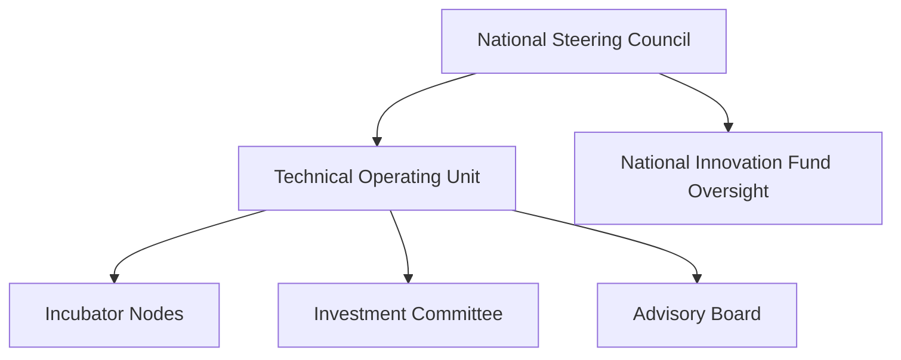

# Annex 04 — National Incubator Network Establishment Decree  
## Template for Government Use (Legal + Structural)

---

# **1. Title of the Decree**

**Decree No. XXX-20XX**  
**Establishing the National Public–Private Incubator Network under the Vigía IncubaNet Framework (VIF)**

---

# **2. Purpose of the Decree**

This decree formally establishes the **National Public–Private Incubator Network** as a strategic mechanism to promote entrepreneurship, innovation, economic diversification, competitiveness, and long-term national development.

The decree provides:

- Legal authority for national governance structures  
- Mandates for ecosystem actors  
- Funding provisions  
- Public–private coordination mechanisms  
- Oversight and accountability measures  

---

# **3. Legal Basis**

This decree is issued under the authority granted by:

- The Constitution of the Republic  
- National laws on science, technology, and innovation  
- Public administration and modernization laws  
- Investment and competitiveness legislation  
- Digital transformation governing frameworks  

(References can be adapted to local legislation.)

---

# **4. Definitions**

| Term | Definition |
|------|------------|
| **Incubator Network** | The unified national system of public, private, and academic incubators. |
| **VIF** | Vigía IncubaNet Framework — the official methodology for system design and operation. |
| **NSC** | National Steering Council — highest oversight authority. |
| **TOU** | Technical Operating Unit — national-level executing body. |
| **National Innovation Fund** | Public capital fund enabling startup financing. |
| **Incubator Node** | Any accredited incubator participating in the national network. |

---

# **5. Article I — Creation of the National Incubator Network**

**Article 1.1**  
The **National Public–Private Incubator Network** is hereby established as a national strategic system for developing high-quality startups and strengthening innovation capabilities.

**Article 1.2**  
The Network shall operate using the **Vigía IncubaNet Framework (VIF)** as its official methodology.

**Article 1.3**  
The Network shall be recognized as a national priority for economic development, competitiveness, and digital transformation.

---

# **6. Article II — Objectives**

The Network aims to:

1. Increase startup creation and quality  
2. Strengthen innovation maturity across institutions  
3. Expand access to capital through public–private co-investment  
4. Enable sector specialization aligned with future opportunities  
5. Improve national competitiveness  
6. Foster research commercialization  
7. Support talent development and workforce transformation  
8. Promote internationalization of startups  
9. Reduce regional disparities in entrepreneurship  

---

# **7. Article III — Governance Structure**

## **7.1 Governance Diagram**

---

## **7.2 Establishment of the National Steering Council (NSC)**

**Article 3.1**  
The NSC is hereby constituted as the highest governing authority of the Network.

**Article 3.2**  
The composition, responsibilities, and rules of the NSC shall be governed by **Annex 01 — NSC Terms of Reference**.

---

## **7.3 Creation of the Technical Operating Unit (TOU)**

**Article 3.3**  
The TOU is established as the central technical body responsible for execution, coordination, monitoring, reporting, and oversight of incubator nodes.

**Article 3.4**  
TOU operations shall be structured according to **Annex 02 — TOU Operating Manual**.

---

## **7.4 Investment Committee (IC)**

**Article 3.5**  
The IC is hereby recognized as the official investment body of the Network.

**Article 3.6**  
The IC will evaluate, approve, or reject funding requests in accordance with **Annex 03 — Investment Committee Evaluation Framework**.

---

# **8. Article IV — Funding and Financial Provisions**

## **8.1 National Innovation Fund**

**Article 4.1**  
The **National Innovation Fund** is created or designated as the primary funding instrument for the Network.

## **8.2 Capital Sources**

| Source | Description |
|--------|-------------|
| Public Budget | Annual allocation guaranteed for at least 5 years |
| Private Co-Investment | Mandatory participation frameworks for matching |
| International Cooperation | Grants, loans, and technical assistance |
| Corporate Partnerships | Innovation funds and direct investment |
| University Funds | Seed investment channels |

## **8.3 Funding Instruments**

The Network may deploy:

- Grants  
- Matching funds  
- SAFE/convertible notes  
- Co-investment pools  
- Innovation vouchers  

---

# **9. Article V — Accreditation of Incubator Nodes**

**Article 5.1**  
Any public, private, or academic institution may become an Incubator Node upon fulfilling accreditation requirements.

**Article 5.2**  
Accreditation shall be based on:

- Compliance with national SOPs  
- Use of MCF-aligned evidence tools  
- Demonstrated program capacity  
- Quarterly reporting compliance  

**Article 5.3**  
Accreditation criteria are detailed in **Annex 10 — Templates & Tools**.

---

# **10. Article VI — Reporting, Monitoring & Transparency**

## **10.1 Required Reports**

| Report | Frequency | Owner |
|--------|-----------|--------|
| Startup KPI Reports | Quarterly | Nodes → TOU |
| Incubator Performance | Quarterly | Nodes → TOU |
| National Dashboard | Quarterly | TOU → NSC |
| Annual National Report | Annual | TOU → NSC + Public |
| Investment Reports | Quarterly | IC → NSC |

## **10.2 Transparency**

All annual national reports must be made public.

---

# **11. Article VII — Legal Authority & Compliance**

**Article 7.1**  
All institutions participating in the Network must comply with:

- Data protection laws  
- Public–private partnership regulations  
- Innovation and digital transformation laws  
- Intellectual property frameworks  
- Ethical guidelines for AI and digital systems  

---

# **12. Article VIII — Amendment Procedures**

This decree may be amended:

- By proposal of the NSC  
- Through public consultation  
- By executive approval  

---

# **13. Article IX — Entry into Force**

This decree enters into force on the date of its publication in the Official Gazette.

---

# **14. Outputs of Annex 04**

This annex provides:

- A complete, ready-to-adapt **national decree template**  
- Legal structure for governance, funding, and compliance  
- Diagrams and tables for clarity  
- A formal policy foundation for launching the VIF-based incubator network

## © Copyright

© 2025 [Doulab](https://doulab.net). All rights reserved.  
[MicroCanvas®](https://www.themicrocanvas.com) Framework and [IMM-P®](https://www.doulab.net/services/innovation-maturity) Program are registered marks of [Doulab](https://doulab.net).  
Licensed under the [Creative Commons Attribution 4.0 International License](../LICENSE.md).
