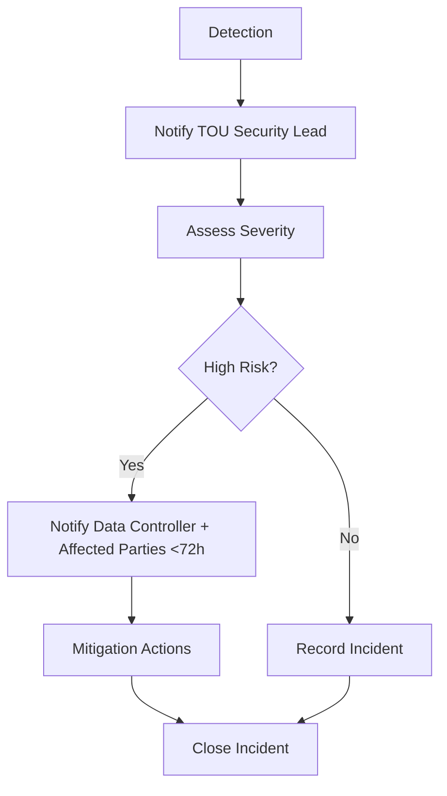

# Annex 07 — Data Privacy & Sharing Agreement  
## Template for National Public–Private Incubator Network (VIF)

---

# **1. Purpose of the Agreement**

This **Data Privacy & Sharing Agreement (DPSA)** establishes the rules, safeguards, and responsibilities related to the collection, processing, storage, sharing, and protection of data within the **National Public–Private Incubator Network**, operated under the **Vigía IncubaNet Framework (VIF)**.

It ensures compliance with:
- National data protection laws  
- GDPR-equivalent frameworks (if applicable)  
- Ethical AI and digital governance principles  
- [MCF 2.1](https://www.themicrocanvas.com) evidence integrity requirements  
- [IMM-P®](https://www.doulab.net/services/innovation-maturity) transparency and maturity indicators  

---

# **2. Parties to the Agreement**

| Party | Type | Role | Responsibilities |
|------|------|------|------------------|
| Government Institution | Public | Data Controller / Regulator | Legal compliance, oversight |
| Technical Operating Unit (TOU) | Network | Data Processor | Dashboard, KPIs, evidence mgmt |
| Incubator Node | Operator | Data Collector | Startup data submission |
| Startup / Founder | Beneficiary | Data Subject / Generator | Provides evidence & KPIs |
| Private Investor | Partner | Authorized Third Party | Receives limited reports |

---

# **3. Definitions**

| Term | Definition |
|------|------------|
| **Data Controller** | Entity determining purpose & means of data processing |
| **Data Processor** | Entity processing data on behalf of controller |
| **Data Subject** | Individual or entity that owns the data |
| **Evidence Package** | Documents/data required under [MCF 2.1](https://www.themicrocanvas.com) |
| **National Dashboard** | Central KPI system administered by TOU |
| **Confidential Data** | Financials, IP, customer insights, etc. |
| **Shared Data** | Aggregated or anonymized data used for reports |

---

# **4. Principles of Data Management**

All parties agree to uphold:

1. **Lawfulness, Fairness & Transparency**  
2. **Purpose Limitation**  
3. **Data Minimization**  
4. **Accuracy**  
5. **Storage Limitation**  
6. **Integrity & Confidentiality**  
7. **Accountability**  

Aligned with GDPR Articles 5–6 equivalents.

---

# **5. Categories of Data Covered**

## **5.1 Startup-Level Data**

| Category | Examples | Level | Notes |
|----------|----------|--------|--------|
| Business Data | Pitch deck, model, sector | Sensitive | Restricted |
| Financial Data | Revenue, burn rate | Highly sensitive | Encrypted |
| Validation Data | Customer insights, prototypes | Sensitive | [MCF 2.1](https://www.themicrocanvas.com) evidence |
| Traction Data | Users, pilots, metrics | Sensitive | Quarterly |
| IP & Technical Data | Patents, code snippets | Highly sensitive | Controlled access |

---

## **5.2 Program-Level Data**

| Category | Examples | Notes |
|----------|----------|--------|
| KPIs | Validation rate, traction | Aggregated for dashboards |
| Incubator Performance | Completion rates | Node-level only |
| Mentor Data | Evaluations | Restricted |

---

## **5.3 Public Reports (Aggregated)**

- Startup density  
- Capital deployed  
- Sector trends  
- Ecosystem maturity  

No identifying information is included.

---

# **6. Data Flow Architecture**

```mermaid
flowchart TD
    A[Startup] --> B[Incubator Node]
    B --> C[TOU: Data Processing]
    C --> D[National Dashboard (Anonymized)]
    C --> E[Investment Committee (Restricted Access)]
    D --> F[Public Annual Reports (Aggregated)]
```

---

# **7. Data Processing Responsibilities**

## **7.1 Data Controller (Public Agency)**  
- Ensures compliance with national laws  
- Defines purpose & scope of processing  
- Oversees TOU and network-wide compliance  

## **7.2 Data Processor (TOU)**  
- Manages KPI dashboards  
- Runs data validation procedures  
- Ensures encryption and secure storage  
- Implements access-control rules  
- Maintains breach logs  

## **7.3 Incubator Nodes**  
- Collect evidence and KPIs  
- Verify startup data authenticity  
- Transmit reports securely to TOU  

## **7.4 Startups (Data Subjects)**  
- Provide accurate information  
- Maintain evidence integrity  
- Consent to data processing policies  

## **7.5 Investors / Third Parties**  
- Receive limited reports  
- Must sign confidentiality agreements  

---

# **8. Legal Basis for Processing**

Data is processed based on:

1. **Explicit Consent** from Startups  
2. **Public Interest** (economic development programs)  
3. **Contractual Necessity** (participation in the network)  
4. **Legitimate Interest** (impact measurement, transparency)  

---

# **9. Data Security & Protection Measures**

## **9.1 Technical Safeguards**

| Mechanism | Description |
|-----------|-------------|
| Encryption | At rest + in transit |
| Access Control | Role-based, multi-factor authentication |
| Audit Logs | All data access monitored |
| Secure Storage | Encrypted cloud or national data center |
| Backups | Daily incremental, weekly full backups |

---

## **9.2 Organizational Safeguards**

- Annual security audits  
- Approved personnel only  
- Confidentiality agreements  
- Regular compliance training  

---

# **10. Data Sharing Rules**

## **10.1 Allowed Sharing**

| Destination | Type of Data | Conditions |
|-------------|---------------|--------------|
| NSC | Aggregated + restricted | Governance oversight |
| Investment Committee | Evidence packages | Funding decisions |
| Public | Aggregated only | No identifiers |
| Researchers | Anonymized datasets | Approval required |

---

## **10.2 Prohibited Sharing**

- Raw customer insights  
- Proprietary IP  
- Startup-specific financials  
- Evidence tied to identifiable individuals  
- Any data not explicitly authorized  

---

# **11. Data Retention Policy**

Retention schedule:

| Data Type | Retention Period | Notes |
|-----------|-------------------|--------|
| Financials | 7 years | Legal requirement |
| Evidence Packages | Duration of program + 3 years | For audit |
| KPI Reports | 5 years | Performance tracking |
| Anonymized Data | Indefinite | Research use only |

---

# **12. Breach Notification Protocol**

If a breach occurs:



---

# **13. Rights of Data Subjects**

Startups may request:

- Access to their data  
- Correction of inaccurate data  
- Deletion (after program completion)  
- Restrictions on processing  
- A copy of their evidence package  

Requests must be processed within **30 days**.

---

# **14. Term & Termination**

This agreement remains valid:

- Throughout participation in the incubator network  
- For retention periods defined above  

Termination requires data deletion or anonymization.

---

# **15. Signatures**

Data Controller: _____________________   Date: ______  
Data Processor (TOU): ________________   Date: ______  
Incubator Node: _______________________   Date: ______  
Startup: ______________________________   Date: ______  

---

# **16. Outputs of Annex 07**

This annex provides:
- A complete, adaptable Data Privacy & Sharing Agreement  
- Tables for data types, roles, safeguards, and retention  
- Two Mermaid diagrams for data flow & breach protocol  
- Alignment with national law, GDPR equivalents, and VIF governance  
- Ready-to-use `.md` file for legal and operational integration

## © Copyright

© 2025 [Doulab](https://doulab.net). All rights reserved.  
[MicroCanvas®](https://www.themicrocanvas.com) Framework and [IMM-P®](https://www.doulab.net/services/innovation-maturity) Program are registered marks of [Doulab](https://doulab.net).  
Licensed under the [Creative Commons Attribution 4.0 International License](../LICENSE.md).
