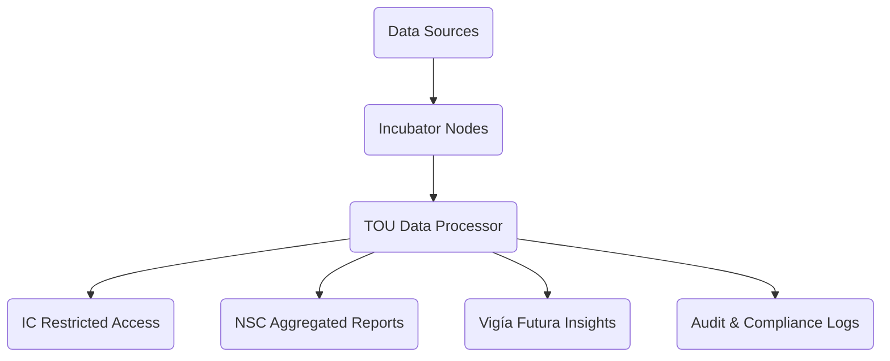

# Annex 07 — Data Privacy & Sharing Agreement  
## Data Governance, Privacy, Security & Sharing Framework  
### Vigía Incubation Framework (VIF)  
**National Public–Private Incubator Network Guide — Version 1.2**

---

# **1. Introduction**

This annex establishes the **data governance, privacy, security, and data‑sharing framework** required for all participants in the **Vigía Incubation Framework (VIF)**, including:

- national authorities,  
- public–private incubator nodes,  
- startups,  
- evaluators and mentors,  
- private investors and co-investors,  
- universities and research institutions.

The purpose of this annex is to ensure:

- lawful and ethical handling of all data,  
- protection of personal and sensitive information,  
- standardized data flows across governance bodies,  
- compliance with evidence and maturity requirements (MCF 2.1, IMM-P®),  
- transparency and auditability of decisions,  
- integrity and security of all records,  
- responsible innovation aligned with national and international standards.

For definitions, see **00c — Glossary**.  
For governance context, see **Sections 03, 04, 07, 09**, and **Annexes 01–03**.

---

# **2. How to Use This Annex**

This annex defines the **minimum data and privacy standards** for national implementation of VIF.

### **Mandatory Components (Not Negotiable)**  
- Compliance with MCF 2.1 evidence integrity rules  
- Compliance with IMM-P® maturity documentation  
- IC independence and restricted access to evaluation data  
- TOU role as national data processor/administrator  
- Standardized KPI and evidence reporting  
- Mandatory security, privacy, and audit rules  
- Mandatory conflict-of-interest obligations  
- Mandatory data retention & deletion rules  

### **Adaptable Components (Country-Specific)**  
- National data protection authority references  
- Cloud or local hosting requirements  
- Data transfer restrictions  
- Archival formats and retention timelines  
- Encryption standards (minimum required: AES‑256)  

### **Prohibited Modifications**  
Countries may NOT remove or weaken:

- audit logs,  
- IC independence constraints,  
- consent requirements,  
- evidence integrity rules,  
- data minimization principles,  
- cyber‑security standards.

---

# **3. Data Governance Architecture**

---

# **4. Roles & Responsibilities**

## **4.1 Data Controller**
Typically the national innovation authority or ministry, responsible for:

- defining lawful data purposes,  
- ensuring compliance with national data privacy laws,  
- approving data retention and deletion policies,  
- ensuring proper execution by all parties.

## **4.2 Data Processor (TOU)**
Responsible for:

- receiving and verifying data submitted by nodes,  
- maintaining secure systems for evidence, KPIs, and logs,  
- ensuring access controls,  
- generating audit trails and compliance reports.

## **4.3 Incubator Nodes**
Responsible for:

- collecting accurate, lawful data,  
- obtaining required consents,  
- maintaining integrity of evidence,  
- submitting KPIs and logs to the TOU.

## **4.4 Startups**
Responsible for:

- lawful collection of customer data used in experiments,  
- anonymization or pseudonymization where required,  
- maintaining experiment logs consistent with MCF 2.1.

## **4.5 Investment Committee**
Has **restricted access** only to:

- investment memos,  
- validated evidence,  
- KPI summaries,  
- risk assessments.

The IC does **not** receive personal customer data.

## **4.6 National Steering Council**
Receives **aggregated, non‑personal** data only.

---

# **5. Data Principles (Mandatory)**

## **5.1 Lawfulness, Fairness & Transparency**
All data must be processed:

- with legal basis,  
- transparently,  
- in compliance with national and international law.

## **5.2 Purpose Limitation**
Data must only be used for:

- incubation management,  
- evidence review (MCF 2.1),  
- maturity assessments (IMM-P®),  
- investment decisions,  
- program improvement.

## **5.3 Data Minimization**
Only the **minimum necessary data** may be collected.

## **5.4 Accuracy**
All KPI and evidence data must be:

- accurate,  
- complete,  
- verifiable.

## **5.5 Storage Limitation**
Data must be retained only for the legally required duration.

## **5.6 Integrity & Confidentiality**
Requires implementation of:

- AES‑256 encryption at rest,  
- TLS 1.3 encryption in transit,  
- access control via least‑privilege principles,  
- mandatory MFA for all administrative accounts.

---

# **6. Data Sharing Requirements**

## **6.1 Sharing with TOU**
Nodes and startups must share:

- evidence logs,  
- KPIs,  
- maturity assessment inputs,  
- audit documentation.

## **6.2 Sharing with IC (Restricted)**
IC receives only:

- validated evidence summaries,  
- KPIs,  
- risk assessments,  
- investment memos.

IC must not have access to:

- personal customer data,  
- raw experiment logs containing identifiers.

## **6.3 Sharing with NSC**
NSC receives **aggregated, anonymized**, or **statistical** data only.

## **6.4 Sharing with Vigía Futura**
Provides **trend insights** only; no personal data is exchanged.

---

# **7. Consent, Rights & Transparency**

Startups must ensure:

- transparency notices to data subjects,  
- lawful basis for experiment data,  
- right of access, rectification, deletion,  
- right to withdraw consent when applicable,  
- anonymization where feasible.

---

# **8. Security Requirements**

All parties must:

- use MFA for all administrative and platform access,  
- apply OS‑level encryption,  
- maintain endpoint security,  
- implement real‑time intrusion detection,  
- conduct annual penetration tests,  
- enforce role‑based access control (RBAC).

---

# **9. Incident Response & Breach Management**

In case of a suspected breach:

1. Immediate notification to the TOU  
2. Internal investigation (TOU-led)  
3. Notification to national authorities (as required by law)  
4. Remediation and documentation  
5. NSC oversight for serious incidents  

All incidents must be logged and stored for **5 years**, unless national law requires otherwise.

---

# **10. Retention & Deletion**

Minimum required standards:

| Data Category | Retention | Deletion Requirement |
|---------------|-----------|----------------------|
| Evidence Logs | 3–5 years | Secure wipe |
| KPI Data | 5 years | Secure wipe |
| IC Documentation | 10 years | Archive + wipe |
| Audit Logs | 10 years | Archive + wipe |
| Personal Data | As required by law | Anonymization or deletion |

---

# **11. Conflict of Interest (COI)**

All actors must:

- sign annual COI declarations,  
- disclose financial conflicts,  
- recuse themselves when required,  
- avoid access to data when conflicts exist.

Startups must disclose:

- investor relationships,  
- advisory relationships,  
- familial or political connections.

---

# **12. Localization Guidance**

Countries must adapt:

- national data authority references,  
- legally required retention periods,  
- incident notification laws,  
- hosting location requirements.

Countries may NOT remove:

- evidence integrity requirements,  
- data minimization rules,  
- IC restricted-access rules,  
- mandatory encryption,  
- breach notification workflows.

---

# **13. Reference Snapshot**

Primary Doulab frameworks:

- **MicroCanvas® Framework 2.1** — https://www.themicrocanvas.com  
- **Innovation Maturity Model Program (IMM-P®)** — https://www.doulab.net/services/innovation-maturity  
- **Vigía Futura** — https://www.doulab.net/vigia-futura  

External influences (non-primary):

- OECD Privacy Guidelines  
- GDPR (EU General Data Protection Regulation)  
- OECD Public Governance Principles  
- World Bank GovTech Maturity Index  
- OECD Strategic Foresight Toolkit  

Full bibliography available in **11-references.md**.

---

# **14. Licensing**

This annex is licensed under the **Creative Commons Attribution 4.0 International License (CC BY 4.0)**.  
See: **[LICENSE.md](../LICENSE.md)**  

MicroCanvas® and IMM-P® are **proprietary methodologies of Doulab**.
