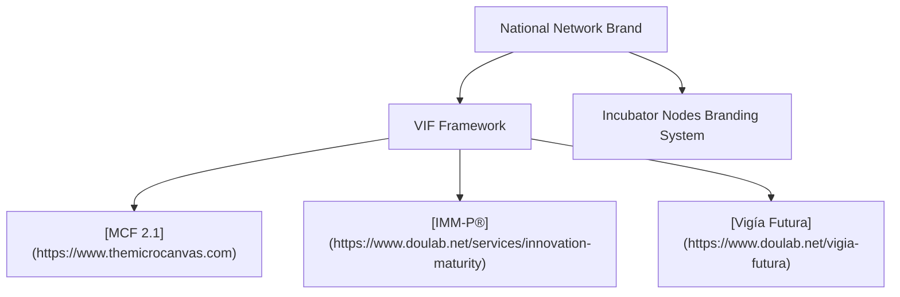
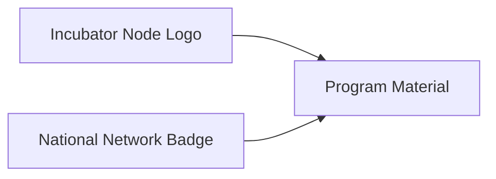
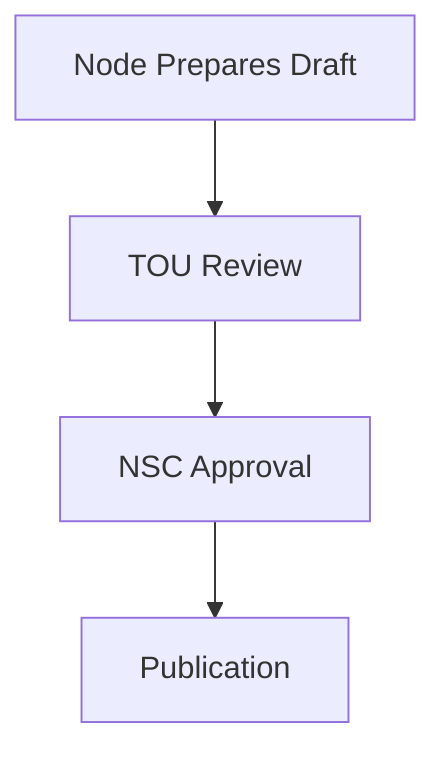

# Annex 09 — National Network Branding & Communication Guide  
## Visual Identity • Messaging • Public Transparency • Media Framework

This annex provides a unified branding and communication standard for the **National Public–Private Incubator Network**, aligned with the **Vigía IncubaNet Framework (VIF)** and compatible with public-sector communication requirements.

---

# **1. Purpose of the Branding & Communication Guide**

The guide ensures:

- A unified and professional national identity  
- Consistency across all incubator nodes  
- Clear communication to entrepreneurs, investors, and the public  
- Transparent reporting of results (aligned with [IMM-P®](https://www.doulab.net/services/innovation-maturity))  
- Future-oriented positioning (aligned with [Vigía Futura](https://www.doulab.net/vigia-futura))  

It applies to all public, private, and academic entities participating in the network.

---

# **2. Core Brand Architecture**

## **2.1 Brand Levels**

| Level | Description | Examples |
|-------|-------------|----------|
| **National Brand** | Represents entire incubator network | IncubaX / National Program Name |
| **Framework Brand** | Methodological layer | VIF • [MCF 2.1](https://www.themicrocanvas.com) • [IMM-P®](https://www.doulab.net/services/innovation-maturity) • [Vigía Futura](https://www.doulab.net/vigia-futura) |
| **Node Brand** | Individual incubator identity | Local public, private, university incubators |

---

## **2.2 Relationship Diagram**

---

# **3. Brand Elements**

## **3.1 Core Logo Guidelines**

- National brand must appear on all official documents  
- Nodes may retain their branding but must include “Member of the National Incubator Network”  
- Logos must not distort, recolor, or be modified  
- Use SVG or high-resolution PNG  

---

## **3.2 Typography**

Recommended fonts:

| Category | Font | Notes |
|-----------|--------|--------|
| Headings | Inter / Montserrat | Clean, modern |
| Body | Inter / Roboto | Highly readable |
| Code / Technical | JetBrains Mono | For MCF/tech docs |

---

## **3.3 Color Palette (Suggested)**

| Color | Hex | Use |
|--------|--------|--------|
| Deep Indigo | #38249a | Primary |
| Teal / Cyan | #72c53c | Highlights |
| Purple | #964590 | Secondary |
| Charcoal | #484854 | Text |
| White | #ffffff | Background |

These match [Doulab](https://doulab.net)'s palette for compatibility.

---

## **3.4 Voice & Tone**

The national network should communicate with:

- **Clarity** (evidence-based, simple)  
- **Neutrality** (non-partisan, professional)  
- **Forward-thinking** (foresight-oriented)  
- **Supportive tone** toward founders  

---

# **4. Messaging Framework**

## **4.1 Elevator Pitch**

“[National Program Name] is the unified public–private incubator network accelerating high-quality startups using the Vigía IncubaNet Framework, supported by evidence-based methods ([MCF 2.1](https://www.themicrocanvas.com)), innovation maturity principles [(IMM-P®)](https://www.doulab.net/services/innovation-maturity), and strategic foresight ([Vigía Futura](https://www.doulab.net/vigia-futura)).”

---

## **4.2 Key Messages by Audience**

| Audience | Core Message | Supporting Points |
|-----------|--------------|---------------------|
| Founders | “We help you build investable startups.” | Evidence, mentorship, capital access |
| Investors | “We reduce risk with validated evidence.” | Due diligence templates, co-investment |
| Government | “We strengthen national competitiveness.” | KPIs, maturity, economic impact |
| Academia | “We connect research to the market.” | IP frameworks, licensing |
| Public | “We support innovation and job creation.” | Transparency reports |

---

# **5. Communication Channels**

## **5.1 Mandatory Channels**

- National website  
- National KPI dashboard  
- Annual report (public)  
- Press releases for major milestones  
- Founder-facing knowledge base  

## **5.2 Optional Channels**

- Social media (LinkedIn, X)  
- Printed brochures  
- Event materials  
- YouTube for demo days  

---

# **6. Transparency & Reporting Templates**

Aligned with [IMM-P®](https://www.doulab.net/services/innovation-maturity) and VIF.

## **6.1 Annual National Report Structure**

| Section | Summary |
|----------|----------|
| Overview | Program purpose & milestones |
| KPIs | National dashboard summary |
| Investment | Capital deployed, ROI indicators |
| Nodes | Performance by incubator |
| Foresight | Sector trends ([Vigía Futura](https://www.doulab.net/vigia-futura)) |
| Policy | Recommendations to government |

---

## **6.2 Quarterly Public Summary (One-Page Template)**

| Metric | Current | Previous | Trend |
|---------|----------|-----------|--------|
| Startups Supported | ___ | ___ | ↑/↓ |
| Capital Deployed | ___ | ___ | ↑/↓ |
| Validation Rate | ___% | ___% | ↑/↓ |
| Traction Growth | ___% | ___% | ↑/↓ |
| Sector Signals | Summary | — | — |

---

# **7. Branding for Incubator Nodes**

Nodes must:

1. Keep existing brand identity  
2. Add national network affiliation in all materials  
3. Use harmonized templates for:  
   - Pitch decks  
   - Startup reports  
   - Certificates  
   - Events  

## **7.1 Node Co-Branding Example**

---

# **8. Media & Public Relations Protocol**

## **8.1 Press Release Workflow**

---

## **8.2 Crisis Communication Protocol**

- Respond within 24 hours  
- TOU handles internal communication  
- NSC approves public messaging  
- Maintain transparency with minimal disclosure  
- Use a “facts-first” approach  

---

# **9. Digital & Web Standards**

## **9.1 Website Requirements**

- Mobile-first design  
- Accessibility (WCAG 2.1)  
- Minimal tracking (privacy-first)  
- Clear navigation for founders and investors  
- Integration with national KPI dashboard  

---

# **10. Allowed & Prohibited Uses**

### **Allowed**
- Co-branding with incubator nodes  
- Use in pitch events, demo days, official reports  
- Institutional presentations  

### **Prohibited**
- Political endorsements  
- Commercial advertising unrelated to startups  
- Recoloring or altering logos  
- Implying government funding without IC approval  

---

# **11. Sign-Off & Governance**

Branding governance is led by:

- **NSC** — strategic oversight  
- **TOU Communications Unit** — operational management  

Changes to brand identity require NSC approval.

---

# **12. Outputs of Annex 09**

This annex provides:

- Full national branding system  
- Templates and messaging frameworks  
- Transparency and communication guidelines  
- Diagrams for workflows and co-branding  
- Ready-to-use structure for both national and node-level branding

## © Copyright

© 2025 [Doulab](https://doulab.net). All rights reserved.  
[MicroCanvas®](https://www.themicrocanvas.com) Framework and [IMM-P®](https://www.doulab.net/services/innovation-maturity) Program are registered marks of [Doulab](https://doulab.net).  
Licensed under the [Creative Commons Attribution 4.0 International License](../LICENSE.md).
