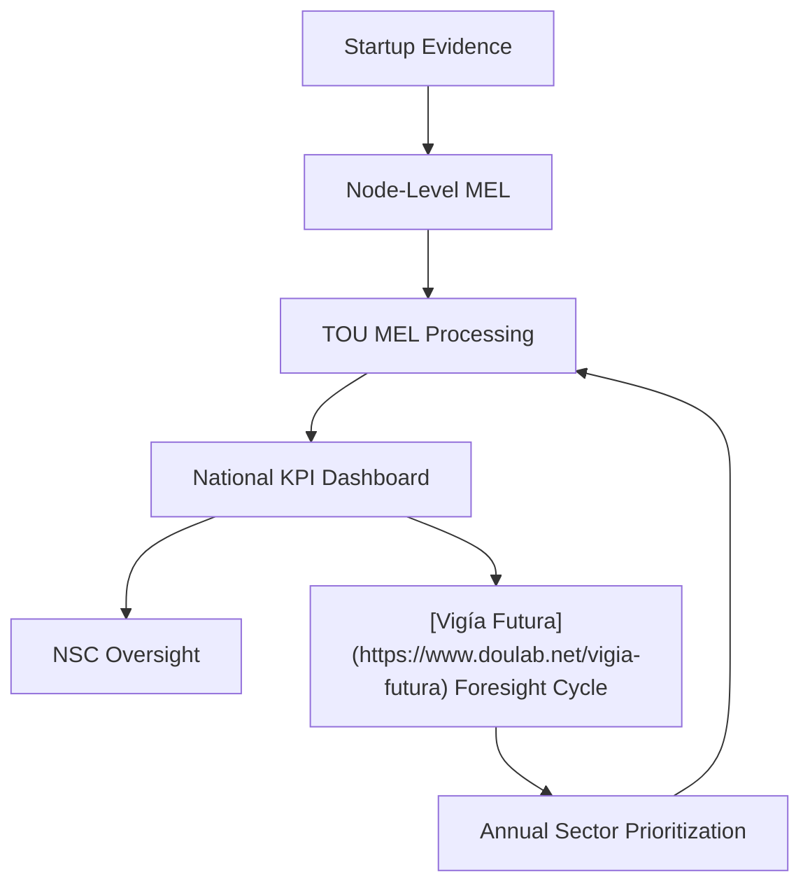
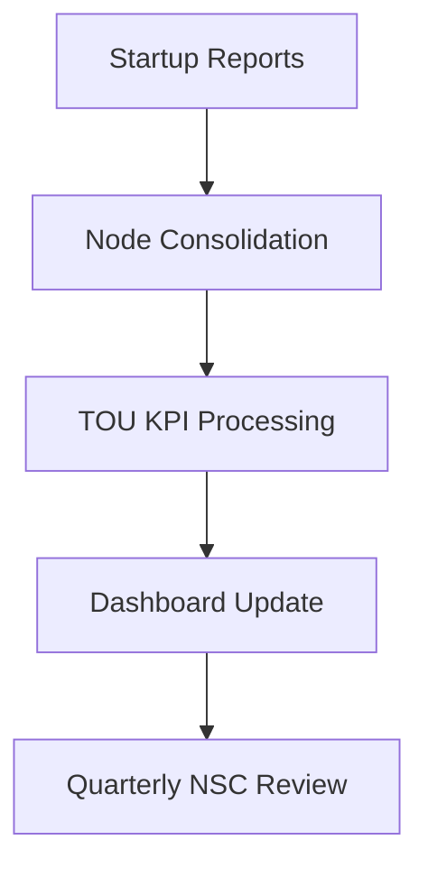
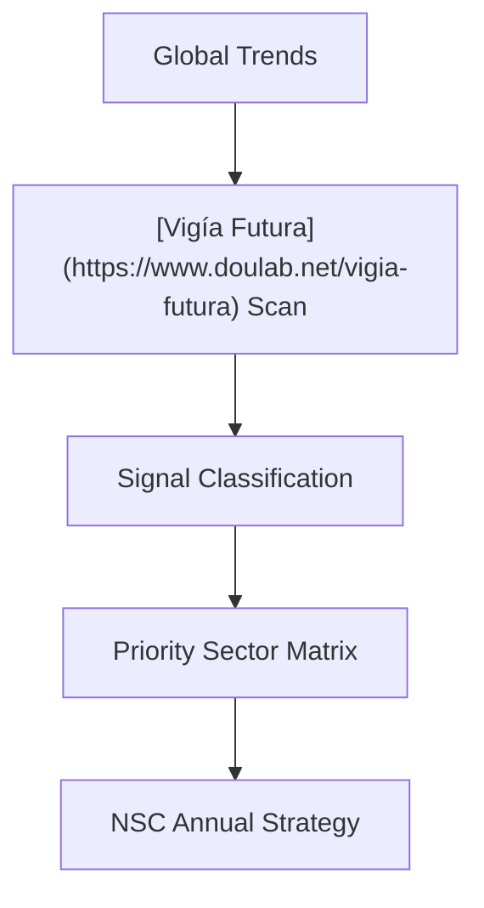
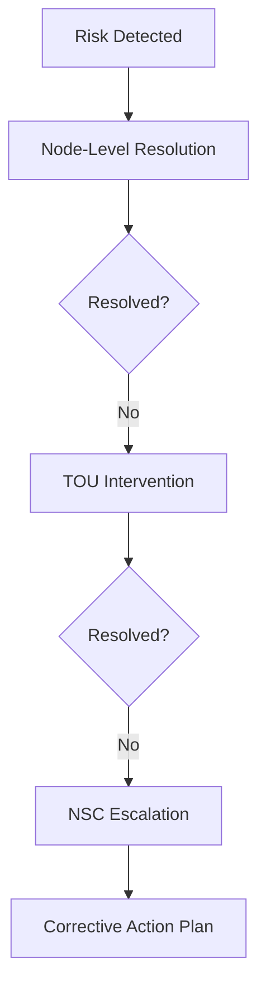

# Annex 10 — Monitoring, Evaluation & Learning (MEL) Framework  
## KPIs • Scorecards • Evidence Cycles • Foresight Integration

This annex provides the complete monitoring, evaluation, and learning (MEL) system for the **National Public–Private Incubator Network**, aligned with:

- **Vigía IncubaNet Framework (VIF)**  
- **[MCF 2.1](https://www.themicrocanvas.com) Evidence Processes**  
- **[IMM-P®](https://www.doulab.net/services/innovation-maturity) maturity indicators**  
- **[Vigía Futura](https://www.doulab.net/vigia-futura) foresight cycles**  

It enables consistent national reporting, performance tracking, and continuous improvement.

---

# **1. Purpose of the MEL Framework**

The MEL system ensures:

- Evidence-based performance tracking  
- Transparent national reporting  
- Consistent quality across incubator nodes  
- Rapid learning and feedback loops  
- Early detection of risks and bottlenecks  
- Alignment with national sector priorities  
- Preparation for long-term policy adaptation  

---

# **2. MEL Architecture Overview**

---

# **3. Key Performance Indicators (KPIs)**

## **3.1 Startup-Level KPIs**

| Category | KPI | Definition | Frequency |
|----------|------|-------------|-----------|
| Evidence | Validation Rate | % of evidence passing MCF quality | Quarterly |
| Traction | User Growth | New active users | Monthly |
| Finance | Runway | Months of cash remaining | Quarterly |
| Team | Execution Score | [IMM-P®](https://www.doulab.net/services/innovation-maturity) team-readiness indicators | Quarterly |
| Product | MVP Readiness | % completion of technical milestones | Quarterly |

---

## **3.2 Incubator Node-Level KPIs**

| Category | KPI | Definition |
|-----------|------|-------------|
| Program Delivery | Completion Rate | % of startups finishing cohort |
| Evidence Quality | Composite Score | Average quality of evidence submitted |
| Mentor Engagement | Hours Delivered | Total structured hours per cohort |
| Startup Success | Validation-to-Growth Rate | Transition rate from early stage to growth |

---

## **3.3 Network-Level KPIs**

| Category | KPI | Definition |
|-----------|------|-------------|
| Ecosystem | Startups Supported | Total across all nodes |
| Capital | Investment Deployed | Total funds released |
| Performance | National Validation Rate | Aggregate evidence success |
| Foresight | Sector Alignment Index | % startups in prioritized sectors |
| Maturity | [IMM-P®](https://www.doulab.net/services/innovation-maturity) National Score | Hybrid public–private maturity score |

---

# **4. National Scorecard Template**

| Dimension | Weight | Indicator | Value | Score |
|-----------|---------|-----------|--------|--------|
| Startup Creation | 20% | Startups supported | ___ | ___ |
| Evidence Strength | 20% | National validation rate | ___% | ___ |
| Traction & Growth | 15% | Avg traction | ___ | ___ |
| Capital Performance | 15% | Funds deployed | ___ | ___ |
| Sector Alignment | 10% | Alignment index | ___ | ___ |
| Node Performance | 10% | Weighted node metrics | ___ | ___ |
| Maturity | 10% | [IMM-P®](https://www.doulab.net/services/innovation-maturity) national | ___ | ___ |

---

# **5. MEL Processes**

## **5.1 Evidence Cycle ([MCF 2.1](https://www.themicrocanvas.com)-Aligned)**

---

## **5.2 KPI Reporting Workflow**

---

# **6. Learning Loops**

The MEL system integrates **short**, **medium**, and **long-term** learning mechanisms.

## **6.1 Short-Term Learning (Quarterly)**

| Mechanism | Purpose |
|------------|----------|
| KPI dashboard | Detect operational issues |
| Node feedback sessions | Improve program delivery |
| Evidence quality audits | Strengthen MCF alignment |

---

## **6.2 Medium-Term Learning (Annual)**

| Mechanism | Purpose |
|------------|----------|
| Annual Report | National performance review |
| [IMM-P®](https://www.doulab.net/services/innovation-maturity) Reassessment | Update maturity levels |
| Sector Performance Study | Track prioritized industries |

---

## **6.3 Long-Term Learning (3–5 Years)**

| Mechanism | Purpose |
|------------|----------|
| National Foresight Review | Adjust long-term vision |
| Policy Impact Study | Evaluate national strategy outcomes |
| Ecosystem Mapping | Understand structural changes |

---

# **7. [Vigía Futura](https://www.doulab.net/vigia-futura) Integration**

Sector prioritization is updated annually based on foresight signals.

## **7.1 Foresight Integration Flow**

---

## **7.2 Priority Sector Matrix Template**

| Sector | Signal Strength | Opportunity Level | Risk Level | Score |
|--------|------------------|-------------------|-------------|--------|
| ___ | High/Medium/Low | ___ | ___ | ___ |
| ___ | High/Medium/Low | ___ | ___ | ___ |

---

# **8. Node Accreditation Metrics**

Node accreditation is tied to MEL outcomes.

| Category | Indicator | Threshold |
|-----------|-----------|------------|
| Reporting Reliability | On-time submission | ≥ 90% |
| Evidence Quality | MCF score | ≥ 80% |
| Program Delivery | Completion rate | ≥ 70% |
| Transparency | Compliance rate | 100% |
| Capacity | Staff trained | ≥ 2 per node |

---

# **9. Risk Monitoring Framework**

## **9.1 Risk Matrix**

| Area | Indicators | Mitigation |
|-------|------------|-------------|
| Market | Low traction | Adjust programs |
| Financial | Burn vs funding | Conditional tranches |
| Operational | Delays in cohorts | TOU intervention |
| Governance | COI breaches | NSC review |
| Sector | Misalignment | Foresight updates |

---

## **9.2 MEL Risk Escalation Flow**

---

# **10. Annual National Performance Review**

Annually, TOU and NSC publish a unified national review including:

- KPI trends  
- Sector performance  
- Foresight-based adjustments  
- Policy recommendations  
- Investment performance  
- Node-level benchmarking  
- Innovation maturity changes [(IMM-P®)](https://www.doulab.net/services/innovation-maturity)  

---

# **11. Documentation Templates**

## **11.1 MEL Monthly Template**

| Metric | Value | Notes |
|----------|--------|--------|
| Evidence items submitted | ___ | ___ |
| Validation success rate | ___ | ___ |
| Key risks | ___ | ___ |

---

## **11.2 Quarterly Review Template**

| Category | Key Findings | Corrective Actions |
|-----------|---------------|---------------------|
| Evidence | ___ | ___ |
| Capital | ___ | ___ |
| Traction | ___ | ___ |
| Sector alignment | ___ | ___ |

---

# **12. Outputs of Annex 10**

This annex provides:

- Full MEL architecture  
- KPI & Scorecard templates  
- Evidence and reporting workflows  
- Learning loops and foresight integration  
- Risk monitoring and corrective action systems  
- Node accreditation indicators  
- Ready-to-deploy national monitoring system for VIF

## © Copyright

© 2025 [Doulab](https://doulab.net). All rights reserved.  
[MicroCanvas®](https://www.themicrocanvas.com) Framework and [IMM-P®](https://www.doulab.net/services/innovation-maturity) Program are registered marks of [Doulab](https://doulab.net).  
Licensed under the [Creative Commons Attribution 4.0 International License](../LICENSE.md).
